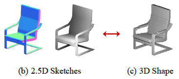
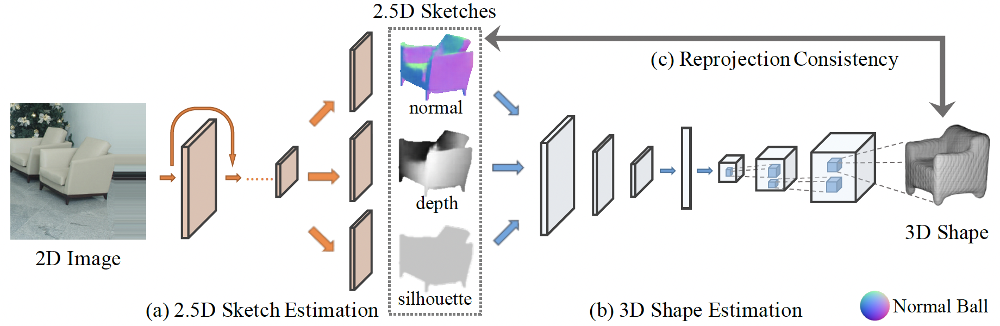

## MarrNet

3D Shape Reconstruction via 2.5D Sketches

### 引言

从单一图片进行三维重建是一个高度欠约束的 (under-determined) 问题，需要很强的三维先验知识。而因为缺少高质量的数据集，纯基于学习的方法也很难实现。先前的工作尝试在合成的数据上训练，但在应用在真实世界时效果通常不理想。

人类可以从图像中快速识别出相同的 3D 物体，而且无论颜色、材质、光照、背景等如何变化。而且甚至可以从只含有表面法线和深度信息的 2.5D 草图中识别物体的形状。

之前的工作直接训练一个模型从 RGB 图像回归到 3D 形状。相比之下，本文提出了一个两步的端到端可学习的网络，**先从图像中恢复 2.5D 草图，再生恢复三维形状**。使用编码器-解码器结构，而且限制草图和三维形状间的二次投影是一致的。这种两步走的方法更容易学习，而且作者认为在合成图像上学习 2.5D 草图能更容易应用在真实世界。从 2.5D 到 3D 形状的部分则可以完全依赖合成图像训练。

本文还在 2.5D 草图到 3D 形状使用了可微分的约束，使得网络可以在没有任何标注的图像上进行端到端的学习。首先在合成图像上进行预训练，然后在真实图像上预测 2.5D 草图，并利用该草图完善 3D 形状，是一种自监督学习。

本文有以下贡献：

- 提出了一个两步的，通过 2.5D 草图对单张图像进行 3D 物体重建
- 提出了一个简单的端到端训练方法，且使用可微分的投影层保证中间层的特征和 3D 形状一致
- 证明该方法在合成和真实数据上的有效性

### 方法

 

网络由三部分组成，首先对图像预测 2.5D 草图，包括表面法线图 (surface normal)、深度图 (depth) 和轮廓图 (silhouette)。然后整合三张图的特征，使用体素预测 3D 形状。最后使用重投影一致性函数计算损失，加强对 3D 形状和 2.5D 草图间的一致性。

**2.5D 草图预测**

从一张 RGB 图像预测 2.5D 草图，包括表面法线图、深度图和轮廓图。目的是提取与 3D 重建相关的特征，丢弃无关的内容，如纹理和光照。编码器由 ResNet-18 实现，将 3\*256\*256 的图像转换成 512\*8\*8 的特征，然后使用 4 组 5\*5 卷积和 4 组 1\*1 卷积和 ReLU 生成也原图一样大小的三个草图。

**3D 形状预测**

从 2.5D 草图预测 3D 形状。合成图像通常和真实图像差距很大，但合成的 2.5D 草图和真实图像的草图非常相似因为不含纹理和光照等信息，所以这部分的网络可以直接在合成图像上训练。

这部分的网络是编码器-解码器结构。

编码器接收由预测的轮廓 mask 的表面法线图和深度图，使用多层卷积、ReLU、池化和全连接层映射到一条 200 维的特征向量。解码器的部分参考 3D GAN，使用线性层将特征升维，然后将形状调整为 5 维张量 (批量、特征维、长、宽、高)，之后使用多个 3D 卷积，最后将特征维降维到 1，输出一个 128\*128\*128 的由体素表示的立方体。

#### 损失

在损失中包含 2.5D 草图和 3D 形状间的投影一致性，并分为深度投影损失和法线投影损失。

- 用 $v_{x, y, z}$ 表示体素在 $(x, y, z)$ 位置上的值，假设 $v_{x, y, z} \in [0, 1], \forall x, y, z$. 
- 用 $d_{x, y}$ 表示在 $(x, y)$ 位置上的预测深度
- 用 $n_{x, y} = (n_a, n_b, n_c)$ 表示在 $(x, y)$ 位置上的预测法向量

**深度投影损失**

该损失保证物体表面的体素值为1，而它前面的所有体素值都为0。令预测的 3D 形状与预测深度相匹配。
$$
L_{\text{depth}}(x, y, z)
  \begin{cases}
    v_{x, y, z}^2 & z < d_{x, y} \\
    (1 - v_{x, y, z})^2 & z = d_{x, y} \\
    0 & z > d_{x, y}
  \end{cases}
$$
**法线投影损失**

$$
\begin{align*}
    L_{\text{normal}} = (1 - v_{x, y-1, z + \frac{n_b}{n_c}})^2 + (1 - v_{x, y+1, z - \frac{n_b}{n_c}})^2 + \\
    (1 - v_{x-1, y, z + \frac{n_a}{n_c}})^2 + (1 - v_{x+1, y, z - \frac{n_a}{n_c}})^2
\end{align*}
$$

#### 训练流程

### 实验

## 代码实现

https://github.com/jiajunwu/marrnet

以 lua 实现，不是 PyTorch.