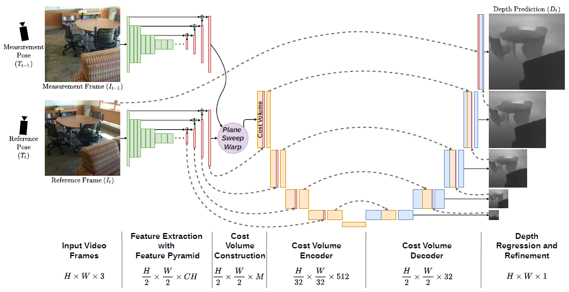
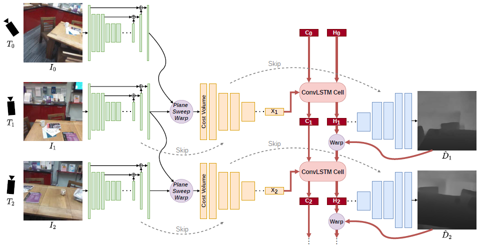

# DeepVideoMVS

DeepVideoMVS: Multi-View Stereo on Video with Recurrent Spatio-Temporal Fusion


## 引言


场景的部分的几何信息可以用于当前时刻的深度预测，使得结果改善并连贯。使用 ConvLSTM 来


提出了一个基础的，仅使用 2D CNN 的预测网络，可以实时预测并节省内存。并且在这个网络的基础上，引入 ConvLSTM 模块的网络，有效提升效果。


pair network


fusion network


## 方法


Pair Network



cost-volume-based, stereo depth prediction network.


novel approach that integrate information flow between successive frames in the latent space over time


## 代码实现

### 环境配置

#### 安装 PyTorch3D

https://github.com/facebookresearch/pytorch3d/blob/main/INSTALL.md

PyTorch3D 只支持 PyTorch 1.10+，且最好配合 Cuda 11.7+ 使用。安装好 PyTorch 和 Cuda 后，再安装下面的库：

```
conda install -c fvcore -c iopath -c conda-forge fvcore iopath
```

然后从原码编译

```
pip install "git+https://github.com/facebookresearch/pytorch3d.git@stable"
```


#### 其他配置

```
kornia==0.4.1
```


### 读取数据


### Pair - 创建模型


共有四个子模型。特征提取部分使用两个模型组成 U-Net 结构，Cost Volume 部分也使用两个模型组成 U-Net 结构。

```py
feature_extractor = FeatureExtractor()
feature_shrinker = FeatureShrinker()
cost_volume_encoder = CostVolumeEncoder()
cost_volume_decoder = CostVolumeDecoder()
model = [feature_extractor, feature_shrinker, cost_volume_encoder, cost_volume_decoder]
```


#### 特征提取器


##### Feature Extractor

特征提取器是一个预训练的 MNASNet 模型。使用 FPN，会收集5个尺寸的特征。

```py
class FeatureExtractor(torch.nn.Module):
    def __init__(self):
        super(FeatureExtractor, self).__init__()
        backbone_mobile_layers = list(models.mnasnet1_0(pretrained=True).layers.children())

        self.layer1 = torch.nn.Sequential(*backbone_mobile_layers[0:8])
        self.layer2 = torch.nn.Sequential(*backbone_mobile_layers[8:9])
        self.layer3 = torch.nn.Sequential(*backbone_mobile_layers[9:10])
        self.layer4 = torch.nn.Sequential(*backbone_mobile_layers[10:12])
        self.layer5 = torch.nn.Sequential(*backbone_mobile_layers[12:14])

    def forward(self, image):
        layer1 = self.layer1(image)
        layer2 = self.layer2(layer1)
        layer3 = self.layer3(layer2)
        layer4 = self.layer4(layer3)
        layer5 = self.layer5(layer4)

        return layer1, layer2, layer3, layer4, layer5
```


##### Feature Shrinker

接收来自提取器的结果，将输出的特征调整成目标尺寸。输入特征的特征维度：`[16, 24, 40, 96, 320]`，输出特征维度都是 32。

```py
def forward(self, layer1, layer2, layer3, layer4, layer5):
    fpn_input = OrderedDict()
    ...
    fpn_output = self.fpn(fpn_input)

    features_half = fpn_output['layer1']
    features_quarter = fpn_output['layer2']
    features_one_eight = fpn_output['layer3']
    features_one_sixteen = fpn_output['layer4']

    return features_half, features_quarter, features_one_eight, features_one_sixteen
```


### Cost Volume


#### Cost Volume Encoder


#### Cost Volume Decoder


### Pair - 前向过程

首先冻结预训练模型，训练剩下三个模型。之后全部模型一起训练。

#### 特征提取

首先将所有图片通过特征提取器，最终会收集四个尺寸的特征。

`pairnet.run-training.forward_pass()`

```py
for i in range(0, len(images)):
    images_cuda.append(images[i].cuda())
    poses_cuda.append(poses[i].cuda())
    depths_cuda.append(depths[i].cuda())
    feature_half, feature_quarter, feature_one_eight, feature_one_sixteen = feature_shrinker(*feature_extractor(images_cuda[i]))
    feature_halfs.append(feature_half)
    feature_quarters.append(feature_quarter)
    feature_one_eights.append(feature_one_eight)
    feature_one_sixteens.append(feature_one_sixteen)
```


创建 Cost Volume


### Fusion - 创建模型



共有五个子模型。特征提取部分使用两个模型组成 U-Net 结构，一个 Cost Volume 编码器，一个 LSTM fusion 模块，最后一个 Cost Volume 解码器。

```py
feature_extractor = FeatureExtractor().cuda()
feature_shrinker = FeatureShrinker().cuda()
cost_volume_encoder = CostVolumeEncoder().cuda()
lstm_fusion = LSTMFusion().cuda()
cost_volume_decoder = CostVolumeDecoder().cuda()

model = [feature_extractor, feature_shrinker, cost_volume_encoder, lstm_fusion, cost_volume_decoder]
```


### Fusion - 前向过程

#### 特征提取

和 Pair Net 部分一样，输出四个尺寸的特征图。


#### 创建 Cost Volume

使用当前帧和上一帧创建 Cost Volume，


wrap

```py
h_cur = warp_frame_depth(image_src=h_cur,
                         depth_dst=estimated_current_depth,
                         src_trans_dst=transformation,
                         camera_matrix=camera_matrix,
                         normalize_points=False,
                         sampling_mode='bilinear')
```


