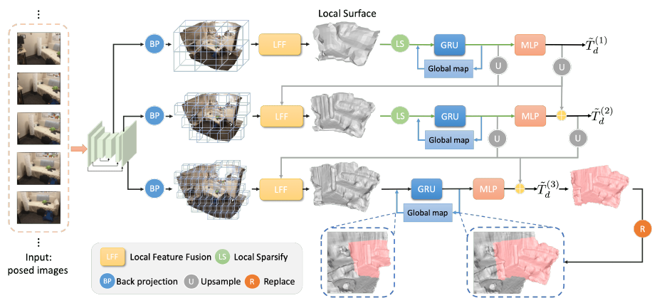

# VisFusion

Visibility-aware Online 3D Scene Reconstruction from Videos


## 论文

### 引言

本文提出的是一种实时的三维重建的方法，不需要预览完整的视频，和 Nerual Recon 类似。前作的三维重建通常会采取两阶段的方法，首先预测关键帧的深度图，然后将深度图转换为 TSDF Volume，最后提取 3D mesh。这种方法难以达到全局连贯性，由于低纹理区域 (如：墙面) 的深度很难估计，所以会影响后续的操作。近期的工作 (NeuralRecon, PlanarRecon) 提出在深度图生成的 TSDF Volume 上直接进行回归，以求达到全局连贯性。

遮盖影响 fusion，之前的工作要么忽视遮盖，在体素上使用特征的均值，或使用 attention 隐式学习应对遮盖。但这些方法不足以消除遮盖的影响，所以本作提出要使用监督模型显式预测每个体素的能见度权重。空体素和完全遮盖的体素在任何角度都是不可见的。

在一段观察相同 3D 场景的短片中，首先将 3D 体素投射到每个关键帧上，收集各个帧上的的 2D 特征进行比较，如果帧的特征与其他帧同体素位置上的特征不同，就代表在这个帧上有了遮盖。由此根据特征的相似度计算可见度权重。

Volumetric-based 方法通常使用金字塔形的结构逐步精细化体素，并删除阈值过低的体素。这种方法可能会错误删除过细物件的体素。所以应该根据占位概率排列光线路径上的体素。


### 相关论文

**Multi-view depth estimation**

- COLORMAP：传统方法，对于无特征区域重建效果不好。
- SimpleRecon：从图片预测深度图，后续使用深度融合的方法如 TSDF
- KinectFusion：简单高效的两阶段方法，但会有计算量重叠。

**End-to-end 3D scene reconstruction**

- SurfaceNet：首个使用 volumetric 方法和 3D CNN 预测


### 方法




## 代码实现

### 读取数据

**创建数据集**

创建数据集时读取所有配对信息，每行配对信息作为一个样本，和 NeuralRecon 的处理一样。

```py
def build_list(self):
    if self.scene is None:
        # load data for all scenes in the train/val/test split
        path = os.path.join(self.datapath, self.tsdf_file, 'fragments_{}.pkl'.format(self.mode))
    else:
        # load data for a specific scene
        path = os.path.join(self.datapath, self.tsdf_file, self.scene, 'fragments.pkl')
    with open(path, 'rb') as f:
        metas = pickle.load(f)

    # Sample data from ScanNetv2-Pre, only similar to ScanNetv1
   	# metas[0] = {
    #   'scene': 'scene0000_00', 'fragment_id': '000800',
    #   'image_ids': ['000000', '000100', '000200', '000300', '000400', '000500', '000600', '000700', '000800'],
    #   'vol_origin': array([-0.8577213, -1.1173394, -1.573204 ], dtype=float32),
    #   'voxel_size': 0.04
    #   }
    # vol_origin is the world coords for first voxel, it is the same within one scene
    return metas
```

**读取样本**

读取以下数据：

```py
items = {
    'imgs': imgs,                       # 9 images
    'depth': depth,                     # if load_gt = true, load 9 depth map, 
    'intrinsics': intrinsics,           # (9, 3, 3)
    'poses': poses,           			# (9, 4, 4)
    'tsdf_list_full': tsdf_list,        # if load_gt = true, load 3 TSDF for 3 stages, no. of vox roughly halved in each stage, and not same in diff. scene
    'vol_origin': meta['vol_origin'],   # (3,), voxel origin in world coordinate
    'scene': meta['scene'],             # string, scene/folder name
    'fragment': meta['scene'] + '_' + str(meta['fragment_id']),     # scene name + fragment name
    'epoch': [self.epoch],              # for random, value from: TrainImgLoader.dataset.epoch = epoch_idx
}
```

之后进行数据变换和增强，有以下变换。首先将图片0填充到 4:3 的尺寸，然后缩小到 640 ×480。之后将图片、深度图、内参外参矩阵和 TSDF 标签转换为张量。

```py
transform = [transforms.ResizeImage((640, 480)),
             transforms.ToTensor(),
             transforms.RandomTransformSpace(
                 cfg.MODEL.N_VOX, cfg.MODEL.VOXEL_SIZE, random_rotation, 								 random_translation, paddingXY, paddingZ, 
                 max_epoch=cfg.TRAIN.EPOCHS),
             transforms.IntrinsicsPoseToProjection(n_views, 4)]
transforms = transforms.Compose(transform)
```

然后对场景进行变换，仅更新外参矩阵和 TSDF volume。TSDF 值是高密度降采样到模型使用的尺寸。OCC 来自只用9张图片搭建的 TSDF 。


`IntrinsicsPoseToProjection`

最后计算各个图片/视角投影矩阵，结合内外参矩阵。

- `world_to_aligned_camera`：(4x4)，世界坐标投射到中间的相机/图片上，有旋转 ??
- `proj_matrices` 和 `proj_matrices_inv`：(9x4x4x4)：世界坐标投射到每个相机/图片上，4个投影矩阵分别对应原图和3个 stage。


### 创建模型

`models.VisFusion`

```py
def __init__(self, cfg):
    super(VisFusion, self).__init__()
    
    self.cfg = cfg.MODEL

    alpha = float(self.cfg.BACKBONE2D.ARC.split('-')[-1])
    self.pixel_mean = torch.Tensor(cfg.MODEL.PIXEL_MEAN).view(-1, 1, 1)
    self.pixel_std = torch.Tensor(cfg.MODEL.PIXEL_STD).view(-1, 1, 1)
    self.n_scales = len(self.cfg.THRESHOLDS) - 1

    # networks
    self.backbone2d = MnasMulti(alpha)
    self.coarse_to_fine_recon = ReconNet(cfg.MODEL)
    self.fuse_to_global = GlobalFusion(cfg.MODEL, direct_substitute=True)
```


### 前向过程

#### 特征提取

通过 MNASNet 的特征提取器获取每张图片在 3 个 stage 的特征图。尺寸分别是 `24×H/4×W/4`, `40×H/8×W/8` 和 `80×W/16×H/16`。

```py
imgs = torch.unbind(inputs['imgs'], 1)      # (9, B, C, H, W)
features = [self.backbone2d(self.normalizer(img)) for img in imgs]   # (9, 3, B, C, H, W), 3 
```


#### Local feature fusion

从最粗糙的结果开始，进行三次迭代到最细致的结果。

**首轮迭代**

生成 TSDF 区域所有体素的编号坐标，供 24×24×24=13824 个体素。然后在坐标维度上拓展一维，将批量信息加进去。最后将所有编号坐标在批量维度叠起来。

```py
interval = 2 ** (self.n_scales - i)     # 4, 2, 1
scale = self.n_scales - i               # 2, 1, 0
loss_dict[f'loss_{i}'] = torch.Tensor([0.0]).cuda()[0]

if i == 0:
    # generate new coords, coords: (3, 13824)
    coords = self.generate_grid(self.cfg.N_VOX, interval)[0]
    up_coords = []
    for b in range(bs):
        up_coords.append(torch.cat([torch.ones(1, coords.shape[-1], device=coords.device) * b, coords]))
    # (B * 13824, 4)
    up_coords = torch.cat(up_coords, dim=1).permute(1, 0).contiguous()
```

然后取出当前 stage 对应的特征，送入 `visible_fusion()`。

```py
feats = torch.stack([feat[scale] for feat in features])
volume, view_weights, view_mask_targets, count = self.visible_fusion(up_coords, feats, inputs, self.cfg.VOXEL_SIZE, scale, output_gt=compute_loss)
```


##### Visible fusion

**流程**

- 获取样本信息
- 计算体素有效性


**获取样本信息**

- `feature_volume_all`：每个体素在每个视角下的特征
- `visibility_values_all`：每个体素的相似度特征
- `mask_all`：每个体素在每个视角下的 mask
- `im_z_normal_all`：每个体素的深度 ??
- `visibility_target_all`：每个体素在每个视角下可见性的标签，需要计算 loss 才会使用
- `c_coords`：每个体素的编号坐标，含有批量信息

```py
# (B * 13824, 9, C)
feature_volume_all = torch.zeros(n_points_all, n_views, c, device=device)
# (B * 13824, 72)
visibility_values_all = torch.zeros(n_points_all, self.similarity_dim, device=device)
# (B * 13824, 9)
mask_all = torch.zeros(n_points_all, n_views, dtype=torch.bool, device=device)
# (B * 13824, 1)
im_z_norm_all = torch.zeros(n_points_all, 1, device=device)
# (B * 13824, 72)
visibility_target_all = torch.zeros(n_points_all, n_views, dtype=torch.bool, device=device) if output_gt else None
# (B * 13824, 4)
c_coords = coords.detach().clone().float()
```

迭代批量中的每个样本，单独计算

```py
batch_ind = torch.nonzero(coords[:, 0] == batch).squeeze(1)
n_points = len(batch_ind)

# 获取该样本的体素
coords_batch = coords[batch_ind][:, 1:].view(-1, 3) 	# [n_points, 3]
feats_batch = feats[:, batch] 							# [n_views, c, h, w]

# 获取当前 stage 和原图的投影矩阵
proj_feat_batch = inputs['proj_matrices'][batch, :, scale+1] 	# [n_views, 4, 4]
proj_img_batch = inputs['proj_matrices'][batch, :, 0] 			# [n_views, 4, 4]

# 获取体素原点的世界坐标
origin_batch = inputs['vol_origin_partial'][batch].unsqueeze(0)  	# [1, 3]
```

计算所有体素的世界坐标在所有视角下的世界坐标，所有视角下使用同样的世界坐标。在坐标的最后一维加1，转换成 homogeneous coordinate。

```py
# (13824, 3)
world_coords_batch = coords_batch * voxel_size + origin_batch.float()
# (9, 13824, 3)
w_coords = world_coords_batch.unsqueeze(0).expand(n_views, -1, -1)
w_coords =w_coords.permute(0, 2, 1).contiguous()
# (9, 4, 13824)
w_coords = torch.cat([w_coords, torch.ones([n_views, 1, n_points], device=device)], dim=1)
```


**计算体素可投影性**

```py
# get the mask of views for each voxel, roughly 2~3k vox valid in each image at stage 1
mask = self.get_view_mask(w_coords, voxel_size, scale, inputs['imgs'][batch], proj_img_batch)
```

与 NeuralRecon 不同的是，这里的可投影性计算更严格。对每个体素生成其8个角的世界坐标，只有8个角都可以投影到图片上 (像素坐标不超过图片尺寸的1.1倍??)，且体素深度为正数，才认为该体素可以投影到图片上。而 NeuralRecon 中，只要体素的中心点在可以投影到图片上且体素深度为正数就算可投影。

`get_view_mask()`

```py
rs_grid_corners = coords[:, :, None].clone()

# get the coords of voxel corners, (8, 4)
corners = torch.tensor([[0.5, 0.5, 0.5, 0.0], [0.5, 0.5, -0.5, 0.0],
                        [0.5, -0.5, 0.5, 0.0], [0.5, -0.5, -0.5, 0.0],
                        [-0.5, 0.5, 0.5, 0.0], [-0.5, 0.5, -0.5, 0.0],
                        [-0.5, -0.5, 0.5, 0.0], [-0.5, -0.5, -0.5, 0.0]])
corners = corners.transpose(1, 0).to(device=coords.device, dtype=coords.dtype)[None, :, :, None]   # (1, 4, 8, 1)
rs_grid_corners = rs_grid_corners + corners * voxel_size * (2 ** scale)
rs_grid_corners = rs_grid_corners.reshape([n_views, 4, -1])

# project to image
im_p_corners = proj_mats @ rs_grid_corners
im_x_corners, im_y_corners, im_z_corners = im_p_corners[:, 0], im_p_corners[:, 1], im_p_corners[:, 2]
im_x_corners /= im_z_corners
im_y_corners /= im_z_corners
im_grid_corners = torch.stack([2 * im_x_corners / (im_w - 1) - 1, 2 * im_y_corners / (im_h - 1) - 1], dim=-1)
im_grid_corners = im_grid_corners.reshape([n_views, 8, coords.shape[2], 2])

# assign True if any of the 8 corners could be projected within the image, 1.1??
mask = ((im_grid_corners.abs() <= 1.1).all(dim=-1) & (
        im_z_corners.reshape([n_views, 8, coords.shape[2]]) > 0)).any(dim=1)
```


**计算体素真实的可见性**

上述计算中，图片中每条光线上所有的体素都认为可投影 (包括物体后面)，而现实中可能光线上前面的某个体素是物体，使光线上后续体素不可见，因此利用深度图标签计算体素真实的可见性，只有物体表面的体素为可见，空体素和被遮挡的体素都不算可见。计算结果也作为标签不参与预测。

```py
if output_gt:
    vis_target = get_visibility_target(w_coords, voxel_size, scale, inputs['depths'][batch], proj_img_batch, mask, margin=3)
    visibility_target_all[batch_ind] = vis_target.permute(1, 0)
```

将所有体素投影到每张深度图上，获取对应像素上的深度。对于在该图片中可能可见的体素，筛选出表示物体的体素，也就是物体表面在光线上前后2~3个体素。

`get_visibility_target()`

```py
# project grid to depth images
im_p = proj_mats @ coords # [n_views, 4, n_points]
im_x, im_y, im_z = im_p[:, 0], im_p[:, 1], im_p[:, 2]
im_x /= im_z
im_y /= im_z

# extract depths
im_grid = torch.stack([2 * im_x / (im_w - 1) - 1, 2 * im_y / (im_h - 1) - 1], dim=-1) # [n_views, n_points, 2]
im_grid = im_grid.view(n_views, 1, -1, 2) # [n_views, 1, n_points, 2]
depths_gt = depths_gt.view(n_views, 1, im_h, im_w) # [n_views, 1,  H, W]
depths = grid_sample(depths_gt, im_grid, mode='nearest', padding_mode='border', align_corners=True)
depths = depths.view(n_views, -1) # [n_views, n_points]

# mask out voxels outside camera frustums
depths[mask == False] = 0

# calculate tsdf
sdf_trunc = margin * voxel_size * 2 ** scale   # margin = 3
tsdf = (depths - im_z) / sdf_trunc
# (tsdf >= -1) & (tsdf <= 1) indicates that voxel's depth from camera matches with the depth at that pixel,
# so it is occupied and the first voxel to be seen from camera.
visibility_mask = mask & (depths > 0) & (tsdf >= -1) & (tsdf <= 1)
visibility_mask[(visibility_mask.sum(0) == 1).unsqueeze(0).expand(n_views, -1)] = 0
```

最终每张图的真实可见体素约为 400~900个。


**采样体素对应的特征和深度**

将所有体素投影到每张特征图上，采样特征。并将不可投影的体素的特征和深度置为0。

```py
# project to feature maps
im_p = proj_feat_batch @ w_coords  # [n_views, 4, n_points]
im_x, im_y, im_z = im_p[:, 0], im_p[:, 1], im_p[:, 2]
im_x /= im_z
im_y /= im_z

# extract features from feature maps
im_grid = torch.stack([2 * im_x / (w - 1) - 1, 2 * im_y / (h - 1) - 1], dim=-1)  # [n_views, n_points, 2]
im_grid = im_grid.view(n_views, 1, -1, 2)  # [n_views, 1, n_points, 2]
features = grid_sample(feats_batch, im_grid, padding_mode='border', align_corners=True)
features = features.view(n_views, c, -1)  # [n_views, c, n_points]

# remove nan
mask = mask.view(n_views, -1)  # [n_views, n_points]
features[mask.unsqueeze(1).expand(-1, c, -1) == False] = 0
im_z[mask == False] = 0

# 保存特征和可见性信息
feature_volume_all[batch_ind] = features.permute(2, 0, 1).contiguous()
mask_all[batch_ind] = mask.permute(1, 0)
```


**计算特征相似度**

使用 cosine similarity。得到每个体素在每对视角下的相似度。然后清除同视角下的相似度，剩余 72 个相似度分数，然后展平保存。

```py
feature_norm = torch.linalg.norm(features, dim=1)  # [n_views, n_points]
feature_norm = features / (feature_norm.unsqueeze(1) + 1e-10)  # [n_views, c, n_points]
# [n_points, n_views, n_views]
similarity_map = feature_norm.permute(2, 0, 1) @ feature_norm.permute(2, 1, 0)

# remove diagonal entries and flatten the maps as vectors
visibility_values = similarity_map.reshape(n_points, -1)[:, :-1].reshape(
    n_points, n_views - 1, n_views + 1)[:, :, 1:].reshape(n_points, -1)
visibility_values_all[batch_ind] = visibility_values
del similarity_map, visibility_values
```


**标准化深度**

计算体素可投影时的平均深度，然后计算全部体素可投影且深度为正时的均值方差，进行标准化。

```py
im_z = im_z.sum(dim=0).unsqueeze(1) / (mask.sum(dim=0) + 1e-10).unsqueeze(1)  # [n_points, 1] mean of views
im_z_mean = im_z[im_z > 0].mean()
im_z_std = torch.norm(im_z[im_z > 0] - im_z_mean) + 1e-5
im_z_norm = (im_z - im_z_mean) / im_z_std
im_z_norm[im_z <= 0] = 0
im_z_norm_all[batch_ind] = im_z_norm
```


**保存所有体素在中间的视角下的坐标**

```py
# convert from world to aligned camera coordinate
c_coords_batch = torch.cat((world_coords_batch, torch.ones_like(world_coords_batch[:, :1])), dim=1)
c_coords_batch = c_coords_batch @ inputs['world_to_aligned_camera'][batch, :3, :].permute(1, 0).contiguous()
c_coords[batch_ind, 1:] = c_coords_batch
```

以上操作对每个样本执行一次。


**可见性权重**

跳出批量的循环后，使用 sparse 3D CNN 计算每个体素在每个视角下的可见性权重，将其与特征算加权和。预期能降低空体素和被遮挡体素的权重，使得融合的特征都是在物体表面的体素的特征。然后将标准化后的深度添加到特征最后一维。

```py
# predict weights for different views by sparse 3D convolution
c_coords = c_coords[:, [1, 2, 3, 0]]
point_feat = PointTensor(visibility_values_all, c_coords)
# (B * 13824, 9)
view_weights = self.view_select[self.n_scales - scale](point_feat, pres=1,
                                                       vres=self.cfg.VOXEL_SIZE * 2 ** scale)

# mask out voxels outside camera frustums
view_weights = view_weights * mask_all

# feature fusion
feature_volume = (feature_volume_all * view_weights.unsqueeze(2)).sum(1)
del feature_volume_all

# (B * 13824, 81)
feature_volume = torch.cat([feature_volume, im_z_norm_all], dim=1)
# (B * 13824, 9), 依旧包含空体素和被遮挡体素
count = mask_all.sum(dim=1).float()

# feature_volume: 	(B * n_voxels, C+1)
# view_weights: 	(B * n_voxels, n_views)
# visibility_target_all: 	(B * n_voxels, n_views)
# count: 			(B * n_voxels,)
return feature_volume, view_weights, visibility_target_all, count
```


#### 可见性权重损失

计算可投影体素预测出的 `view_weights` 和真实的 `visibility_target_all` 的 L2 损失。使得 `view_weights` 提高物体表面的体素的权重，降低空体素和被遮挡的体素的权重。也只考虑有特征的体素的损失。

```py
# true if voxel can be projected in any image
grid_mask = count > 0
# compute view select loss
if compute_loss:
    weights_loss = self.compute_view_select_loss(view_weights, view_mask_targets.float(), grid_mask)
    loss_dict[f'loss_{i}'] += weights_loss
```

`compute_view_select_loss()`

```py
if mask is not None:
    mask = mask.view(-1)
    view_weights = view_weights[mask]
    view_weights_target = view_weights_target[mask]

loss = torch.Tensor([0.0]).cuda()[0]
if mask.sum() != 0:
    # compute visibility L2 loss
    occ_view_mean = view_weights_target / (view_weights_target.sum(dim=1, keepdims=True) + 1e-10)
    loss = (occ_view_mean - view_weights).pow(2).mean()

return loss
```


**计算 TSDF 特征**

再次计算所有体素在中间的视角下的坐标，和融合权重后的特征一起送入 sparse 3D CNN 得出本个 stage 用于计算 TSDF 的特征。

```py
# sparse 3D convolution
point_feat = PointTensor(feat, r_coords)
feat = self.sp_convs[i](point_feat)
```


**计算 TSDF 值和 OCC 值**

OCC 值代表体素是否处于一个表面。

```py
if i != 0 and up_near_feat is not None:
    feat = feat[:up_feat.shape[0]]
    up_coords = up_coords[:up_feat.shape[0]]

# predict local TSDF and occupancy
tsdf = self.local_tsdf_preds[i](feat)	# (B * n_voxels, 1)
occ = self.local_occ_preds[i](feat)		# (B * n_voxels, 1)
```


#### TSDF 和 OCC 损失

读取标签然后进行比较，一样只比对有特征的体素。

```py
if compute_loss:
    tsdf_target, occ_target = self.get_target(up_coords, inputs, scale)
    local_loss = self.compute_loss(tsdf, occ, tsdf_target, occ_target, grid_mask, self.cfg.POS_WEIGHT)
    loss_dict[f'loss_{i}'] += local_loss
```

由于标签和预测值的尺寸不同，将预测值的编码坐标映射到标签的尺寸 (0~24 -> 0~24)，然后采样。

`get_target()`

```py
tsdf_target = inputs['tsdf_list'][scale]	# (B, 24, 24, 24)
occ_target = inputs['occ_list'][scale]		# (B, 24, 24, 24)
coords_down = coords.detach().clone().long()
coords_down[:, 1:] = torch.div(coords[:, 1:], 2 ** scale, rounding_mode='trunc')

tsdf_target = tsdf_target[coords_down[:, 0], coords_down[:, 1], coords_down[:, 2], coords_down[:, 3]]	  # (B * n_voxels)
occ_target = occ_target[coords_down[:, 0], coords_down[:, 1], coords_down[:, 2], coords_down[:, 3]]		# (B * n_voxels)
```

对 OCC 值计算 BCE 损失，对 TSDF 值进行对数变换，然后计算预测值和标签的差值的均值。使用对数可以更强调小于1的差值的重要性。

`compute_loss()`

```py
# compute occ BCE loss
occ_loss = F.binary_cross_entropy_with_logits(occ, occ_target.float(), pos_weight=w_for_1)

# compute TSDF L1 loss
tsdf = apply_log_transform(tsdf[occ_target])
tsdf_target = apply_log_transform(tsdf_target[occ_target])
tsdf_loss = torch.mean(torch.abs(tsdf - tsdf_target))

# compute final loss
loss = loss_weight[0] * occ_loss + loss_weight[1] * tsdf_loss
```


#### Ray-based Local Sparsification

计算留下参与下一轮迭代的体素。首先创建两个图片平面，近的深度为 0.2，远的深度为 3.5，长宽是特征的长宽。

```py
near, far = near_far
ys, xs = torch.meshgrid(torch.linspace(0, H - 1, H, device=device), torch.linspace(0, W - 1, W, device=device)) # HW
# (30, 40, 3)
near_plane = torch.stack((xs, ys, torch.ones_like(xs, device=device)), dim=-1) * near
# (30, 40, 3)
far_plane = torch.stack((xs, ys, torch.ones_like(xs, device=device)), dim=-1) * far
```

在中间均匀创建 34 个同样的平面，共 36 个平面，组成一个 volume。然后 flatten。

```py
linspace_z = torch.linspace(0.0, 1.0, D, device=device).view(D, 1, 1, 1)
pts_volume = (1.0 - linspace_z) * near_plane + linspace_z * far_plane # [D=36, H, W, 3]
pts_volume = pts_volume.view(-1, 3).T   # (3, D*H*W)
```

将 volume 给每个视角复制一份，然后用每个视角的逆投影矩阵将 volume 投影到世界坐标。

```py
R = proj_feat_batch[:, :3, :3] # [n_views, 3, 3]
T = proj_feat_batch[:, :3, 3:] # [n_views, 3, 1]

# transform points from camera to world
pts_volume = pts_volume[None].expand(N_views, -1, -1)
pts_volume = R @ pts_volume + T # [n_views, 3, n_samples]
pts_volume = pts_volume.permute(0, 2, 1).contiguous().view(N_views, D, H, W, 3) # (n_views, D, H, W, 3)
```

创建每个体素在 24x24x24 的区域的编号坐标。

```py
dim = torch.div(torch.Tensor(N_VOX), 2 ** scale, rounding_mode='trunc').int()
dim_list = dim.data.cpu().numpy().tolist()
occ_coords = torch.div(coords_batch.long(), 2 ** scale, rounding_mode='trunc') # [n_points, 3]

# sparse to dense, (13824,) -> (24, 24, 24) ??
occ_volume = sparse_to_dense_torch(occ_coords, occ_batch, dim_list, default_occ_value, device)   # (24)
occ_mask = sparse_to_dense_torch(occ_coords, 1, dim_list, 0, device, dtype=torch.bool)
```

将出每个视角的 volume 的点的世界坐标转化为编号坐标，如 `[ 18,  16,  11]`。然后将体素区域中间点定位在 11.5，计算每个编号坐标与体素区域的比值。

```py
pts_volume = torch.round((pts_volume - origin_batch) / voxel_size / 2 ** scale).long() # [n_views, D, H, W, 3]
pts_volume_n = 2 * pts_volume / (torch.Tensor(dim_list).cuda() - 1) - 1
pts_volume_n = pts_volume_n[:, :, :, :, [2, 1, 0]]
occ_volume_n = occ_volume[None, None, ...].expand(N_views, -1, -1, -1, -1)
```

采样 volume 所在位置附近的体素的 OCC 值，形状是 `[n_views, D, H, W]`。

```py
pts_occ = F.grid_sample(occ_volume_n, pts_volume_n, mode='nearest', padding_mode='border', align_corners=False).squeeze(1)
```

xyz 任何一个维度超出体素区域的点会被忽略

```py
valid_mask = (pts_volume_n.abs() <= 1).sum(dim=-1) == 3 # [n_views, D, H, W]
del pts_volume_n
valid_mask[pts_occ == default_occ_value] = False
pts_occ[valid_mask == False] = default_occ_value # [n_views, D, H, W]
```


体素
