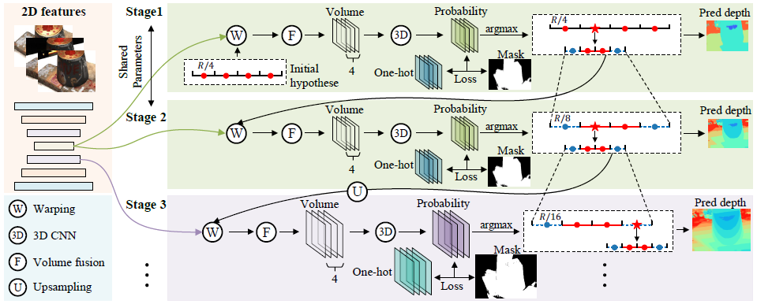

# GBi-MVSNet

总体框架如图所示。它主要由两部分组成，即用于学习视觉图像表达的2D CNN网络和用于迭代深度估计的广义二进制搜索网络。GBi-Net包含K个搜索阶段，在每个搜索阶段，首先通过参考特征图和源特征图在特定对应比例下的单应性变化和4个深度假设，来计算3D代价体并进行融合。然后利用3D CNN对代价体进行正则化，以进行深度标签预测。广义二进制搜索能够根据预测的标签迭代初始化和更新深度假设。在每两个阶段中，网络处理相同尺度的特征图，并共享网络参数。最后，根据深度图GT计算出一个训练整个网络的One-hot标签。





## Model

- Feature Extractor
- Cost Network
- View Weight Nets


### Feature Extractor

- `StageFeatExtNet`
- `DeformStageNet`

特征提取器最终产生 `stage_num` 个不同通道数和尺寸的特征图，只支持3或4。通道数通过配置文件的 `output_channels` 调整，通常 `[32, 32, 16, 8]`。尺寸暂时无法调整，默认为 [8, H, W], [16, H/2, W/2], [32, H/4, W/4], [B, 64, H/8, W/8]。

`group_nums` 通常 `[8, 8, 8, 4]`


#### `StageFeatExtNet`

U-net 结构，`stage_num = 4` 为例，通过 2D CNN 获得 4 个 [8, H, W], [16, H/2, W/2], [32, H/4, W/4], [B, 32, H/8, W/8] 的特征图，此阶段的特征图形状比例固定。`stage_num = 3` 则没有尺寸 /8 的特征图。然后对低尺寸的特征图进行 bilinear 尺寸上采样，和高一层尺寸的特征图相加，然后通过一个卷积层到该层要求的通道个数（该层的输出通道数不一定等于尺寸压缩时的通道数）。


#### `DeformStageNet`

输出特征图形状与上面的网络一致，只是在从中间尺寸到该层要求的尺寸的时候使用 Deformable Convolution 代替普通卷积。


最终特征抽取器输出为 4 个特征图，形状为：

```
[B, 32, H/8, W/8]
[B, 32, H/4, W/4]
[B, 16, H/2, W/2]
[B, 8, H, W]
```


### Feature Fetcher

根据相机参数抓取 `world_points` 在 src 特征上的特征。


### Cost Network

#### `CostRegNetBN`

小型 3DCNN 网络，使用 Batch Norm，U-net结构，通道最大到 64，有残差连接，最后输出的通道数为1，也就是输出深度的概率图。每个 stage 各有一个，每个的通道数都是 `group_nums[i]` 到 8，也就是输出都是 8 通道数。


### View Weight Nets

#### `PixelwiseNet`

小型 3DCNN 网络。每个 stage 各有一个，输入通道数是 `group_nums[i]`。通过 3DCNN 聚合通道维/group 维，输出通道数是1，然后使用 sigmoid 和在 Ndepth 维抽最大。最终得到 1xHxW 的特征表示每个像素的权重，用在单应性变换。

```py
# estimate pixel-wise view weight
class PixelwiseNet(nn.Module):
    def __init__(self, in_channels):
        super(PixelwiseNet, self).__init__()
        self.conv0 = Conv3dUnit(in_channels, 16, kernel_size=1, stride=1, padding=0, norm="batchnorm")
        self.conv1 = Conv3dUnit(16, 8, kernel_size=1, stride=1, padding=0, norm="batchnorm")
        self.conv2 = nn.Conv3d(8, 1, kernel_size=1, stride=1, padding=0)
        self.output = nn.Sigmoid()

    def forward(self, x1):
        # x1: [B, G, Ndepth, H, W]
        # [B, Ndepth, H, W]
        x1 = self.conv2(self.conv1(self.conv0(x1))).squeeze(1)

        output = self.output(x1)
        del x1
        # [B,H,W]
        output = torch.max(output, dim=1)[0]

        return output.unsqueeze(1)  # [B,1,H,W]
```


## Loss Function & Metric

`GBiNet_loss`

将预测视为分类问题，因此使用常见的交叉熵分类损失函数，首先将预测值的通道/分类维放到最后一维，然后和真实值一起过 mask，最后传入交叉熵分类损失函数。

```py
def GBiNet_loss(preds, gt_label, mask):
    # preds: B, C, H, W, gt_label: B, H, W, mask: B, H, W
    mask = mask > 0.0  # B, H, W
    preds = preds.permute(0, 2, 3, 1)  # B, H, W, C
    preds_mask = preds[mask]  # N, C
    gt_label_mask = gt_label[mask]  # N
    loss = F.cross_entropy(preds_mask, gt_label_mask, reduction='mean')
    return loss
```


**Metric**

```
"thres2mm_accu"
```


## Dataset: DTU

### Init

```py
self.datapath = datapath				# 数据位置
self.listfile = listfile				# 场景列表
self.mode = mode                        # train/val
self.nviews = nviews                    # 5
self.ndepths = ndepths                  # 256, 在 stage 网络中似乎没有使用
self.interval_scale = interval_scale    # 0.8, 0.8*2.5=2, 最终的 depth_interval
self.img_mean = img_mean				# 对所有图片按照提供的均值方差进行标准化
self.img_std = img_std
self.out_scale = out_scale              # 1.0, scale the image and intrinsic
self.self_norm = self_norm              # T: 每张图片自己标准化, F: 按照提供的均值方差进行标准化
self.color_mode = color_mode			# "RGB", "BGR" or None, 加载图片到对应的颜色模式
self.is_stage = is_stage				# 是否使用 stage，默认使用，就会输出多个尺寸的图片
self.stage_info = stage_info			# 配置文件中的 stage_info
self.random_view = random_view			# src视角是列表中随机选n个还是按顺序前n个
if img_interp == "linear":				# 升降尺寸用的采样方法
    self.img_interp = cv2.INTER_LINEAR
elif img_interp == "nearest":
    self.img_interp = cv2.INTER_NEAREST
else:
    self.img_interp = cv2.INTER_LINEAR
self.random_crop = random_crop			# 是否随机裁剪，默认F
self.crop_h = crop_h
self.crop_w = crop_w
self.depth_num = depth_num				# 4, error bins?
```


数据

```py
self.metas		# 所有ref图片和src图片列表的列表
self.metas[0] = ('scan2', 0, 0, [10, 1, 9, 12, 11, 13, 2, 8, 14, 27])
```


### Get item

**加载ref图片、src图片和相机参数**

```py
imgs			# 存储 ref 和 4 个 src 图片，有标准化
stage_num		# 3 or 4
proj_matrices	# 存储每个 stage 中每张图片的 intrinsic * extrinsic, [4, 4]
cams			# 存储每个 stage 中每张图片的 extrinsic 和 intrinsic, [2, 4, 4]
ref_imgs		# 存储 ref 图片在每个 stage 的图片，没有标准化
ref_cams		# 额外存储 ref 图片在每个 stage 的 extrinsic 和 intrinsic [2, 4, 4]
```


**计算 depth 和 mask**

注意调整 depth 和 mask 的尺寸。

```py
depth_values = [425.0, ..., 935] # 共 256 个值, 区间 510
depth_min_max = [425., 935.]	# 最小最大深度
depths			# ref 图片每个 stage 的深度图 gt
masks			# ref 图片每个 stage 的 mask，mask 掉 mask<0.0 的像素
```


**binary_tree 和 sample_depth**

```py
binary_tree		# [2, stage 0 H, stage 0 W], 第一个维度全1，第二个维度全0
sample_interval	# depth_range / depth_num, 两侧加了 bin 后每个 bin 管理的区间，如 127.5
sample_depth	# [4, stage 0 H, stage 0 W], 使用容错箱，因此初始 bin 也是 4 个，储存每个 bin 的中位深度，如 448.75, 616.25, 743.75, 871.25，并填充到 stage 0 特征的形状
```


`norm_img`

用于标准化图片和 mask，`self_norm=True` 就直接根据均值方差标准化，否则就先将值域从 0-255 转换到 0-1，若提供全局均值方差就再进行标准化，否则就直接返回图片。

```py
def norm_img(self, np_img, self_norm=False, img_mean=None, img_std=None):
    if self_norm:
        var = np.var(np_img, axis=(0, 1), keepdims=True)
        mean = np.mean(np_img, axis=(0, 1), keepdims=True)
        np_img = (np_img - mean) / (np.sqrt(var) + 1e-7)
        return np_img
    else:
        np_img = np_img / 255.		# scale 0~255 to 0~1
        if (img_mean is not None) and (img_std is not None):
            # scale with given mean and std
            img_mean = np.array(img_mean, dtype=np.float32)
            img_std = np.array(img_std, dtype=np.float32)
            np_img = (np_img - img_mean) / img_std
    return np_img
```


## Training

**Optimizer**

```yaml
name: "adam"
base_lr: 1.e-4
weight_decay: 0.0
betas: [0.9, 0.999]
```

**Scheduler**

到达循环将学习率乘 0.5。

```yaml
name: "multi_step"
milestones: [10, 12, 14]
gamma: 0.5
```

**Depth**

```
max_max_tree_depth = cfg["max_depth"]		# 8
init_max_depth = cfg["model"].get("init_max_depth", 2)   # 2
max_tree_depth = min(epoch + init_max_depth, max_max_tree_depth)	# 2
```


### Forward in Training

在前几个循环中不会训练到底。如第一轮中只会在 stage 0 进行两次二值查找。

每个 stage 进行两次二值查找，所以`max_depth` = 8，每一小批数据训经过一次二值查找后马上更新模型。

```py
# 前向单个 stage
self.forward_one_depth(data_batch, stage_id=stage_id)
```


#### Feature Extraction

将所有图片通过特征提取器获得目前 stage 对应的特征图。

```py
img_feature_maps = []
for i in range(num_view):
    curr_img = img_list[:, i, :, :, :]
    curr_feature_map = self.img_feature(curr_img)[str(stage_id)]
    img_feature_maps.append(curr_feature_map)
```

创建 ref 图片的坐标矩阵，用于单应性变换。

```py
# (B, 1, 3, FH*FW)
feature_map_indices_grid = get_pixel_grids(H, W) \
            .view(1, 1, 3, -1).expand(B, 1, 3, -1).to(img_feature_maps[0].device)
```


#### Sequential Warping

将 ref 特征的特征维度拆分成 `(group_num, C // group_num)`，这样让结果不再依赖特征维度，而是依赖 `group_num` 参数。

将 ref 坐标矩阵根据相机参数投影到 4 个 `sample_depth` 的深度上，并变成 `world_points`。开始时所有坐标的 `sample_depth` 是 4 个初始 bin 的中位深度，随着 stage 深入，每个坐标的 `sample_depth` 会由新的 4 个 bin 的 中位深度代替。

```py
# (B, 1, 3, FH*FW)
uv = torch.matmul(torch.inverse(ref_cam_intrinsic).unsqueeze(1), feature_map_indices_grid)

# (B, D, 3, FH*FW)
cam_points = (uv * current_depths.view(B, depth_num, 1, -1))
# world points at all depths, (B, 3, D*FH*FW)
world_points = torch.matmul(R_inv[:, 0:1, :, :], cam_points - t[:, 0:1, :, :]).transpose(1, 2).contiguous().view(B, 3, -1)
```

然后在每个 src 特征上进行采样。采样后和 ref 特征一样拆分特征维度。计算相似度时直接与 ref 特征相乘并在 `C // group_num` 维度取平均然后删除该维度。将相似度结果通过 `view_weight_nets` 得到特征尺寸上相似度的权重。将其与相似度相乘并累加起来。最后除以总权重进行标准化。

```py
similarity_sum = 0.0
pixel_wise_weight_sum = 0.0
for src_idx in range(1, num_views):
    src_fea = torch.unsqueeze(features[src_idx], 1)
    src_cam_intrinsic = cam_intrinsic[:, src_idx:src_idx + 1]   # (B, 1, 3, 3)
    src_cam_extrinsic = cam_extrinsic[:, src_idx:src_idx + 1]   # (B, 1, 3, 4)
    warped_volume = self.feature_fetcher(src_fea, world_points, src_cam_intrinsic, src_cam_extrinsic)   # (B, 1, C, D*FH*FW)
    warped_volume = warped_volume.squeeze(1).view(B, C, depth_num, H, W)
    warped_volume = warped_volume.view(B, group_num, C // group_num, depth_num, H, W)
    similarity = (warped_volume * ref_feature.unsqueeze(3)).mean(2)  # (B, G, D, FH, FW)
    view_weight = self.view_weight_nets[str(stage_id)](similarity)  # (B, 1, FH, FW)
    
    # [B, G, D, H, W]
    similarity_sum = similarity_sum + similarity * view_weight.unsqueeze(1)
    # [B, 1, 1, H, W]
    pixel_wise_weight_sum = pixel_wise_weight_sum + view_weight.unsqueeze(1)

similarity = similarity_sum.div_(pixel_wise_weight_sum)
```

最终 cost volume 形状 `(B, G, D, FH, FW)`。


#### Cost Network

通过 3D CNN 获得该 stage 该 depth 的深度预测图，并取概率最大的深度作为预测值，预测值区间是 bin 的编号。

```py
pred_feature = self.cost_network[str(stage_id)](cost_img)   # (B, 1, D, FH, FW)
pred_feature = torch.squeeze(pred_feature, 1)

pred_label = torch.argmax(pred_feature, 1)      # (B, FH, FW)
pred_prob = torch.max(torch.softmax(pred_feature, 1), 1)[0]     # (B, FH, FW)
```


#### Loss Computation

**从gt深度生成标签**

使用 `depth_update.get_four_label_l4_s4_bin()` 动态生成 `gt_label` 和 `bin_mask`。`bin_edge_list` 形状 `(5, B, FH, FW)`，5个内容代表 4 个 bin 的深度边界，首次是 425, 552.5, 680, 807.5, 935。

```py
bin_edge_list.append(torch.zeros_like(gt_depth_img) + depth_start)
depth_range = depth_end - depth_start
interval = depth_range / 4.0
for i in range(4):
    bin_edge_list.append(bin_edge_list[0] + interval * (i + 1))
```

之后再运行就是根据上一轮的预测深度(bin 中位深度)，在周围画 bin 的边界。之后将 gt 深度映射到对应的 bin 中。如果深度在所有 bin 外就将 `bin_mask` 设置为 `False`，bin 的值为 -1，在里面就是 bin 的数值。也就是说如果坐标的 gt 深度已经超出了坐标上的所有的 bin，mask 就为 False，不会参与梯度回传。

```py
gt_label = torch.zeros(gt_depth_img.size(), dtype=torch.int64, device=gt_depth_img.device) - 1 
for i in range(4):
    bin_mask = torch.ge(gt_depth_img, bin_edge_list[i])
    bin_mask = torch.logical_and(bin_mask, 
        torch.lt(gt_depth_img, bin_edge_list[i + 1]))
    gt_label[bin_mask] = i
bin_mask = (gt_label != -1)
```

然后将的 stage 0 的 `bin_mask_prefix` 做上采样 (有需要的话)，之后和 `bin_mask` 做交集，最后和当前 stage 的 gt mask 做交集，才是最终的 mask。然后送入分类交叉熵损失函数计算损失并更新模型。


**更新的 bin 的区间**

使用 `depth_update.update_4pred_4sample1()` 获得下一轮的深度搜索区间。

```
# stage 0
边界: [425, 552.5, 680, 807.5, 935]
中位: [448.75, 616.25, 743.75, 871.25], 区间长度: 127.5

预测在区间0:
新边界: [425, 425, 488.75, 552.5, 616.25]
新中位: [425, 456.875, 520.625, 584.375], 区间长度: 31.875, 63.75??

预测在区间1:
新边界: [488.75, 552.5, 616.25, 680, 743.75]
新中位: [520.625, 584.375, 648.125, 711.875], 区间长度: 63.75

预测在区间2:
新边界: [616.25, 680, 743.75, 807.5, 871.25]
新中位: [648.125, 711.875, 775.625, 839.75], 区间长度: 63.75

预测在区间3:
新边界: [743.75, 807.5, 871.25, 935, 998.75]
新中位: [775.625, 839.375, 903.125, 935], 区间长度: 31.875, 63.75??
```

更新 `sample_cuda["binary_tree"]["tree"]` 到显示目前在树的哪一层，开始时是全1，一轮后是全2，全2代表总共有 2^3=8个 bin，


#### Metric 计算

预测深度为 bin 的中位深度，gt 深度来自数据集，是真实深度，不是标签对应 bin 的中位深度。

`accu`

计算 bin 标签的准确度，再分别计算 4 个 bin 个别的准确度。由于只是 4 个标签对比，准确度会比较高。

```py
scalar_outputs["accu"] = GBiNet_accu(pred_label, gt_label, mask > 0.0)
scalar_outputs["accu0"] = GBiNet_accu(pred_label, gt_label, torch.logical_and(torch.eq(gt_label, 0), mask > 0.0))
scalar_outputs["accu1"] = GBiNet_accu(pred_label, gt_label, torch.logical_and(torch.eq(gt_label, 1), mask > 0.0))
scalar_outputs["accu2"] = GBiNet_accu(pred_label, gt_label, torch.logical_and(torch.eq(gt_label, 2), mask > 0.0))
scalar_outputs["accu3"] = GBiNet_accu(pred_label, gt_label, torch.logical_and(torch.eq(gt_label, 3), mask > 0.0))
```

`thresxmm_error` 和 `thresxmm_accu`

计算深度差距是否在 2, 4, 8mm 之内。预测深度是 bin 的中位深度，gt 深度是真实深度，因此早期准确度较低。

```py
scalar_outputs["thres2mm_error"] = Thres_metrics(depth_est, depth_gt, mask > 0.0, 2)
scalar_outputs["thres4mm_error"] = Thres_metrics(depth_est, depth_gt, mask > 0.0, 4)
scalar_outputs["thres8mm_error"] = Thres_metrics(depth_est, depth_gt, mask > 0.0, 8)
scalar_outputs["thres2mm_accu"] = 1.0 - scalar_outputs["thres2mm_error"]
scalar_outputs["thres4mm_accu"] = 1.0 - scalar_outputs["thres4mm_error"]
scalar_outputs["thres8mm_accu"] = 1.0 - scalar_outputs["thres8mm_error"]
```

`front_prob` 和 `back_prob`

计算概率图均值。

```py
scalar_outputs["front_prob"] = Prob_mean(prob_map, mask > 0.0)
scalar_outputs["back_prob"] = Prob_mean(prob_map, mask == 0.0)
```


## Setup

```
python==3.8.16
torch==1.9.1
torchvision==0.10.1
torchaudio==0.9.1
tensorboard==
opencv-python
pyyaml
matplotlib
pandas
plyfile
--find-links https://download.openmmlab.com/mmcv/dist/cu111/torch1.9.0/index.html
mmcv-full==1.3.9
```

