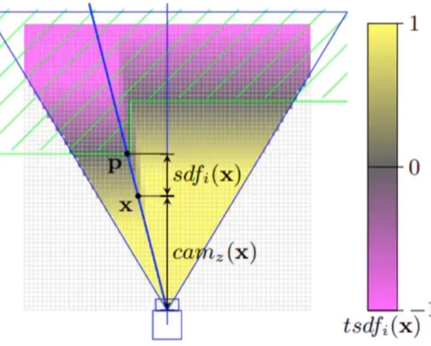
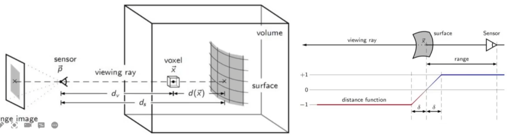
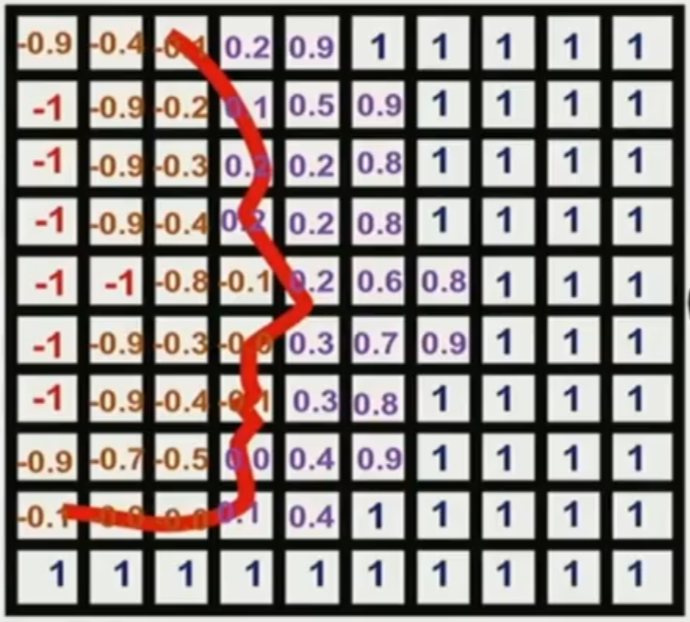

## TSDF

Truncated Signed Distance Function


### 前置条件

- 原始图片
- 图片的深度信息
- 图片的相机内参和外参矩阵 (做坐标系转换)


**流程**

一步步计算各个体素的 TSDF 值，再把它们拼接起来

1. 首先创建一大块空区域 (不能太大，否则 GPU 放不下，所以更适合室内场景)
2. 一般把这个大区域叫做 volume
3. 它有很多个小正方体组成，每个叫 voxel (体素)
4. 需要计算每个体素的 TSDF 值和其权重


**初始化操作**

- 定义一个三维的大区域，由 L×W×H 个体素组成，体素的数量和每个体素的大小影响着计算量和精细度
- 比如定义每个体素代表 0.05m×0.05m×0.05m 的区域，一个 5m×5m×5m 的场景就会有 10^6 个体素，计算量还是很大的


### TSDF 计算



x 是一个体素，绿色区域是一个物体，p 点是物体平面上距离 x 最近的一点，所以体素 x 的取值就是 x 和 p 点的距离，就是 SDF。

- 取值的正负表示体素在物体里面还是外面
- 取值有上下限，通常是 -1 到 1，体素离最近的平面太远就取上下限的值




- 物体表面到相机的深度是 ds，就是深度图中该像素对应的深度，体素到相机的距离是 dv，通过坐标系转换计算，则 SDF d(x) = ds - dv。

- d(x) > 0 说明该体素在真实的面的前面，d(x) < 0则说明该体素在真实的面的后面
- 最后再做截断


**实现**

- 将体素从世界坐标系转换到相机坐标系上，计算体素到相机的距离 dv
- 将体素由相机坐标系再投射到图片平面上，获得与其重叠的像素的深度信息 ds
- 计算获得 d(x)


### TSDF 结果



这是一帧的结果示例，离得远的体素会取上下限的值。多个帧的结果会进行融合。


### TSDF 融合

每一帧图片都会对体素的值进行更新，可以是动量平均更新，或者根据体素与相机的距离位姿考虑权重。有的算法预测出深度图直接计算 TSDF ，有的会额外计算点云数据。但最终都会计算 TSDF 数据。


### 代码实现

https://github.com/andyzeng/tsdf-fusion-python

#### 环境配置

若缺少 `libgl1` 文件，通过 `apt-get install libgl1` 安装。

修改 `fusion.py` 文件中两个 `marching_cube_lewiner` 为 `marching_cubes` 才能使用 scikit-image 0.19.2。

直接运行时不指名架构，貌似会使用最新的架构 `sm_89`，即使将 pycuda 降级为 2021.1，其他库降级到 2021-2022 期间的版本也无法解决。

`pycuda`

```py
if arch is None:
    from pycuda.driver import Error

    try:
        from pycuda.driver import Context

        arch = "sm_%d%d" % Context.get_device().compute_capability()
    except Error:
        pass
```

解决方案是在 `fusion.py` 文件调用 SourceModule 使手动传入架构号，`sm_86` 可以在 cuda 11.3 环境下运行。

```py
# Cuda kernel function (C++)
            self._cuda_src_mod = SourceModule("""
        __global__ void integrate(float * tsdf_vol,
		...
          color_vol[voxel_idx] = new_b*256*256+new_g*256+new_r;
        }""", arch='sm_86')
```


#### 创建 volume 和体素

**确定 volume 大小**

首先确定 volume。遍历所有深度图计算每张图中的相机 frustrum，找到所有 frustrum 最远的边界点，结合的结果就是 volume 的长宽高。

`vol_bnds`：记录每个维度的上下边界，`[[-4.22, 3.86], [-2.66, 2.60], [0, 5.76]]`。

```py
vol_bnds = np.zeros((3, 2))
for i in range(n_imgs):
    # Read depth image and camera pose
    depth_im = cv2.imread("data/frame-%06d.depth.png" % (i), -1).astype(float)
    depth_im /= 1000.  # depth is saved in 16-bit PNG in millimeters, covert to meter
    depth_im[depth_im == 65.535] = 0  # set invalid depth to 0 (specific to 7-scenes dataset)
    cam_pose = np.loadtxt("data/frame-%06d.pose.txt" % (i))  # 4x4 rigid transformation matrix

    # Compute camera view frustum in world coords and extend convex hull
    view_frust_pts = fusion.get_view_frustum(depth_im, cam_intr, cam_pose)
    vol_bnds[:, 0] = np.minimum(vol_bnds[:, 0], np.amin(view_frust_pts, axis=1))
    vol_bnds[:, 1] = np.maximum(vol_bnds[:, 1], np.amax(view_frust_pts, axis=1))
```


**创建体素**

每个体素是 2x2x2 cm 大小，区域大小除以单个体素，共有 405 x 264 x 289 = 30,899,880 个体素。

```py
tsdf_vol = fusion.TSDFVolume(vol_bnds, voxel_size=0.02)
```

返回的 `tsdf_vol` 是 volmue 的对象

- `_vol_bnds`：传入的 volume 在 xyz 维度上的长度
- `_vol_size`：传入的体素的大小，2cm
- `_trunc_margin`：TSDF 截取的值，通常为 1
- `_vol_dim`, `_vol_bnds`：计算 volume 内能够容纳多少体素，然后将 volume 区域取整
- `_vol_origin`：编号 `(0, 0, 0)` 体素的世界坐标，通过它、体素编号和体素大小可以计算任意体素的世界坐标
- `vox_coords`：体素在 volume 内的编号坐标，不是体素的世界坐标

```py
[[0, 0, 0], [0, 0, 1], [0, 0, 2], ..., [404, 263, 288]]
```


#### 循环更新 TSDF

读入每张图片和深度图，更新 TSDF。

```py
for i in range(n_imgs):
    # Load image and depth map...
    # Integrate observation into voxel volume (assume color aligned with depth)
    tsdf_vol.integrate(color_image, depth_im, cam_intr, cam_pose, obs_weight=1.)
```

```py
def integrate(self, color_im, depth_im, cam_intr, cam_pose, obs_weight=1.):
    """Integrate an RGB-D frame into the TSDF volume.

Args:
  color_im (ndarray): An RGB image of shape (H, W, 3).
  depth_im (ndarray): A depth image of shape (H, W).
  cam_intr (ndarray): The camera intrinsics matrix of shape (3, 3).
  cam_pose (ndarray): The camera pose (i.e. extrinsics) of shape (4, 4).
  obs_weight (float): The weight to assign for the current observation. A higher
    value
"""
    # Fold RGB color image into a single channel image

    # Convert voxel grid coordinates to pixel coordinates

    # Eliminate pixels outside view frustum

    # Integrate TSDF

    # Integrate color
```


**计算所有体素的世界坐标**

```py
def vox2world(vol_origin, vox_coords, vox_size):
    """Convert voxel grid coordinates to world coordinates.
"""
    vol_origin = vol_origin.astype(np.float32)
    vox_coords = vox_coords.astype(np.float32)
    cam_pts = np.empty_like(vox_coords, dtype=np.float32)
    for i in prange(vox_coords.shape[0]):
        for j in range(3):
            cam_pts[i, j] = vol_origin[j] + (vox_size * vox_coords[i, j])
    return cam_pts
```


**计算所有体素的像素坐标**

将体素的坐标从世界转换到相机，体素的 z 值就是体素到相机的距离 dv。然后用内参矩阵将体素映射到图片上，取得体素的像素坐标 xy。

```py
cam_pts = rigid_transform(cam_pts, np.linalg.inv(cam_pose))
pix_z = cam_pts[:, 2]
pix = self.cam2pix(cam_pts, cam_intr)
pix_x, pix_y = pix[:, 0], pix[:, 1]
```


**计算有效体素的 SDF**

对于像素坐标在图片里的体素，该坐标的深度就是它与它最近的表面的距离 ds 。

```py
# 筛选出有效体素 (本张图片观察到的体素)
valid_pix = np.logical_and(pix_x >= 0, np.logical_and(pix_x < im_w, np.logical_and(pix_y >= 0, np.logical_and(pix_y < im_h, pix_z > 0))))

depth_val = np.zeros(pix_x.shape)
# 将有效体素的深度 ds 设置为深度图对应像素的深度
depth_val[valid_pix] = depth_im[pix_y[valid_pix], pix_x[valid_pix]]
```

计算体素到表面的距离 SDF d(x) = ds - dv。

```py
depth_diff = depth_val - pix_z
```


**计算 TSDF**

出界和体素后为背景的体素的 `depth_val` 为 0，会被忽略。并且只考虑在表面后 10cm 和表面到相机位置的体素作为最终的有效体素。然后将过大的距离截断为1。

```py
valid_pts = np.logical_and(depth_val > 0, depth_diff >= -self._trunc_margin)
dist = np.minimum(1, depth_diff / self._trunc_margin)
```


**更新 TSDF**

抽取出有效体素对应的旧 TSDF 值和新的 TSDF 值结合，新旧值的权重可以自定义，此处仅使用全局平均。

- `w_old`：记录了体素被更新的次数，用于计算平均
- `obs_weight`：新 TSDF 值在计算平均时的权重，默认为 1

```py
valid_vox_x = self.vox_coords[valid_pts, 0]
valid_vox_y = self.vox_coords[valid_pts, 1]
valid_vox_z = self.vox_coords[valid_pts, 2]
w_old = self._weight_vol_cpu[valid_vox_x, valid_vox_y, valid_vox_z]
tsdf_vals = self._tsdf_vol_cpu[valid_vox_x, valid_vox_y, valid_vox_z]
valid_dist = dist[valid_pts]
tsdf_vol_new, w_new = self.integrate_tsdf(tsdf_vals, valid_dist, w_old, obs_weight)
self._weight_vol_cpu[valid_vox_x, valid_vox_y, valid_vox_z] = w_new
self._tsdf_vol_cpu[valid_vox_x, valid_vox_y, valid_vox_z] = tsdf_vol_new
```


```py
def integrate_tsdf(tsdf_vol, dist, w_old, obs_weight):
    """Integrate the TSDF volume.
"""
    tsdf_vol_int = np.empty_like(tsdf_vol, dtype=np.float32)
    w_new = np.empty_like(w_old, dtype=np.float32)
    for i in prange(len(tsdf_vol)):
        w_new[i] = w_old[i] + obs_weight
        tsdf_vol_int[i] = (w_old[i] * tsdf_vol[i] + obs_weight * dist[i]) / w_new[i]
    return tsdf_vol_int, w_new
```

接下来更新颜色...

