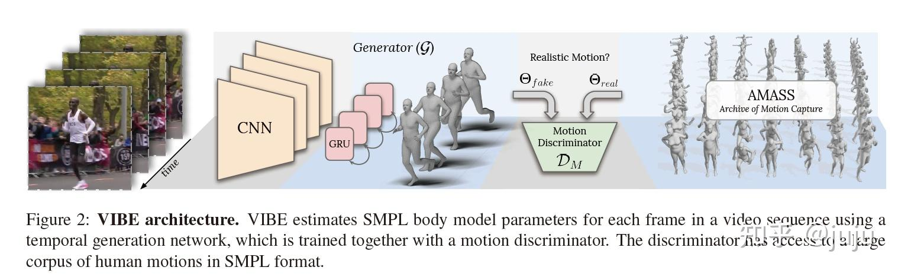

## VIBE

Video Inference for Human Body Pose and Shape Estimation

### 引言

尽管从单张图像预测 3D 人体姿态有不错的进展，依据影片的姿态预测依旧不精准和自然，因为缺乏相关的影片数据集。本文提出 VIBE，一个利用影片进行动作估计的新方法，**使用基于时间序列的网络在没有真实 3D 标签的情况下生成合理的动作序列，并使用对抗网络来区分真实人体动作和网络生成的动作**，令到网络生成的人体动作更加真实。数据集使用 AMASS 和使用关键点注释或伪注释的二维数据集。

这一思想借鉴了2018年提出的HMR模型，这项工作从单张图片重建人体模型，而本文则将这一模型由图片扩展到了视频，在原有模型基础上加入了 GRU和 motion discriminator。

几点贡献：

- 引入了 GRU 来处理序列问题
- 使用 AMASS 数据集进行对抗训练
- 加入动作判别器来判断预测标签与实际标签间的差距，并在其中引入了自注意力机制
- 借鉴 VPoser 提出human sequence prior (MPoser) ，并说明它的性能不如动作鉴别器

过往的研究多使用**室内三维数据集**与**使用关键点注释或伪注释的二维数据集**，这些数据集有以下缺点：

- 室内三维数据集在目标数量、运动范围和图像复杂度等方面存在局限性
- 二维数据集数量不足以训练神经网络
- 伪注释的二维数据集对于训练三维模型来说很不可靠，(来自以前的模型预测??)

这些研究主要分为两个方向：基于单张图片提取人体模型、基于视频提取人体模型

### 方法

网络主要分为两个部分：

- temporal encoder $\mathcal{G}$ （时序编码器）
  输入视频帧序列，输出SMPL人体模型参数
- motion discriminator $D_M$（动作判别器）
  输入上述编码器生成的 SMPL 人体模型参数和 AMASS 中的数据样本，区分样本的真假

**特征提取器**

输入是一串视频帧，使用一个在单张图像预训练的 ResNet-50 为每一帧提取特征 ，特征向量长度为 2048。特征提取器被冻结，不参与训练。而且将所有帧的特征保存为数据集，省去训练时要前向的时间。

**时序编码器**

将所有帧的特征通过两层双向 GRU，隐藏状态长度为 1024，实验中发现步长取 16 最佳。然后将特征通过由两层的 MLP 实现的回归器。回归器隐藏层大小为 1024

**自回归器**

**动作判别器**

### 实验

## 代码实现

### 数据处理

### 网络结构