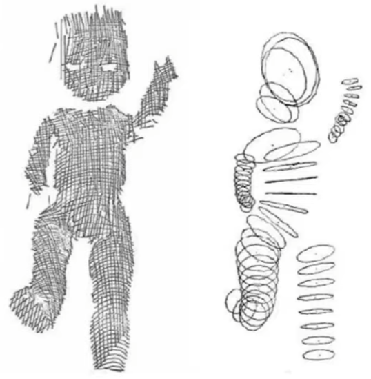
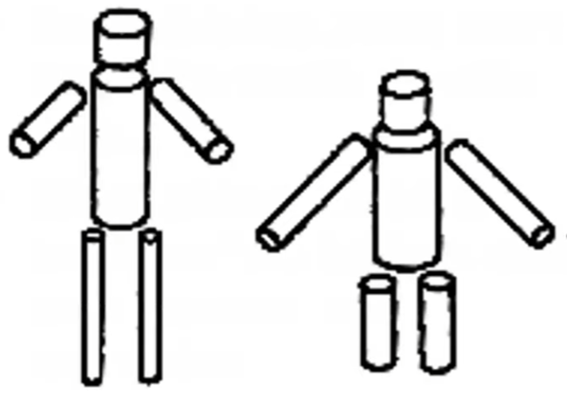
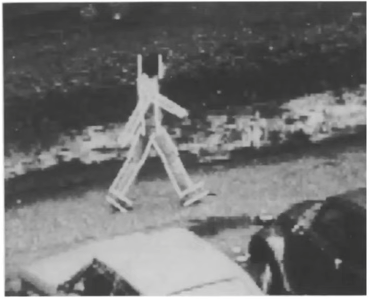
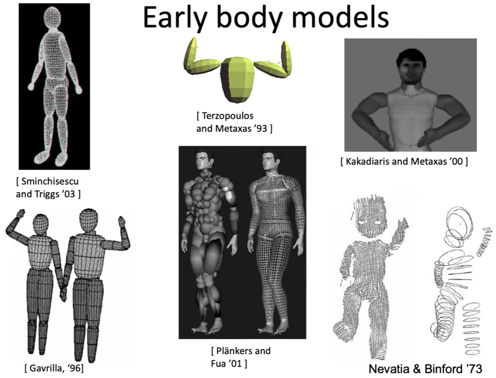
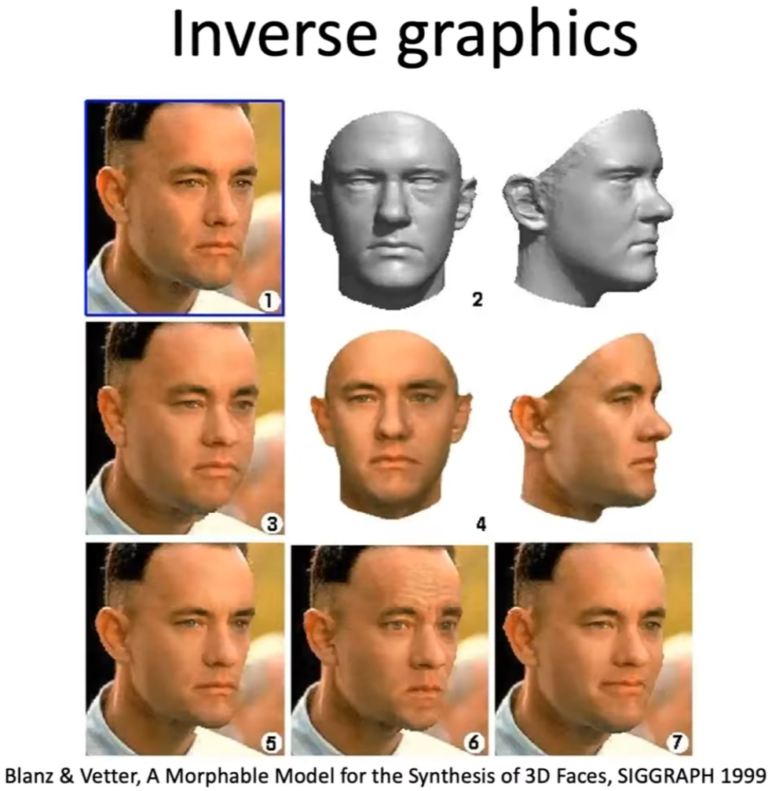
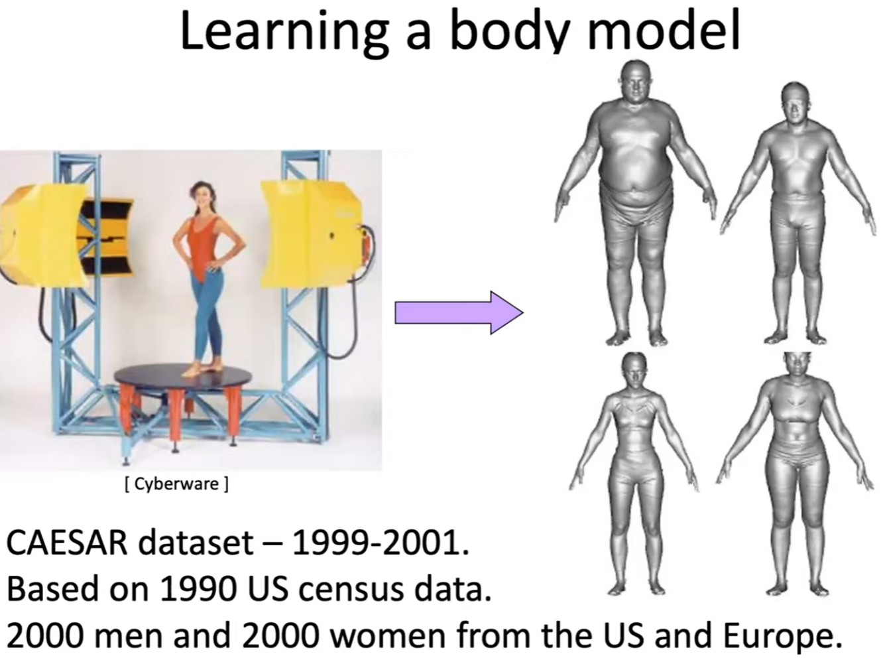

## SMPL

A Skinned Multi-Person Linear Model

### Intro

从 2D 图像中重建人体动作。我们希望有一套描述人体和动作的标准，并能让计算机理解或生成。

Define a simple mathematical model of body shape. It should look and move like real people. It should be low-D, differentiable, have joints, and be easy to animate and fit to data. It should be compatible with standard graphics tools. 

三维对象通常由编码其三维形状的顶点和三角形表示。对象越详细，需要的顶点就越多。由于人类的外形和动作很相似，人类的 3D 网格可以由一些低维参数表示，如表示身高、肥胖、胸围、腹部大小、姿势等，使用时再映射回 高维的 3D 网格。这种表示通常更小且更有意义。

SMPL是一种统计模型，它拆分人的外形参数和姿势参数。

- 外形参数 $\beta$：长度为 $10$ 的向量，每个标量值都可以解释为人体对象沿某个方向（如更高或更短）的膨胀/收缩量，基本表示人的高矮胖瘦。
- 姿势参数 $\theta$：形状为 $24 \times 3$ 标量值的姿势向量，用于描述某个时刻人体的动作姿态，其中的 24 是表示 24 个定义好的人体关节点，3 是指该节点针对其父节点的旋转角度的轴角式表达 (axis-angle representation)

由此，人的外形和姿势得以拆分，可以将同样的姿势作用于不同的人身上。

SMPL represents the body pose and shape by $\Theta$, which consists of the pose and shape parameters $\theta \in \R^{72}$ and $\beta \in \R^{10}$ respectively. The pose parameters include the global body rotation and the relative rotation of 23 joints in axis-angle format. The shape parameters are the first 10 coefficients of a PCA shape space. Given these parameters, the SMPL model is a differentiable function, $\mathcal{M}(\theta, \beta) \in \R^{6890 \times 3}$, that outputs a posed 3D mesh.

### 体姿转换过程原理

#### 基于形状的混合成形(Shape Blend Shapes)

在这个阶段，一个基模版（或者称之为统计上的均值模版) $\bar T$作为整个人体的基本姿态，这个基模版通过统计得到，用N = 6890 N=6890N=6890个端点(vertex)表示整个mesh，每个端点有着( x , y , z ) (x,y,z)(x,y,z)三个空间坐标，要注意和骨骼点joint区分。
随后通过参数β \betaβ去描述我们需要的人体姿态和这个基本姿态的偏移量，叠加上去就形成了我们最终期望的人体姿态，这个过程是一个线性的过程。其中的B s ( β → ) B_s(_\beta^\to)B 
s

 ( 
β
→

 )就是一个对参数β \betaβ的一个线性矩阵的矩阵乘法过程，我们接下来会继续讨论。此处得到的人体mesh的姿态称之为静默姿态(rest pose，也可以称之为T-pose)，因为其并没有考虑姿态参数的影响。

1

2.基于姿态的混合成形 (Pose Blend Shapes)
当我们根据指定的β \betaβ参数对人体mesh进行形状的指定后，我们得到了一个具有特定胖瘦，高矮的mesh。但是我们知道，特定的动作可能会影响到人体的局部的具体形状变化，举个例子，我们站立的时候可能看不出小肚子，但是坐下时，可能小肚子就会凸出来了，这个就是很典型的 具体动作姿态影响人体局部mesh形状的例子了。 换句话说，就是姿态参数[公式]也会在一定程度影响到静默姿态的mesh形状。结合完形状变形和姿态变形之后，就去估算关节点的位置，用于第三步蒙皮操作。

3.蒙皮 (Skinning)
在之前的阶段中，我们都只是对静默姿态下的mesh进行计算，当人体骨骼点运动时，由端点(vertex)组成的“皮肤”将会随着骨骼点(joint)的运动而变化，这个过程称之为蒙皮。蒙皮过程可以认为是皮肤节点随着骨骼点的变化而产生的加权线性组合。简单来说，就是距离某个具体的骨骼点越近的端点，其跟随着该骨骼点旋转/平移等变化的影响越强。

## Reference

### History

#### Goals

Vision: Train computers to "see" us

- Understand our behaviors, emotions, actions
- Understand our interactions with each other and the world

AR/VR/Graphics: Train avatars to mimic us, 模拟人体动作

- By watching us, learn to behave like us
- If we can reproduce human-like behavior, then we have understood it at some level

**Why is it Difficult**

- Loss of 3D in 2D images
- Unusual poses causes difficulties
- Self occlusion
- Low contrast due to clothes
- Body shape, skin color, clothing difference

#### Using Points

**Use a set of points on the joints to represent human body motion**

The motion of the living body was represented by a few bright spots describing the motions of the main joints. 10-12 such elements in adequate motion combinations. Evoke a compelling impression of human walking, running, dancing, etc. By Gunnar Johansson

**Are joints enough?**

- The human joints are inside the body, which is unobserved.
- Contact is key. Joints doesn't touch the world, the skin does.
- We need to model the surface of the body to reason about the contact and expression.
- Our shape is also related to our health and how the world perceives us.

#### Using 3D Shape

- Nevatia and Binford '73
  
  - Generalized cylinders fit to range data, without depth sensors.
  
  
  
- Marr and Mishihara '78
  
  - Proposal for a general, compositional, 3D shape representation.
  
    
  
- Model-based vision: A program to see a walking person, D Hogg Image and Vision computing '83
  - A bench of hand-coded descriptions of some primitives and their spatial to each other, and how much they could rotate relative to each other and it is **very much a hand-crafted model**.
  
    
  
- Other early body models

  

**The Problem**

- We don't look like this.
- Models don't match the data.
- Systems using such models tends to be brittle.
- We argue that we need a better model of human shape and motion.

**The breakthrough started with the face** 

It comes from the work used to model faces, then people use the same method to model bodies. It scans faces and learn a statistical model of shape and appearance.

**Why is it hard to model body?**

- The body has 600 muscles, 200 bones, 200 joints and many types of joints
- We also bulge, breath, flex, and jiggle.
- Our body shape changes with our age, our fitness level, and what we had for lunch.
- **Approach: model only what we can see -- the surface.**

**Learning a model mesh**

