## MobileNet v1

MobileNets: Efficient Convolutional Neural Networks for Mobile Vision Applications


### 引言

本文提出了一种适合在移动端嵌入式端使用的高效网络。提出了深度可分离卷积 (depthwise separable convolution) 结构组成轻量网络。并提出两个收缩超参数平衡模型的精度和运行速度。模型可以用于很多场景，如物体识别等。


### 方法

#### 深度可分离卷积 Depthwise Separable Convolution

标准卷积与深度可分离卷积比较。

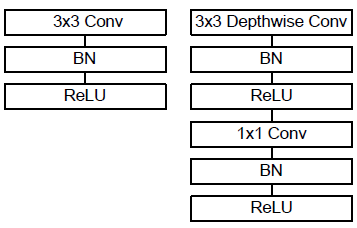

**标准卷积**

- 输入形状 $H \times W \times C_1$，输出形状：$H \times W \times C_2$
- 卷积核参数量：$K \times K \times C_1 \times C_2$
- 计算量：$K \times K \times C_1 \times C_2 \times H \times W$，输出上每个特征维度上的每个点都有 $K \times K \times C_1$ 次计算


**深度可分离卷积**

深度可分离卷积则分为 depthwise 卷积核 pointwise 卷积两步。即拆分成**高宽维度的卷积**和**特征维度的卷积**。以下的计算量只考虑乘法操作。

**depthwise 卷积**

对输入的每个特征维使用一个单独的 $K \times K \times 1$ 的平面卷积核，得到 $H \times W \times 1$ 的结果，然后将结果在特征维度拼接起来。输入输出的特征维度相同。后续发现 depthwise 部分的卷积核容易废掉，即卷积核参数大部分为零。

- 输入形状 $H \times W \times C_1$，输出形状：$H \times W \times C_1$
- 卷积核参数量：$K \times K \times C_1$，每个特征维上是 $K \times K \times 1$
- 计算量：$K \times K \times C_1  \times H \times W$，输出上每个特征维度上的每个点都有 $K \times K \times 1$ 次计算

**pointwise 卷积**

即 $1 \times 1$ 卷积，整合特征维度上的信息，并调整特征维度到目标维度。

- 输入形状 $H \times W \times C_1$，输出形状：$H \times W \times C_2$
- 卷积核参数量：$1 \times 1 \times C_1 \times C_2$
- 计算量：$1 \times 1 \times C_1  \times C_2 \times H \times W$


**与标准卷积比较**

- 标准卷积计算量：$K \times K \times C_1 \times C_2 \times H \times W$
- 深度可分离卷积计算量：$(K \times K + C_2) \times C_1 \times H \times W$

$$
\begin{align}
&\frac{(K \times K + C_2) \times C_1 \times H \times W}{K \times K \times C_1 \times C_2 \times H \times W} \\
= &\frac{1}{C_2} + \frac{1}{K^2}
\end{align}
$$

$C_2$ 通常较大有 64、128、256 ，所以第一项可忽略，MobileNet 常使用 $3 \times 3$ 大小的卷积核，所以上面的比较结果就接近 $\frac{1}{9}$，大约比标准卷积减少了 8 到 9 倍的计算量。


#### 网络结构

网络网络主要由深度可分离卷积组成，每层后面都跟随 BN 和 ReLU 层。下采样用 stride convolution 实现。

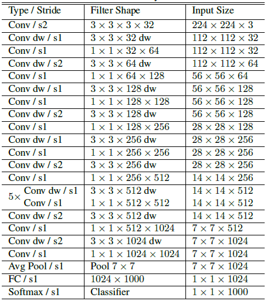

最终整个网络 95% 的计算量和 75% 的参数量都在 $1 \times 1$ 卷积上，平面卷积参数量很少。而且部署的时候  $1 \times 1$ 卷积可以使用高效的矩阵乘法实现 (GEMM)。

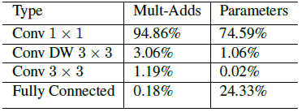

同时因为小模型通常不会过拟合，所以训练时使用了较少的正则化和数据增强。


#### Width Multiplier: Thinner Models

使用 $\alpha$ 统一控制每层的特征维度，进而减少参数量和计算量。对于给定的层和 $\alpha$，输入维度改为 $C_1 \times \alpha$，输出维度改为 $C_2 \times \alpha$。使用 $\alpha$ 后的深度可分离卷积的计算量：$(K \times K + \alpha C_2) \times \alpha C_1 \times H \times W$。$\alpha$ 取值 1、0.75、0.5 或 0.25。该超参数基本可以将计算量和参数量减少平方倍 $\alpha^2$。比较详见论文。


#### Resolution Multiplier: Reduced Representation

使用 $\rho$ 控制网络的特征图的高宽，进而减少计算量。其实就是缩放输入图像，这样后续的特征图高宽都会响应减少。使用 $\rho$ 后的深度可分离卷积的计算量：$(K \times K + \alpha C_2) \times \alpha C_1 \times \rho H \times \rho W$。实现时直接将输入图像分辨率缩放为 224、192、160 或 128。比较详见论文。


### 代码实现

#### 深度可分离卷积

由 depthwise 卷积块和 pointwise 卷积块组成。pointwise 卷积就是普通的 $1 \times 1$ 卷积，用于调整特征维度。每次卷积操作后都会通过 BN 和 ReLU 层。

```py
class DwsConvBlock(nn.Module):
    """
    use_bn : bool, default True
        Whether to use BatchNorm layer.
    dw_activation : function or str or None, default nn.ReLU(inplace=True)
        Activation function after the depthwise convolution block.
    pw_activation : function or str or None, default nn.ReLU(inplace=True)
        Activation function after the pointwise convolution block.
    """
    def __init__(self,
                 in_channels,
                 out_channels,
                 kernel_size,
                 stride,
                 padding,
                 dilation=1,
                 bias=False,
                 use_bn=True,
                 bn_eps=1e-5,
                 dw_activation=(lambda: nn.ReLU(inplace=True)),
                 pw_activation=(lambda: nn.ReLU(inplace=True))):
        super(DwsConvBlock, self).__init__()
        self.dw_conv = dwconv_block(
            in_channels=in_channels,
            out_channels=in_channels,
            kernel_size=kernel_size,
            stride=stride,
            padding=padding,
            dilation=dilation,
            bias=bias,
            use_bn=use_bn,
            bn_eps=bn_eps,
            activation=dw_activation)
        self.pw_conv = conv1x1_block(
            in_channels=in_channels,
            out_channels=out_channels,
            bias=bias,
            use_bn=use_bn,
            bn_eps=bn_eps,
            activation=pw_activation)

    def forward(self, x):
        x = self.dw_conv(x)
        x = self.pw_conv(x)
        return x
```

**depthwise 卷积**

通过标准卷积实现，**关键是将 `group` 参数设置为特征维度**，同时输入输出的特征维度相等，这样每个特征维度上都在单独进行卷积，最后合并。

```py
def dwconv_block(in_channels,
                 out_channels,
                 kernel_size,
                 stride=1,
                 padding=1,
                 dilation=1,
                 bias=False,
                 use_bn=True,
                 bn_eps=1e-5,
                 activation=(lambda: nn.ReLU(inplace=True))):
    """
    use_bn : bool, default True
        Whether to use BatchNorm layer.
    bn_eps : float, default 1e-5
        Small float added to variance in Batch norm.
    activation : function or str or None, default nn.ReLU(inplace=True)
        Activation function or name of activation function.
    """
    return ConvBlock(
        in_channels=in_channels,
        out_channels=out_channels,
        kernel_size=kernel_size,
        stride=stride,
        padding=padding,
        dilation=dilation,
        groups=out_channels,
        bias=bias,
        use_bn=use_bn,
        bn_eps=bn_eps,
        activation=activation)
```


#### 网络结构

统一定义网络每层的特征维度，然后用 `width_scale` 进行缩放。

```py
def get_mobilenet(width_scale,
                  model_name=None,
                  pretrained=False,
                  root=os.path.join("~", ".torch", "models"),
                  **kwargs):
    """
    Parameters:
    ----------
    width_scale : float
        Scale factor for width of layers.
    model_name : str or None, default None
        Model name for loading pretrained model.
    pretrained : bool, default False
        Whether to load the pretrained weights for model.
    root : str, default '~/.torch/models'
        Location for keeping the model parameters.
    """
    channels = [[32], [64], [128, 128], [256, 256], [512, 512, 512, 512, 512, 512], [1024, 1024]]
    first_stage_stride = False

    if width_scale != 1.0:
        channels = [[int(cij * width_scale) for cij in ci] for ci in channels]

    net = MobileNet(
        channels=channels,
        first_stage_stride=first_stage_stride,
        **kwargs)

    return net
```

最后通过全局平均池化转换成一条向量，然后通过全连接层计算分类结果。

```py
class MobileNet(nn.Module):
    """
    MobileNet model from 'MobileNets: Efficient Convolutional Neural Networks for Mobile Vision Applications,'
    https://arxiv.org/abs/1704.04861.

    Parameters:
    ----------
    channels : list of list of int
        Number of output channels for each unit.
    first_stage_stride : bool
        Whether stride is used at the first stage.
    in_channels : int, default 3
        Number of input channels.
    in_size : tuple of two ints, default (224, 224)
        Spatial size of the expected input image.
    num_classes : int, default 1000
        Number of classification classes.
    """
    def __init__(self,
                 channels,
                 first_stage_stride,
                 in_channels=3,
                 in_size=(224, 224),
                 num_classes=1000):
        super(MobileNet, self).__init__()
        self.in_size = in_size
        self.num_classes = num_classes

        self.features = nn.Sequential()
        init_block_channels = channels[0][0]
        self.features.add_module("init_block", conv3x3_block(
            in_channels=in_channels,
            out_channels=init_block_channels,
            stride=2))
        in_channels = init_block_channels
        for i, channels_per_stage in enumerate(channels[1:]):
            stage = nn.Sequential()
            for j, out_channels in enumerate(channels_per_stage):
                stride = 2 if (j == 0) and ((i != 0) or first_stage_stride) else 1
                stage.add_module("unit{}".format(j + 1), dwsconv3x3_block(
                    in_channels=in_channels,
                    out_channels=out_channels,
                    stride=stride))
                in_channels = out_channels
            self.features.add_module("stage{}".format(i + 1), stage)
        self.features.add_module("final_pool", nn.AvgPool2d(
            kernel_size=7,
            stride=1))

        self.output = nn.Linear(
            in_features=in_channels,
            out_features=num_classes)

        self._init_params()

    def _init_params(self):
        for name, module in self.named_modules():
            if 'dw_conv.conv' in name:
                nn.init.kaiming_normal_(module.weight, mode='fan_in')
            elif name == 'init_block.conv' or 'pw_conv.conv' in name:
                nn.init.kaiming_normal_(module.weight, mode='fan_out')
            elif 'bn' in name:
                nn.init.constant_(module.weight, 1)
                nn.init.constant_(module.bias, 0)
            elif 'output' in name:
                nn.init.kaiming_normal_(module.weight, mode='fan_out')
                nn.init.constant_(module.bias, 0)

    def forward(self, x):
        x = self.features(x)
        x = x.view(x.size(0), -1)
        x = self.output(x)
        return x
```


## MobileNet v2

MobileNetV2: Inverted Residuals and Linear Bottlenecks


### 引言

MobileNetV2架构基于倒置残差结构，其中残差块的输入和输出是与传统残差模型相反的薄瓶颈层，传统残差块在输入和输出中使用扩展特征。 MobileNetV2 使用轻量级的深度卷积来过滤中间扩展层中的功能。此外，作者发现删除中间窄层中的非线性单元对于保持表示能力很重要，并证明了这可以提高性能，并提供导致这种设计的启发。

这篇论文的主要贡献是一个新的模块：具有线性bottleneck的倒置残差层。该模块以一个低维的压缩特征作为输入，首先被扩展到高维，然后用一个轻量级的深度卷积过滤。特征随后用线性卷积投影回低维表示。

此外，该卷积模块特别适合于移动设备设计，因为它可以通过从未完全实现大型中间张量来显着减少推理过程中所需的内存占用。 这减少了许多嵌入式硬件设计中对主存储器访问的需求，这些设计可提供少量非常快的软件控制的高速缓存。


### 方法

#### Inverted Residual Block

**Residual Block**

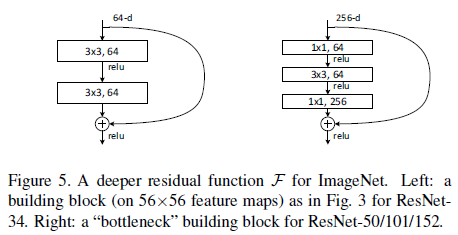

较深的残差网络使用了右边这种 bottleneck 块，包含三个卷积层，先用 $1 \times 1$ 卷积减少特征图的特征维度，然后进行 $3 \times 3$ 卷积，最后再做 $1 \times 1$ 卷积恢复特征维度。这么做是因为直接对高维特征图做 $3 \times 3$ 卷积需要更多的参数量。


**Inverted Residual Block**

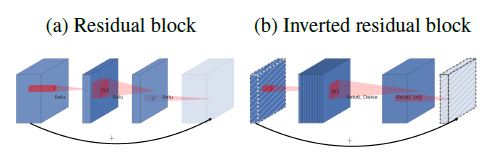

本作认为残差网络中，低维特征图其实包含更多的关键信息，高维特征图只是前者非线性变换的结果。所以应该对低维特征图进行残差连接，将中间的 $3 \times 3$ 卷积替换为深度可分离卷积以减少参数量，剩余两层不变。

**激活函数**

前两个卷积层使用 ReLU6 激活函数。$x < 0, \ y = 0 \quad 0 < x < 6, \ y = x \quad x > 6, \ y = 6$
$$
\text{ReLU6(x) = min(max(x, 0), 6)}
$$

ReLU6 在低精度计算时有更好的鲁棒性。


**结构**

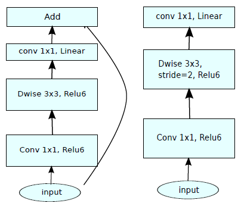


#### Linear Bottlenecks

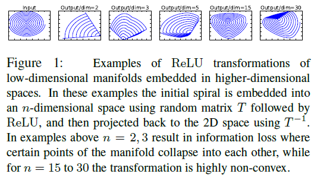

作者将二维空间的一个螺旋线施加变换 T 到高维空间，然后施加一个 ReLU 函数，然后施加 T 的逆变换还原到低维。上图展示了不同高维的情况下，还原出来的结果。作者认为将特征投影到低维并使用 ReLU 会丢失大量信息，而投射到高维不会，所以**在倒残差结构中将高维特征图投回低维时不添加 ReLU 激活，直接输出卷积的结果**。


#### 网络结构

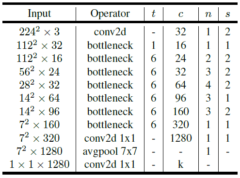

**倒残差块**

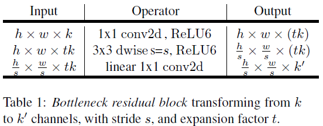

$t$ 是倒残差连接中间维度的扩展因子，$c$ 是输出的特征维度，$n$ 是同样设定的残差块的重复次数，$s$ 是步长，仅在每组残差块的开始使用，减少特征图高宽。


### 代码实现

#### Inverted Residual Block

先将特征映射到高维，然后使用深度可分离卷积，这两步使用 ReLU6 激活函数。最后映射回低维，此时不使用任何激活函数。

```py
class InvertedResidual(nn.Module):
    def __init__(
        self, inp: int, oup: int, stride: int, expand_ratio: int,
        norm_layer: Optional[Callable[..., nn.Module]] = None
    ) -> None:
        super(InvertedResidual, self).__init__()
        self.stride = stride
        assert stride in [1, 2]

        if norm_layer is None:
            norm_layer = nn.BatchNorm2d

        hidden_dim = int(round(inp * expand_ratio))
        self.use_res_connect = self.stride == 1 and inp == oup

        layers: List[nn.Module] = []
        if expand_ratio != 1:
            # pw
            layers.append(ConvBNReLU(inp, hidden_dim, kernel_size=1, norm_layer=norm_layer))
        layers.extend([
            # dw
            ConvBNReLU(hidden_dim, hidden_dim, stride=stride, groups=hidden_dim, norm_layer=norm_layer),
            # pw-linear
            nn.Conv2d(hidden_dim, oup, 1, 1, 0, bias=False),
            norm_layer(oup),
        ])
        self.conv = nn.Sequential(*layers)
        self.out_channels = oup
        self._is_cn = stride > 1

    def forward(self, x: Tensor) -> Tensor:
        if self.use_res_connect:
            return x + self.conv(x)
        else:
            return self.conv(x)
```


## MobileNet v3

### 引言

该论文主要讲如何使用NAS搜索出适用于移动设备的轻型网络，提出了MobileNetV3-Large和MobileNetV3-Small两个模型。主要更新了倒残差块、使用 NAS 搜索参数和重新设计耗时的层的结构。


### 方法

#### 倒残差块中加入 SE 模块

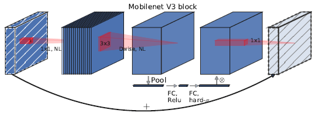

在 $3 \times 3$ depthwise 卷积后和 $1 \times 1$ pointwise卷积间插入 Squeeze-and-Excite，调整通道注意力。只对部分的倒残差块使用 SE 模块。


#### 重新设计耗时层的结构

将第一个卷积层的卷积核个数由 32 调整为 16，因为两者精度一样。

调整最后几层的结构，删除数个耗时的卷积层。

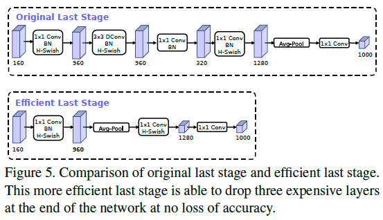


#### 重新设计激活函数

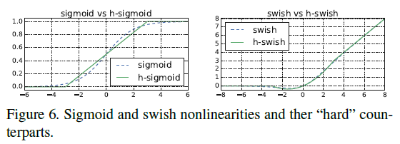

一些网络提出使用 swish 激活函数代替 ReLU 获得了不错的效果，但 swish 的计算和求导复杂，而且对量化过程不友好，不适合在移动端使用。因此本作提出 h-swish 代替 ReLU6。
$$
\begin{align}
\text{swish} (x) &= x \cdot \sigma(x)\\
\text{h-swish} (x) &= x \frac{\text{ReLU6}(x + 3)}{6}
\end{align}
$$
并且使用 h-sigmoid 代替 SE 模块中的 sigmoid。
$$
\begin{align}
\text{sigmoid}(x) = \frac{1}{1 + e^{-x}} \\
\text{h-sigmoid}(x) = \frac{\text{ReLU6}(x + 3)}{6}
\end{align}
$$


#### 网络结构

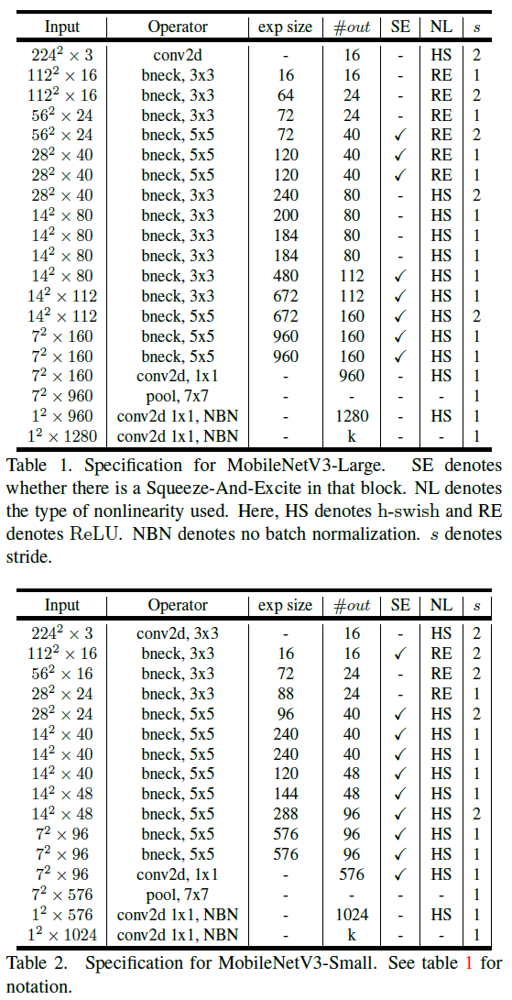


### 代码实现

#### 倒残差块中加入 SE 模块

仅在 $3 \times 3$ depthwise 卷积后和 $1 \times 1$ pointwise卷积间插入 Squeeze-and-Excite 模块，其他部分没有改动。

```py
class InvertedResidual(nn.Module):
    def __init__(self, cnf: InvertedResidualConfig, norm_layer: Callable[..., nn.Module],
                 se_layer: Callable[..., nn.Module] = SqueezeExcitation):
        super().__init__()
        if not (1 <= cnf.stride <= 2):
            raise ValueError('illegal stride value')

        self.use_res_connect = cnf.stride == 1 and cnf.input_channels == cnf.out_channels

        layers: List[nn.Module] = []
        activation_layer = nn.Hardswish if cnf.use_hs else nn.ReLU

        # expand
        if cnf.expanded_channels != cnf.input_channels:
            layers.append(ConvBNActivation(cnf.input_channels, cnf.expanded_channels, kernel_size=1,
                                           norm_layer=norm_layer, activation_layer=activation_layer))

        # depthwise
        stride = 1 if cnf.dilation > 1 else cnf.stride
        layers.append(ConvBNActivation(cnf.expanded_channels, cnf.expanded_channels, kernel_size=cnf.kernel,
                                       stride=stride, dilation=cnf.dilation, groups=cnf.expanded_channels,
                                       norm_layer=norm_layer, activation_layer=activation_layer))
        if cnf.use_se:
            layers.append(se_layer(cnf.expanded_channels))

        # project
        layers.append(ConvBNActivation(cnf.expanded_channels, cnf.out_channels, kernel_size=1, norm_layer=norm_layer,
                                       activation_layer=nn.Identity))

        self.block = nn.Sequential(*layers)
        self.out_channels = cnf.out_channels
        self._is_cn = cnf.stride > 1

    def forward(self, input: Tensor) -> Tensor:
        result = self.block(input)
        if self.use_res_connect:
            result += input
        return result
```

**SE 模块**

将特征图进行全局平均池化得到一个特征维度长度的向量，将其通过全连接层 + ReLU 和全连接层 + H-sig 得到特征维度长度的向量，与特征图相乘得到结果。MLP 的隐藏层大小是特征维度的 $\frac{1}{4}$。

```py
class SqueezeExcitation(nn.Module):
    def __init__(self, input_channels: int, squeeze_factor: int = 4):
        super().__init__()
        squeeze_channels = _make_divisible(input_channels // squeeze_factor, 8)
        self.fc1 = nn.Conv2d(input_channels, squeeze_channels, 1)
        self.relu = nn.ReLU(inplace=True)
        self.fc2 = nn.Conv2d(squeeze_channels, input_channels, 1)

    def _scale(self, input: Tensor, inplace: bool) -> Tensor:
        scale = F.adaptive_avg_pool2d(input, 1)
        scale = self.fc1(scale)
        scale = self.relu(scale)
        scale = self.fc2(scale)
        return F.hardsigmoid(scale, inplace=inplace)

    def forward(self, input: Tensor) -> Tensor:
        scale = self._scale(input, True)
        return scale * input
```

