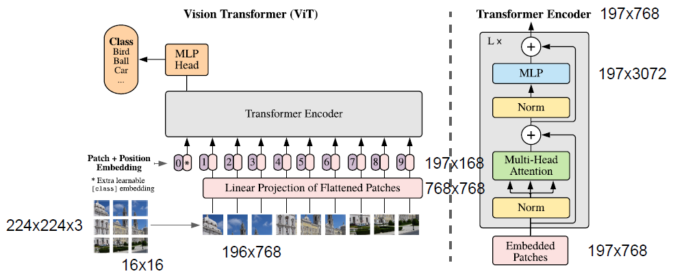
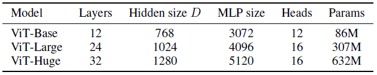
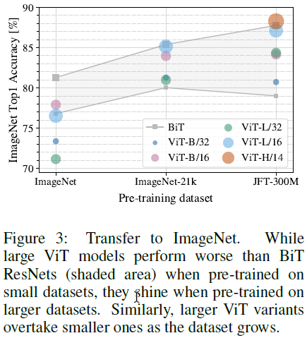
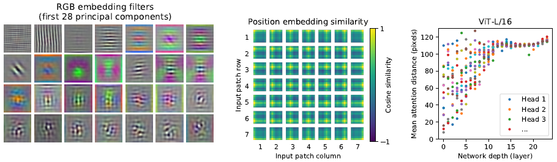

## Vision Transformer

An Image is Worth 16x16 Words: Transformers for Image Recognition at Scale

https://blog.csdn.net/qq_37541097/article/details/118242600


### 概述

Transformer 是 NLP 的必选模型，主流的训练方式是在大规模文字数据上预训练，如 BERT 使用完形填空作为自监督训练，GPT 使用预测下一个词作为预训练，然后在任务数据集上进行微调。Transformer 变得越来越大，而且没有观察到性能瓶颈和过拟合，即扩大模型和数据量不会性能饱和。

Transformer 的计算复杂度是 $O(n^2)$，即序列长度的平方倍。将图像输入给 Transformer 的首要问题就是如何将图像视为序列，如果把每个像素视为一个单独输入，会造成序列过长而特征过少。一种方法是用 CNN 抽取特征并同时将长宽降维，然后将特征图的每个像素作为一个单独输入，这样序列就会变短且每个输入的特征表示也够丰富。还有一些论文提出一些特别的自注意力操作，而这些方法比较复杂，也不支持硬件加速。

本文提出的方法 ViT 在图片分类任务上进行有监督训练，先将一张图片拆分成多个 $16 \times 16$ 大小的图片块，通过全连接层得到每个图片块的编码，送入标准 Transformer 模型提取特征，最后使用分类头分类。

ViT 缺少卷积网络对图像的先验信息，所以需要更多的数据和时间训练，并且在大量的数据上训练，效果可以超过卷积网络。ViT 尤其对有严重遮挡 (Occusion)、数据分布偏移 (Distribution Shift)、对抗数据 (Adversarial Patch) 和图片分块排列组合 (Permuatation) 处理的很好。由于 ViT 模型很大容易过拟合，所以迁移到小数据集时需要加入合适的正则项。


### 方法

#### 网络结构




#### 图片块编码

To handle 2D images, we reshape the image $\bold{x} \in \R^{H \times W \times C}$ into a sequence of flattened 2D patches $\bold{x}_p \in \R^{N \times (p^2 \times C)}$, where $(H, W)$ is the resolution of the original image, $C$ is the number of channels, $(P,  P)$ is the resolution of each image patch, and $N = HW / P^2$ is the resulting number of patches, which also serves as the effective input sequence length for the Transformer. The Transformer uses constant latent vector size $D$ through all of its layers, so we flatten the patches and map to $D$ dimensions with a trainable linear projection.

该编码器可以由一个线性层或步长等于图片块大小的卷积层实现。

**混合模型**

ViT 的默认实现中将每个图片块通过一个线性层获取特征。这部分也可以用 CNN 实现，即将 CNN 最后的特征图作为图片块编码。特征图每个像素的特征就作为每个图片块通过了编码器的特征。


#### **位置编码**

使用**可学习的 1D 位置编码**。作者比较了没有编码、可学习的 1D 编码、可学习的 2D 编码和相对位置编码。可学习的 2D 编码是指对于 X 和 Y 轴上的每个坐标都分别学习一个 D/2 长度的向量，使用时根据图片块的 x, y 位置拼接成 D 维向量。发现使用任意的位置编码效果都比不使用好，但三种编码效果非常近，1D 编码就好一点点。

由于图片块大小与图片块编码器绑定，图片块数量与位置编码的数量绑定，所以 ViT 不适合运行在不同尺寸的图片上。但如果图片块数量变动不大，可以使用插值临时拓展位置编码的数量。


#### **分类头**

和 BERT 类似，在所有图片序列前拼接一个**可学习的 cls token**，经过 Transformer 后，将该位置的特征作为图像整体的特征，传给下游网络。此处也可以参考 CNN 的做法，对 Transformer 对每个图片块的输出做全局平均池化作为最终的特征。但需要谨慎调整学习率，而且效果和用 cls token 差不多，使用 cls token 更贴合 Transformer 的传统用法。


### 实验和分析

#### 数据集

在以下数据集上进行训练。

- ILSVRC-2012 ImageNet：1.4M 图片，1k 类别
- ImageNet-21k：14M 图片、21k 类别
- JFT：303 高清图片，18k 类别


#### 网络变体

图片块数量与图片块大小负相关，所以越小的图片块需要更多的计算量。每个模型内部所有层使用同样的配置。



最大的模型

- ViT-L/16：Large variant with $16 \times 16$ patch size
- ViT-H/14：Huge variant with $14 \times 14$ patch size


#### 结果

对更大的模型在更大的数据集上做预训练效果更好，最终结果超过 CNN 网络。




#### 分析

- 将编码器的权重可视化，发现和 CNN 的卷积核类似，都在匹配特定的颜色和纹理。
- 为 1D 编码两两计算余弦相似度，发现同行同列的编码会有更高的相似度，虽然是 1D 编码，但学习到了 2D 的距离概念。
- Transformer 结构让距离较远的图片块也可以在第一层就开始交互，而不是像 CNN 一样要经过很多层才会有更大的感受野。
- 计算每层每个头中的 mean attention distance：两个像素间真正距离 * 两像素注意力权重。越大就代表更远的像素也有大注意力权重。发现前面的层中，部分较远的像素也有较高的注意力权重。而到了后面的层就主要是全局信息了。代表 ViT 在底层就能够注意到全局信息，比 CNN 更早有大的感受野。





## 代码实现

https://github.com/lucidrains/vit-pytorch

### 网络结构

```py
v = ViT(
    image_size = 224, patch_size = 16, num_classes = 1000, dim = 1024,
    depth = 6, heads = 16, mlp_dim = 2048, dropout = 0.1, emb_dropout = 0.1
)
```


**创建网络**

首先计算图片和图片块的信息。每个图片块会被展平成一个 `patch_dim` 的向量。使用 $224 \times 224 \times 3$ 的图片和 $16 \times 16$ 大小的图片块，`patch_dim` 就是 768。共有五个可学习的部分：

- 图片块编码器
- 可学习的位置编码
- 可学习的分类头向量
- Transformer
- 单层全连接分类器

```py
class ViT(nn.Module):
    def __init__(self, *, image_size, patch_size, num_classes, dim, depth, heads, mlp_dim, pool='cls', channels=3,
                 dim_head=64, dropout=0., emb_dropout=0.):
        super().__init__()
        image_height, image_width = pair(image_size)   # 224, 224
        patch_height, patch_width = pair(patch_size)   # 16, 16

        assert image_height % patch_height == 0 and image_width % patch_width == 0, 'Image dimensions must be divisible by the patch size.'
		# 196
        num_patches = (image_height // patch_height) * (image_width // patch_width)
        # 768
        patch_dim = channels * patch_height * patch_width
        assert pool in {'cls', 'mean'}, 'pool type must be either cls (cls token) or mean (mean pooling)'

        self.to_patch_embedding = nn.Sequential(
            Rearrange('b c (h p1) (w p2) -> b (h w) (p1 p2 c)', p1=patch_height, p2=patch_width),
            nn.LayerNorm(patch_dim),
            nn.Linear(patch_dim, dim),
            nn.LayerNorm(dim),
        )
		# (1, 197, 1024)
        self.pos_embedding = nn.Parameter(torch.randn(1, num_patches + 1, dim))
        # (1, 1, 1024)
        self.cls_token = nn.Parameter(torch.randn(1, 1, dim))
        self.dropout = nn.Dropout(emb_dropout)

        self.transformer = Transformer(dim, depth, heads, dim_head, mlp_dim, dropout)

        self.pool = pool
		# 1024 -> 1000
        self.mlp_head = nn.Linear(dim, num_classes)
```


**前向过程**

首先将图片拆分成图片块，并将每个图片块都展平成一个 `patch_dim` 长度的向量，通过编码器，拼接上分类头向量，然后将整个序列和位置编码相加。通过 Transformer 后，选择分类头位置的特征作为输出，传入最后的分类器进行预测。

```py
def forward(self, img):
    # (B, num_patches, dim)
    x = self.to_patch_embedding(img)
    b, n, _ = x.shape
	
    # (1, 1, dim) -> (B, 1, dim)
    cls_tokens = repeat(self.cls_token, '1 1 d -> b 1 d', b=b)
    # (B, num_patches + 1, dim)
    x = torch.cat((cls_tokens, x), dim=1)
    x += self.pos_embedding[:, :(n + 1)]
    x = self.dropout(x)

    x = self.transformer(x)
	# (B, dim), choose feature at 0
    x = x.mean(dim=1) if self.pool == 'mean' else x[:, 0]

	# (B, num_classes)
    x = self.mlp_head(x)
    return x
```


#### 图片块编码器

编码器由一层全连接层实现。将展平后的图片块映射到高维的特征，如 1024 维，中间做两次 Layer Norm。

```py
self.to_patch_embedding = nn.Sequential(
    Rearrange('b c (h p1) (w p2) -> b (h w) (p1 p2 c)', p1=patch_height, p2=patch_width),
    nn.LayerNorm(patch_dim),
    nn.Linear(patch_dim, dim),
    nn.LayerNorm(dim),
)
```

该编码器也可以由一层 CNN 实现，这样直接传入图片即可。

```py
nn.Conv2d(in_chans, embed_dim, kernel_size=patch_size, stride=patch_size)
```


#### 分类头和位置编码

将分类头向量和图片块编码在序列维度拼接，然后加上可学习的位置编码。

```py
cls_tokens = repeat(self.cls_token, '1 1 d -> b 1 d', b=b)   # Repeat batch size times
x = torch.cat((cls_tokens, x), dim=1)
x += self.pos_embedding[:, :(n + 1)]
x = self.dropout(x)
```


#### Transformer

所有层用同样的配置，使用多头自注意力机制。每层顺序如下：Layer Norm -> 注意力计算 -> MLP。有残差连接。最后输出前还有一次 Layer Norm。隐藏层大小和图片块的特征长度一样。

```py
x = self.transformer(x)
```

```py
class Transformer(nn.Module):
    # dim=1024, depth=6, heads=16, dim_head=64, mlp_dim=2048
    def __init__(self, dim, depth, heads, dim_head, mlp_dim, dropout=0.):
        super().__init__()
        self.norm = nn.LayerNorm(dim)
        self.layers = nn.ModuleList([])
        for _ in range(depth):
            self.layers.append(nn.ModuleList([
                Attention(dim, heads=heads, dim_head=dim_head, dropout=dropout),
                FeedForward(dim, mlp_dim, dropout=dropout)
            ]))

    def forward(self, x):
        for attn, ff in self.layers:
            x = attn(x) + x
            x = ff(x) + x

        return self.norm(x)
```


**注意力层**

计算 QKV 用一个全连接层实现，之后拆分成三份。如果 头数量*头维度 不等于输入图片块特征维度，就在最后做一次映射。

```py
class Attention(nn.Module):
    def __init__(self, dim, heads=8, dim_head=64, dropout=0.):
        super().__init__()
        inner_dim = dim_head * heads
        project_out = not (heads == 1 and dim_head == dim)

        self.heads = heads
        self.scale = dim_head ** -0.5

        self.norm = nn.LayerNorm(dim)

        self.softmax = nn.Softmax(dim=-1)
        self.dropout = nn.Dropout(dropout)

        self.to_qkv = nn.Linear(dim, inner_dim * 3, bias=False)

        self.to_out = nn.Sequential(
            nn.Linear(inner_dim, dim),
            nn.Dropout(dropout)
        ) if project_out else nn.Identity()
```

首先对输入做 Layer Norm，然后用全连接层将输入的特征维度扩大到 头数量\*头维度\*3 倍，并在特征维拆分三份分别为 QKV。每个 QKV 再将特征拆分成 头数量 个。

```py
def forward(self, x):
    x = self.norm(x)
    # (B, num_patches + 1, inner_dim * 3)
    qkv = self.to_qkv(x).chunk(3, dim=-1)

    # q, k, v: (B, heads, num_patches + 1, dim_head)
    q, k, v = map(lambda t: rearrange(t, 'b n (h d) -> b h n d', h=self.heads), qkv)

```

然后计算 Scaled Dot-Product Attention。最后调整输出形状。
$$
\text{Attention}(Q,K,V) = \text{softmax}(\frac{QK^T}{\sqrt{d_k}})V
$$

```py
    # (B, heads, num_patches + 1, num_patches + 1)
    dots = torch.matmul(q, k.transpose(-1, -2)) * self.scale

    attn = self.softmax(dots)
    attn = self.dropout(attn)

    out = torch.matmul(attn, v)
    out = rearrange(out, 'b h n d -> b n (h d)')
    return self.to_out(out)
```


**MLP 层**

两层 MLP，中间使用 Layer Norm。`hidden_dim` 通常是 `dim` 的两至三倍。

```py
class FeedForward(nn.Module):
    def __init__(self, dim, hidden_dim, dropout=0.):
        super().__init__()
        self.net = nn.Sequential(
            nn.LayerNorm(dim),
            nn.Linear(dim, hidden_dim),
            nn.GELU(),
            nn.Dropout(dropout),
            nn.Linear(hidden_dim, dim),
            nn.Dropout(dropout)
        )

    def forward(self, x):
        return self.net(x)
```


#### 分类器

将 Transformer 的输出的第一个位置的特征取出，传给分类器。

```py
x = x.mean(dim=1) if self.pool == 'mean' else x[:, 0]
x = self.mlp_head(x)
```


### 损失

使用分类常规的多分类交叉熵损失函数。