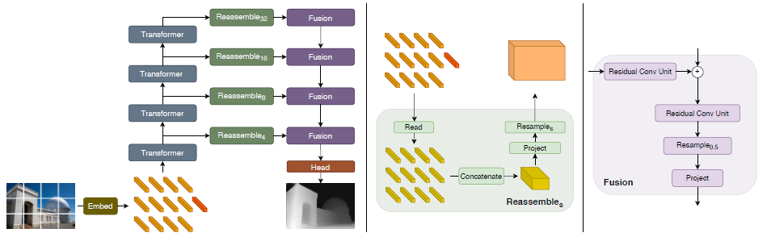

## Vision Transformers for Dense Prediction

### 引言

We assemble tokens from various stages of the vision transformerinto image-like representations at various resolutions andprogressively combine them into full-resolution predictionsusing a convolutional decoder. The transformer backboneprocesses representations at a constant and relatively highresolution and has a global receptive field at every stage.

我们提出了适用于密集预测 (Dense Prediction) 任务的 DPT 网络。使用 ViT 代替密集预测任务中常用的骨干卷积网络。


我们将来自视觉变换器各个阶段的信号组合成不同分辨率的类图像表征，并使用卷积解码器逐步将它们组合成全分辨率预测。


与卷积网络相比，这些特性使得 DPT 能够提供粒度更细、全局一致性更强的预测。DPT 网络在密集预测任务上有很大的性能提升，尤其是在有大量训练数据的情况下。在单目深度估计上与最先进的卷积网络 (MiDaS) 相比，相对性能提高了 28%。在语义分割上，DPT 在 ADE20K 数据集上打到了超过 SOTA 的表现，mIoU 为 49.02%。DPT 也可以在 NYUv2、KITTI 和 Pascal Context 等较小的数据集上进行微调，并且也超过了 SOTA 的表现。


**密集预测 Dense Prediction**

这类任务通常需要对每个像素进行类别或数值预测，如语义分割和单目深度估计。


### 方法



单目深度估计和语义分割都是使用同一个骨干网络，但最后的预测头不同。

骨干网络由 ViT 和多个重组和微调网络组成，将 ViT 多层的特征输出收集起来重组和微调，最后的微调网络逐步融合并上采样要高分辨率作为输出。重组和微调的部分类似一个 FPN (Feature Pyramid Network)。


#### 骨干网络

使用纯 ViT 或 ViT-Hybrid。在图片块序列的前面拼接一个 readout token (等同于 cls token)，相信能够保留全局的信息。使用 `hooks` 提取 ViT 在四个层的特征 (图片块特征 + readout token 特征)。

##### Reassemble

将 readout token 的特征与图片块的特在特征维度拼接，然后通过多个线性层和 $1 \times 1 $ 卷积整合信息，按需进行上采样。

##### Fusion

使用残差卷积单元组合当前和低层的特征，并对特征图进行上采样。


#### 单目深度估计


#### 语义分割


### 实验

#### 骨干网络

一共使用三种网络，图片块大小都是 16。

- ViT-B/16@384：图片块编码器是线性层，图片块特征向量长度为 768，Transformer 12 层
- ViT-L/16@384：图片块编码器是线性层，图片块特征向量长度为 1024，Transformer 24 层。
- ViT-B-Hybrid/16@384：图片块编码器是 ResNet-50，Transformer 12 层.


## 代码实现

代码没有公布训练流程。以下为将 dpt_large 用于单目深度估计的前向过程  `run_monodepth.py`。


### 数据处理

调整图像大小、标准化。标准化的均值方差根据网络对应的数据集有些许变化。

```py
normalization = NormalizeImage(mean=[0.5, 0.5, 0.5], std=[0.5, 0.5, 0.5])
transform = Compose(
    [
        Resize(
            net_w,
            net_h,
            resize_target=None,
            keep_aspect_ratio=True,
            ensure_multiple_of=32,
            resize_method="minimal",
            image_interpolation_method=cv2.INTER_CUBIC,
        ),
        normalization,
        PrepareForNet(),
    ]
)
```

调整输入的格式。

`dpt.transforms.py`

```py
class PrepareForNet(object):
    """Prepare sample for usage as network input."""

    def __init__(self):
        pass

    def __call__(self, sample):
        image = np.transpose(sample["image"], (2, 0, 1))
        sample["image"] = np.ascontiguousarray(image).astype(np.float32)

        if "mask" in sample:
            sample["mask"] = sample["mask"].astype(np.float32)
            sample["mask"] = np.ascontiguousarray(sample["mask"])

        if "disparity" in sample:
            disparity = sample["disparity"].astype(np.float32)
            sample["disparity"] = np.ascontiguousarray(disparity)

        if "depth" in sample:
            depth = sample["depth"].astype(np.float32)
            sample["depth"] = np.ascontiguousarray(depth)

        return sample
```

没有公布训练时的数据处理方法。


### 网络结构

#### 骨干网络

`dpt_large` 网络使用 ViT-L/16@384。

`run_monodepth.py`

```py
# load network
if model_type == "dpt_large":  # DPT-Large
    net_w = net_h = 384
    model = DPTDepthModel(
        path=model_path,
        backbone="vitl16_384",
        non_negative=True,
        enable_attention_hooks=False,
    )
```


**创建 DPTDepthModel 网络**
`DPTDepthModel` 是 `DPT` 的子类，主要给父类创建了任务相关的预测头。`features` 默认为 256。当预测的是深度的逆时，使用 `scale` 和 `shift` 调整值的区间。

```py
class DPTDepthModel(DPT):
    def __init__(
        self, path=None, non_negative=True, scale=1.0, shift=0.0, invert=False, **kwargs
    ):
        features = kwargs["features"] if "features" in kwargs else 256

        self.scale = scale   # 1.0
        self.shift = shift   # 0.0
        self.invert = invert   # False

        head = nn.Sequential(
            # 256 -> 128
            nn.Conv2d(features, features // 2, kernel_size=3, stride=1, padding=1),
            Interpolate(scale_factor=2, mode="bilinear", align_corners=True),
			# 128 -> 32
            nn.Conv2d(features // 2, 32, kernel_size=3, stride=1, padding=1),
            nn.ReLU(True),
            nn.Conv2d(32, 1, kernel_size=1, stride=1, padding=0),
            nn.ReLU(True) if non_negative else nn.Identity(),
            nn.Identity(),
        )

        super().__init__(head, **kwargs)

        if path is not None:
            self.load(path)

    def forward(self, x):
        inv_depth = super().forward(x).squeeze(dim=1)

        if self.invert:
            depth = self.scale * inv_depth + self.shift
            depth[depth < 1e-8] = 1e-8
            depth = 1.0 / depth
            return depth
        else:
            return inv_depth
```


**创建 DPT 网络**

包含 ViT、reassemble、 refine 和 head 四部分网络，head 由子类提供。

```py
class DPT(BaseModel):
    def __init__(
        self,
        head, features=256, backbone="vitb_rn50_384", readout="project",
        channels_last=False, use_bn=False, enable_attention_hooks=False,
    ):
        super(DPT, self).__init__()
        self.channels_last = channels_last

        hooks = {
            "vitb_rn50_384": [0, 1, 8, 11], "vitb16_384": [2, 5, 8, 11],
            "vitl16_384": [5, 11, 17, 23],
        }

        # Instantiate backbone and reassemble blocks
        self.pretrained, self.scratch = _make_encoder(
            backbone, features,
            False,  # 训练设置为 True，使用预训练的网络，测试时随意，因为会读取存储的网络
            groups=1, expand=False, exportable=False, hooks=hooks[backbone],
            use_readout=readout, enable_attention_hooks=enable_attention_hooks,
        )

        self.scratch.refinenet1 = _make_fusion_block(features, use_bn)
        self.scratch.refinenet2 = _make_fusion_block(features, use_bn)
        self.scratch.refinenet3 = _make_fusion_block(features, use_bn)
        self.scratch.refinenet4 = _make_fusion_block(features, use_bn)

        self.scratch.output_conv = head

    def forward(self, x):
        if self.channels_last == True:
            x.contiguous(memory_format=torch.channels_last)

        layer_1, layer_2, layer_3, layer_4 = forward_vit(self.pretrained, x)

        layer_1_rn = self.scratch.layer1_rn(layer_1)
        layer_2_rn = self.scratch.layer2_rn(layer_2)
        layer_3_rn = self.scratch.layer3_rn(layer_3)
        layer_4_rn = self.scratch.layer4_rn(layer_4)

        path_4 = self.scratch.refinenet4(layer_4_rn)
        path_3 = self.scratch.refinenet3(path_4, layer_3_rn)
        path_2 = self.scratch.refinenet2(path_3, layer_2_rn)
        path_1 = self.scratch.refinenet1(path_2, layer_1_rn)

        out = self.scratch.output_conv(path_1)

        return out
```


**创建 ViT 和 reassemble 网络**

```py
def _make_encoder(
    backbone, features, use_pretrained, groups=1, expand=False, exportable=True,
    hooks=None, use_vit_only=False, use_readout="ignore", enable_attention_hooks=False,
):
    if backbone == "vitl16_384":
        pretrained = _make_pretrained_vitl16_384(
            use_pretrained,
            hooks=hooks,
            use_readout=use_readout,
            enable_attention_hooks=enable_attention_hooks,
        )
        scratch = _make_scratch(
            [256, 512, 1024, 1024], features, groups=groups, expand=expand
        )  # ViT-L/16 - 85.0% Top1 (backbone)
    
    return pretrained, scratch
```


#### 创建 ViT 网络

创建一个 ViT 网络对象，该对象包含由 `Conv2d` 实现的图片块编码器，和最后的 1k 类分类头。使用 `hooks` 读取多个层的中间特征输出。

```py
def _make_pretrained_vitl16_384(
    pretrained, use_readout="ignore", hooks=None, enable_attention_hooks=False
):
    model = timm.create_model("vit_large_patch16_384", pretrained=pretrained)

    hooks = [5, 11, 17, 23] if hooks == None else hooks
    return _make_vit_b16_backbone(
        model, features=[256, 512, 1024, 1024], hooks=hooks, vit_features=1024,
        use_readout=use_readout, enable_attention_hooks=enable_attention_hooks,
    )
```

**添加 hooks**

记录 5, 11, 17, 23 索引位置的层的输出。

```py
activations = {}

def get_activation(name):
    def hook(model, input, output):
        activations[name] = output

    return hook

def _make_vit_b16_backbone(
        model, features=[96, 192, 384, 768], size=[384, 384], hooks=[2, 5, 8, 11], 
        vit_features=768, use_readout="ignore", start_index=1,
        enable_attention_hooks=False,
):
    pretrained = nn.Module()

    pretrained.model = model
    pretrained.model.blocks[hooks[0]].register_forward_hook(get_activation("1"))
    pretrained.model.blocks[hooks[1]].register_forward_hook(get_activation("2"))
    pretrained.model.blocks[hooks[2]].register_forward_hook(get_activation("3"))
    pretrained.model.blocks[hooks[3]].register_forward_hook(get_activation("4"))

    pretrained.activations = activations    
```

`register_forward_hook` 方法要求传入一个回调方法，回调方法参数是本层的对象、本层的输入和输出。回调方法可以操作外部的内容来记录输出，本文中用一个外部的字典存储层的输出。用完 hooks 后应该手动关闭。

```py
def hook_fn(module, input, output):
    print("Inside the hook!")
    print("Output's shape:", output.shape)
```


**创建 readout 映射层**

创建 hooks 数量的线性层。每个线性层由 2 * `vit_features` 映射到 `vit_features`。

```py
# vit_features = 1024, features = [256, 512, 1024, 1024], use_readout = "project"
readout_oper = get_readout_oper(vit_features, features, use_readout, start_index)
```

```py
def get_readout_oper(vit_features, features, use_readout, start_index=1):
    if use_readout == "ignore":
        readout_oper = [Slice(start_index)] * len(features)
    elif use_readout == "add":
        readout_oper = [AddReadout(start_index)] * len(features)
    elif use_readout == "project":
        readout_oper = [
            ProjectReadout(vit_features, start_index) for out_feat in features
        ]
    return readout_oper
```

前向时，将 readout token 的特征与图片块的特征在特征维拼接，送入映射层。特征维度还是 `vit_features` 。

```py
class ProjectReadout(nn.Module):
    def __init__(self, in_features, start_index=1):
        super(ProjectReadout, self).__init__()
        self.start_index = start_index
        self.project = nn.Sequential(nn.Linear(2 * in_features, in_features), nn.GELU())

    def forward(self, x):
        readout = x[:, 0].unsqueeze(1).expand_as(x[:, self.start_index:])
        features = torch.cat((x[:, self.start_index:], readout), -1)
        # seq_len is seq_len - 1
        return self.project(features)
```


继续 `_make_vit_b16_backbone()` 方法，对每个 readout 映射的结果进一步处理。首先将序列维和特征维调换，将序列维放在最后，然后使用将序列恢复成 2D 的排列。用 $1 \times 1$ 卷积层调整特征维度。然后用转置卷积做上采样四倍。后两组只需要正常卷积，不需要转置卷积。

```py
	# 32, 48, 136, 384
    pretrained.act_postprocess1 = nn.Sequential(
        readout_oper[0],
        Transpose(1, 2),
        nn.Unflatten(2, torch.Size([size[0] // 16, size[1] // 16])),
        nn.Conv2d(in_channels=vit_features, out_channels=features[0], kernel_size=1, 				stride=1, padding=0
        ),
		# 转置卷积，上采样四倍
        nn.ConvTranspose2d(
            in_channels=features[0], out_channels=features[0], kernel_size=4,
            stride=4, padding=0, bias=True, dilation=1, groups=1,
        ),
    )

    pretrained.act_postprocess2 = nn.Sequential(
        readout_oper[1],
        Transpose(1, 2),
        nn.Unflatten(2, torch.Size([size[0] // 16, size[1] // 16])),
        nn.Conv2d(in_channels=vit_features, out_channels=features[1], kernel_size=1, 				stride=1, padding=0
        ),
        # 转置卷积，上采样两倍
        nn.ConvTranspose2d(
            in_channels=features[1], out_channels=features[1], kernel_size=2,
            stride=2, padding=0, bias=True, dilation=1, groups=1,
        ),
    )
    
    pretrained.act_postprocess3 = nn.Sequential(
        readout_oper[2],
        Transpose(1, 2),
        nn.Unflatten(2, torch.Size([size[0] // 16, size[1] // 16])),
        nn.Conv2d(in_channels=vit_features, out_channels=features[2], kernel_size=1, stride=1, padding=0),
    )

    pretrained.act_postprocess4 = nn.Sequential(
        readout_oper[3],
        Transpose(1, 2),
        nn.Unflatten(2, torch.Size([size[0] // 16, size[1] // 16])),
        nn.Conv2d(in_channels=vit_features, out_channels=features[3], kernel_size=1, stride=1, padding=0),
        nn.Conv2d(in_channels=features[3], out_channels=features[3], kernel_size=3, stride=2, padding=1),
    )
```

最后替换 ViT 的前向方法和位置编码方法，使得其可以应对更长的图片序列。将这两个方法绑定到 ViT 对象上。

```py
	pretrained.model.start_index = start_index
    pretrained.model.patch_size = [16, 16]

    # We inject this function into the VisionTransformer instances so that
    # we can use it with interpolated position embeddings without modifying the library source.
    pretrained.model.forward_flex = types.MethodType(forward_flex, pretrained.model)
    pretrained.model._resize_pos_embed = types.MethodType(
        _resize_pos_embed, pretrained.model
    )

    return pretrained
```

修改后的 ViT 会提取 4 个层的位置的特征，然后进行简单的映射


**创建 reassemble 网络**

用 4 个 Conv2d 将 ViT 的 4 个输出进行局部整合，`kernel_size = 1`.

`_make_encoder()`

```py
scratch = _make_scratch(
    [256, 512, 1024, 1024], features, groups=groups, expand=expand
)
```


**创建 refine 网络**

```py
```


