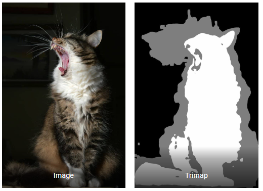
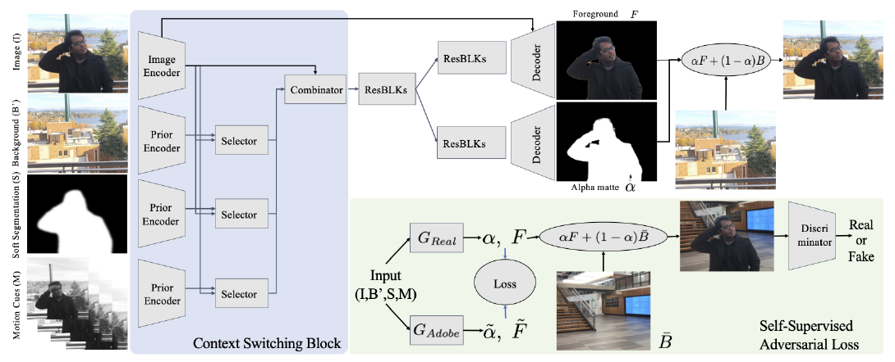

# Image Matting

抠图是指从一张图片中提取出前景物体相关的像素点，并标识每个像素属于前景或背景的概率，我们通常对于图片中的人像进行抠图。而图像分割中会直接将像素绝对归为某一类，不会是一个分布。

**Image Matting** is the process of accurately estimating the foreground object in images and videos. It is a very important technique in image and video editing applications, particularly in film production for creating visual effects. In case of image segmentation, we segment the image into foreground and background by labeling the pixels. Image segmentation generates a binary image, in which a pixel either belongs to foreground or background. However, Image Matting is different from the image segmentation, wherein some pixels may belong to foreground as well as background, such pixels are called partial or mixed pixels. In order to fully separate the foreground from the background in an image, accurate estimation of the alpha values for partial or mixed pixels is necessary.

## Background Matting v1

Background Matting: The World is Your Green Screen

## 论文

### 引言

图片 $I$ 可以被视为前景 $F$ 和背景 $B$ 的线性组合，分布权重为 $\alpha$，即：$I = \alpha F + (1-\alpha) B$。本文提出了一种人像抠图的方法，预测出像素级别的前景图 $F$ 和 $\alpha$ 值。之后我们就可以将前景物体抽离并合成到新的背景中，达到背景替换的效果。当时的很多抠图方法需要绿幕背景或者 trimap 图。trimap 指一张将图片分为前景、背景和未知区域的初步三分类图像分割图。

本文提出的方法只需要用户提供一张原图和一张没有任何物体的背景图，然后通过模型计算出前景图和 $\alpha$ 值。

### 方法

本文的方法有两个阶段，分别是有监督训练阶段和对抗训练阶段。输入都是一张静态的背景图片 $B'$ 和一张原图片$I$ 或视频。需保证两者的相机参数一致，动作幅度很小。对原图提取出一个人的软分割 $S$（视频时 optional）。输出是前景图片 $F$ 和 alpha 值。

#### 有监督训练

在 Adobe Matting Dataset 中的非透明物体进行有监督训练。数据集提供了很多背景、前景和 alpha 值，所以可以手动合成原图作为额外的训练数据，增强泛化性。使用了数据增强，包括随机翻转、裁剪、尺寸调整、噪音等。

#### 对抗训练

使用自监督训练进一步增强泛化性。使用训练好的有监督模型作为老师 $G_{\text{Adobe}}$ 产生伪标签，重新初始化一个模型作为学生 $G_{\text{Real}}$，再同时训练一个辨别网络 $D$ 判断生成器预测出的前景融合背景时是真还是假。

## 代码实现