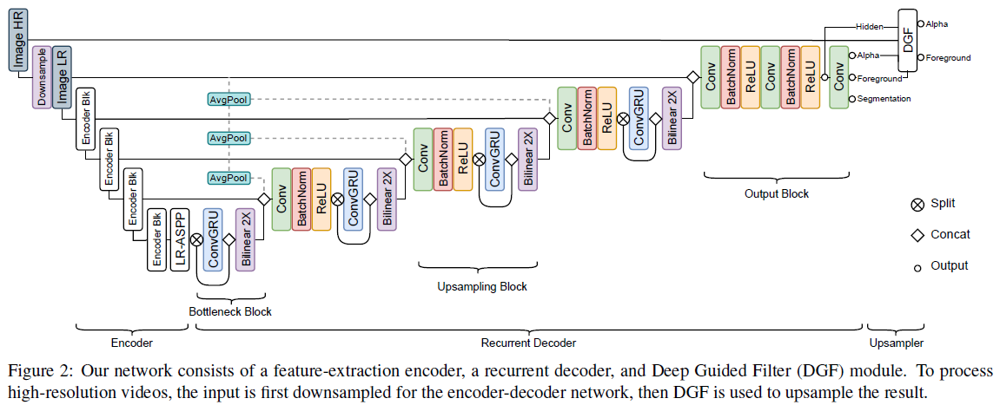

## Robust Video Matting (RVM)

Robust High-Resolution Video Matting with Temporal Guidance

参考：https://blog.csdn.net/qq_45929156/article/details/123297720


### 引言

提出了一个鲁棒、实时且高分辨率的人像抠图模型，该模型仅需原图作为输入，不需要 trimap 和背景图。以前的方法多是对视频的每帧独立进行预测。而本作使用循环网络架构整合时序信息，达到更好的效果。本作提出了一个多任务模型和新的训练方式，使得模型可以同时在语义分割和抠图的数据集上进行训练，进一步提升鲁棒性。作者这么做的原因如下：

- 人像语义分割和人像抠图任务在某种程度上是共通的
- 大多数现有的抠图数据集只提供了必须合成到背景图片中的前景图和 $\alpha$，这种合成看起来有点假。而语义分割的数据集是真实图片，背景特征丰富，能够防止对合成数据的过拟合
- 人像语义分割的数据集从数量还是标注成本上都远好于抠图数据集


### 网络结构



模型包含特征提取器、循环解码器和输出部分。编码器对序列中的每张图片抽取4个尺度的特征，目的是尽可能收集高维和低维的特征。处理高清图片时，在输入到图片编码器前按需进行下采样，以控制网络的计算复杂度。


#### 特征提取器

由 MobileNetV3-Large 实现。对单独的帧进行操作，并为循环解码器提取 $\frac{1}{4}$、$\frac{1}{4}$、$\frac{1}{8}$ 和 $\frac{1}{16}$ 尺寸大小的特征。目的是尽可能多的提取低级特征和高级特征，从而利用提取到的空间信息和全局信息精确分割。


#### 语义分割 LR-ASPP 模块

对特征提取器最后的特征进行操作，输入输出形状一样。


#### 循环解码器

聚合多个尺寸的特征在时间维度的信息，最终为每个图片输出一个图片尺寸的特征。用 ConvGRU 实现。有五个模块。

**一个瓶颈模块 Bottleneck Block**

输入是 $\frac{1}{16}$ 尺寸的瓶颈特征。对一半的特征维度上的特征进行 ConvGRU 计算，然后和原本剩余的一半特征进行拼接。输入输出形状一样。

**三个上采样模块 Upsampling Block**

输入是瓶颈模块/上个上采样模块的输出、特征提取器的同尺寸特征和低分辨率的图片。先将输入上采样，然后拼接并输入到一个卷积层对全特征维度进行信息融合，之后同样使用 ConvGRU 对特征维度一半的特征进行计算。认为这种设计高效，并能促使 ConvGRU 利用一半的特征传递时序信息，另一半传递空间信息。

**一个输出模块 Output Block**

输入是最后的上采样模块的输出和低分辨率的图片。先将输入上采样，然后拼接并输入到两层卷积层映射到目标特征维度。没有时序计算。


#### 映射网络

一层 $1 \times 1$ 卷积。若任务是抠图，就直接将特征降维到 4 维，拆分出前景和 $\alpha$。若任务是语义分割，就直接将特征降维到 1 维，输出一个 mask。


#### 深导滤波器 DGF

处理高清图片和影片时使用。处理高清输入时，会先进行下采样才送入特征提取器。所以最后需要一个有先验知识且可学习的上采样器将预测恢复到高清尺寸，即使用深度滤波器。对输入帧进行因子s的下采样，然后将低分辨率 $\alpha$、前景$F$、最终隐藏特征以及高分辨率输入帧提供给DGF模块，生成高分辨率的 $\alpha$ 和前景 $F$。实际上就是一个融入了可学习参数的引导滤波器，可以更好地拟合出一个高清的分割结果。

https://blog.csdn.net/edvard_hua/article/details/120781575


### 损失计算

#### 抠图损失

**$\alpha$ 的损失**

$\alpha$ 的损失由三部分加总。

**$\alpha$ 预测值与标签值的 L1 距离**
$$
\mathcal{L}_{l1}^\alpha = ||\alpha_t - \alpha_t^*||_1
$$

```py
loss['pha_l1'] = F.l1_loss(pred_pha, true_pha)
```

**$\alpha$ 预测值与标签值的 Laplacian Loss**
$$
\mathcal{L}_{lap}^\alpha = \sum_{s=1}^5 \frac{2^{s-1}}{5}|| \mathcal{L}_{pyr}^s (\alpha_t )- \mathcal{L}_{pyr}^s (\alpha_t^*)||_1
$$

ref: https://blog.csdn.net/lanceloter/article/details/121925904

这个损失能够更好地测量多个尺度下 $\alpha$ 边界区域的差值。所以我们计算 5 个尺度下 $\alpha$ 预测值和标签值的 L1 差值。对于尺度小的图片，其 L1 距离也会较小，所以乘上更大的权重。

```py
loss['pha_laplacian'] = laplacian_loss(pred_pha.flatten(0, 1), true_pha.flatten(0, 1))

def laplacian_loss(pred, true, max_levels=5):
    kernel = gauss_kernel(device=pred.device, dtype=pred.dtype)
    pred_pyramid = laplacian_pyramid(pred, kernel, max_levels)
    true_pyramid = laplacian_pyramid(true, kernel, max_levels)
    loss = 0
    for level in range(max_levels):
        loss += (2 ** level) * F.l1_loss(pred_pyramid[level], true_pyramid[level])
    return loss / max_levels
```

在每个尺度下，先保证图片可被下采样 (长宽都是双数)。然后对图片进行下采样和上采样，记录和原图的差值，然后进行下一个尺度的计算。

```py
def laplacian_pyramid(img, kernel, max_levels):
    current = img
    pyramid = []
    for _ in range(max_levels):
        current = crop_to_even_size(current)
        down = downsample(current, kernel)
        up = upsample(down, kernel)
        diff = current - up
        pyramid.append(diff)
        current = down
    return pyramid
```

在下采样时是直接间隔取像素。边界上原本不相邻的像素可能会靠近，造成虚假的高频信息，所以要先进行高斯平滑，弱化边界上的信号。

```py
def downsample(img, kernel):
    img = gauss_convolution(img, kernel)
    img = img[:, :, ::2, ::2]
    return img
```

在上采样时，创建上采样后的尺寸的0张量，填充4倍的内容，保证数值统一。然后也进行高斯平滑。

```py
def upsample(img, kernel):
    B, C, H, W = img.shape
    out = torch.zeros((B, C, H * 2, W * 2), device=img.device, dtype=img.dtype)
    out[:, :, ::2, ::2] = img * 4
    out = gauss_convolution(out, kernel)
    return out
```

图片经过高斯平滑和采样后必定有信息损失。对于边界上的像素损失更大。本就平滑的区域反而损失很小。所以和原图相减后，**更能突出边界区域的区别**，或者说对于高频信号更为敏感。最后我们衡量 $\alpha$ 预测值的边界差值和标签值的边界差值。总之，**Laplacian Loss 能更精确地多尺度下测量 $\alpha$ 边界上的损失**。

**高斯卷积核**
$$
\pmatrix{1 & 2 & 1 \\ 2 & 4 & 2 \\ 1 & 2 & 1}
$$
目的是弱化离当前像素过远的像素的影响，并对像素周围的内容进行加权和。高斯核既保留各个方向的边缘信息，又能够做好平滑处理。所以做采样时需要先做高斯平滑，这样结果不会出现虚假的高频信息。

```py
def gauss_kernel(device='cpu', dtype=torch.float32):
    kernel = torch.tensor([[1,  4,  6,  4, 1],
                           [4, 16, 24, 16, 4],
                           [6, 24, 36, 24, 6],
                           [4, 16, 24, 16, 4],
                           [1,  4,  6,  4, 1]], device=device, dtype=dtype)
    kernel /= 256
    kernel = kernel[None, None, :, :]
    return kernel

def gauss_convolution(img, kernel):
  B, C, H, W = img.shape
  img = img.reshape(B * C, 1, H, W)
  img = F.pad(img, (2, 2, 2, 2), mode='reflect')
  img = F.conv2d(img, kernel)
  img = img.reshape(B, C, H, W)
  return img
```


**临近两帧的 $\alpha$ 值的差的预测值和标签值的 L2 距离**
$$
\mathcal{L}_{l1}^\alpha = || \frac{d\alpha_t}{dt} - \frac{d\alpha_t^*}{t}||_2 \\
$$

```py
loss['pha_coherence'] = F.mse_loss(pred_pha[:, 1:] - pred_pha[:, :-1],
                                   true_pha[:, 1:] - true_pha[:, :-1]) * 5
```


**前景 $F$ 的损失**

前景 $F$ 的损失由两部分加总，就是 L1 损失和时序相关损失。仅对标签为前景的像素计算。
$$
\begin{align}
\mathcal{L}_{l1}^F = ||(a_t^* > 0) * (F_t - F_t^*) ||_1 \\
\mathcal{L}_{tc}^F = ||(a_t^* > 0) * (\frac{dF_t}{dt} - \frac{dF_t^*}{t}) ||_2 \\
\end{align}
$$

```py
loss['fgr_l1'] = F.l1_loss(pred_fgr, true_fgr)
loss['fgr_coherence'] = F.mse_loss(pred_fgr[:, 1:] - pred_fgr[:, :-1],
                                   true_fgr[:, 1:] - true_fgr[:, :-1]) * 5
```

最后将所有损失加总。

```py
loss['total'] = loss['pha_l1'] + loss['pha_coherence'] + loss['pha_laplacian'] \
              + loss['fgr_l1'] + loss['fgr_coherence']
return loss
```


#### 语义分割损失

本作仅训练分割人像，所以直接使用二分类交叉熵损失函数。
$$
\mathcal{L} = S_t^*(-\log (S_t)) + (1 - S_t^*)(- \log (1 - S_t))
$$

```py
F.binary_cross_entropy_with_logits(pred_seg, true_seg)
```


### 实验

#### 数据集

使用 VideoMatte240K (VM)、Distinctions-646 (D646) 和 Adobe Image Matting (AIM) 数据集用作抠图训练。前者数据为影片，后两者为图片。VM 提供 484 个 4K/HD 分辨率的高清影片。本文将数据集拆分为 475/4/5 分别对应训练、验证和测试集。仅使用 D646 和 AIM 中包含人像的图片，并将它们合并然后拆分为 420/15 作为训练和验证集。从两个数据集挑选 11 和 10 张图片作为测试集。

背景方面使用 [DVM](https://github.com/nowsyn/DVM) 提供的数据集中的背景制作数据集，挑选没有人物的背景。

语义分割方面使用 YouTubeVIS、COCO 和 SPD 数据集，挑选有人物的图片。


#### 训练策略

训练分成四个阶段，逐步提高图片序列长度和尺寸以更高效训练。

**阶段一**

使用 VideoMatte 数据集训练，在低分辨率和不使用 DGF 模块情况下训练 15 epochs。使用较短的序列 (T = 15)。特征提取器使用 ImageNet 预训练的 MobileNetv3 并使用 1e-4 学习率，模型其他部分使用 2e-4 学习率。We sample the height and width of the input resolution h, w independently between 256 and 512 pixels. This makes our network robust to different resolutions and aspect ratios. 实现起来似乎是保证短边至少有 512 像素??

**阶段二**

将序列增加到 T = 50，学习率减半，其他超参数不变，继续训练 2 个 epochs。

**阶段三**

继续用低清长序列影片训练，并加入高清短序列 (T = 6) 影片的训练。训练高清影片时，原图大小为 (1024, 2048)，下采样4倍，最后使用 DGF 上采样回去。训练 1 个 epoch。

**阶段四**

不使用影片抠图数据集，在 D646 和 AIM 的高低清图片数据集上训练 5 个 epoch。


**语义分割的训练**

与上述训练同时进行，单数 epoch 训练分割图片，双数 epoch 训练分割影片。


**总结**

```py
# 每个 epoch 必训练低清抠图
self.train_mat(true_fgr, true_pha, true_bgr, downsample_ratio=1, tag='lr')

# 第三个阶段加入高清抠图训练，根据 downsample_ratio 开启 DGF 训练
if self.args.train_hr:
    true_fgr, true_pha, true_bgr = self.load_next_mat_hr_sample()
    self.train_mat(true_fgr, true_pha, true_bgr, downsample_ratio=self.args.downsample_ratio, tag='hr')

# 每个 epoch 也必训练语义分割，单数训练图片分割，双数训练影片分割
if self.step % 2 == 0:
    true_img, true_seg = self.load_next_seg_video_sample()
    self.train_seg(true_img, true_seg, log_label='seg_video')
else:
    true_img, true_seg = self.load_next_seg_image_sample()
    self.train_seg(true_img.unsqueeze(1), true_seg.unsqueeze(1), log_label='seg_image')
```


## 代码实现

### 数据处理

#### 影片数据


#### 图片数据


### 网络结构

网络由四部分组成，MobileNetV3 的特征提取器、LR-ASPP 模块、ConvGRU 实现的循环上采样网络、映射网络和 Deep Guided Filter 实现的微调网络 。

```py
class MattingNetwork(nn.Module):
    def __init__(self,
                 variant: str = 'mobilenetv3',
                 refiner: str = 'deep_guided_filter',
                 pretrained_backbone: bool = False):
        super().__init__()
        assert variant in ['mobilenetv3', 'resnet50']
        assert refiner in ['fast_guided_filter', 'deep_guided_filter']
        
        if variant == 'mobilenetv3':
            self.backbone = MobileNetV3LargeEncoder(pretrained_backbone)
            self.aspp = LRASPP(960, 128)
            self.decoder = RecurrentDecoder([16, 24, 40, 128], [80, 40, 32, 16])
        else:
            self.backbone = ResNet50Encoder(pretrained_backbone)
            self.aspp = LRASPP(2048, 256)
            self.decoder = RecurrentDecoder([64, 256, 512, 256], [128, 64, 32, 16])
            
        # 实现是使用一层 1×1 卷积进行降维
        self.project_mat = Projection(16, 4)
        self.project_seg = Projection(16, 1)

        if refiner == 'deep_guided_filter':
            self.refiner = DeepGuidedFilterRefiner()
        else:
            self.refiner = FastGuidedFilterRefiner()
```

**前向过程**

当图片尺寸较大时，计算时间会大幅延长。所以这里的策略是**将图片下采样到合理的尺寸，在这个尺寸上计算抠图，之后在通过 refiner 上采样到原本尺寸**。当图片尺寸不大时不需要使用。

首先将合理尺寸的图片送入特征提取器，将最后小尺寸的特征 `f4` 送入 LR-ASPP，降低其特征维度并维持高宽。之后通过循环网络继续调整每张图片的特征，最后进行映射和恢复原尺寸。

```py
def forward(self,
            src: Tensor,
            r1: Optional[Tensor] = None,
            ...
            r4: Optional[Tensor] = None,
            downsample_ratio: float = 1,
            segmentation_pass: bool = False):

    if downsample_ratio != 1:
        src_sm = self._interpolate(src, scale_factor=downsample_ratio)
    else:
        src_sm = src

    f1, f2, f3, f4 = self.backbone(src_sm)
    f4 = self.aspp(f4)
    hid, *rec = self.decoder(src_sm, f1, f2, f3, f4, r1, r2, r3, r4)

    if not segmentation_pass:
        fgr_residual, pha = self.project_mat(hid).split([3, 1], dim=-3)
        if downsample_ratio != 1:
            fgr_residual, pha = self.refiner(src, src_sm, fgr_residual, pha, hid)
        fgr = fgr_residual + src
        fgr = fgr.clamp(0., 1.)
        pha = pha.clamp(0., 1.)
        return [fgr, pha, *rec]
    else:
        seg = self.project_seg(hid)
        return [seg, *rec]
```


#### 特征提取器

编码器默认是一个 MobileNetv3，为序列中每张图片抽取四个尺度的特征。分别是 `(16, H/2, W/2), (24, H/4, W/4), (40, H/8, W/8), (960, H/16, W/16)`。

```py
class MobileNetV3LargeEncoder(MobileNetV3):
    def __init__(self, pretrained: bool = False):
        super().__init__(
            inverted_residual_setting=[
                InvertedResidualConfig( 16, 3,  16,  16, False, "RE", 1, 1, 1),
                ...
                InvertedResidualConfig(160, 5, 960, 160,  True, "HS", 1, 2, 1),
            ],
            last_channel=1280
        )
        
        if pretrained:
            self.load_state_dict(torch.hub.load_state_dict_from_url(
                'https://download.pytorch.org/models/mobilenet_v3_large-8738ca79.pth'))

        del self.avgpool
        del self.classifier
        
    def forward_single_frame(self, x):
        x = normalize(x, [0.485, 0.456, 0.406], [0.229, 0.224, 0.225])
        
        x = self.features[0](x)
        x = self.features[1](x)
        f1 = x
        x = self.features[2](x)
        x = self.features[3](x)
        f2 = x
        x = self.features[4](x)
        x = self.features[5](x)
        x = self.features[6](x)
        f3 = x
        x = self.features[7](x)
				# 8 ... 15
        x = self.features[16](x)
        f4 = x
        return [f1, f2, f3, f4]
    
    def forward_time_series(self, x):
        B, T = x.shape[:2]
        features = self.forward_single_frame(x.flatten(0, 1))   # 将批量和时间步维度合并为批量一起送入网络
        features = [f.unflatten(0, (B, T)) for f in features]   # 将批量和时间步维度还原
        return features

    def forward(self, x):
        if x.ndim == 5:
            return self.forward_time_series(x)
        else:
            return self.forward_single_frame(x)
```


#### LR-ASPP 模块

这部分类似 Squeeze-and-Excitation Networks，一边用 1x1 卷积对特征降维，另一边进行全局平均池化，然后计算每个特征维度的权重，之后与前边的特征相乘。类似 Squeeze-and-Excite 模块。

```py
class LRASPP(nn.Module):
    def __init__(self, in_channels, out_channels):
        super().__init__()
        self.aspp1 = nn.Sequential(
            nn.Conv2d(in_channels, out_channels, 1, bias=False),
            nn.BatchNorm2d(out_channels),
            nn.ReLU(True)
        )
        self.aspp2 = nn.Sequential(
            nn.AdaptiveAvgPool2d(1),
            nn.Conv2d(in_channels, out_channels, 1, bias=False),
            nn.Sigmoid()
        )
        
    def forward_single_frame(self, x):
        return self.aspp1(x) * self.aspp2(x)
    
    def forward_time_series(self, x):
        # 为每个特征调用 forward_single_frame()，然后将结果拼接
```


#### 循环解码器

- `src_sm`：合理尺寸的图片。
- `f1...f4`：特征提取器的多尺度特征。
- `r1...f4`：可选，循环网络的隐藏层状态。没有提供则初始化为零。

```py
hid, *rec = self.decoder(src_sm, f1, f2, f3, f4, r1, r2, r3, r4)
```

循环网络由三部分组成，Bottleneck 模块、Upsampling 模块和 Output 模块。前两类模块含有 ConvGRU。

首先对图片进行多次的平均池化得到多尺寸的特征。然后将 LR-ASPP 的特征传入 Bottleneck 模块，将结果与图片的最小尺寸特征拼接，传入 Upsampling 模块，逐步上采样，最后通过 Output 模块。

```py
class RecurrentDecoder(nn.Module):
  	# MobileNetv3: feature_channels: [16, 24, 40, 128], decoder_channels: [80, 40, 32, 16]
    def __init__(self, feature_channels, decoder_channels):
        super().__init__()
        self.avgpool = AvgPool()
        self.decode4 = BottleneckBlock(feature_channels[3])
        self.decode3 = UpsamplingBlock(feature_channels[3], feature_channels[2], 3, decoder_channels[0])
        self.decode2 = UpsamplingBlock(decoder_channels[0], feature_channels[1], 3, decoder_channels[1])
        self.decode1 = UpsamplingBlock(decoder_channels[1], feature_channels[0], 3, decoder_channels[2])
        self.decode0 = OutputBlock(decoder_channels[2], 3, decoder_channels[3])

    def forward(self, s0: Tensor, f1: Tensor, f2: Tensor, f3: Tensor, f4: Tensor,
                r1: Optional[Tensor], r2: Optional[Tensor],
                r3: Optional[Tensor], r4: Optional[Tensor]):
        s1, s2, s3 = self.avgpool(s0)
        x4, r4 = self.decode4(f4, r4)
        x3, r3 = self.decode3(x4, f3, s3, r3)
        x2, r2 = self.decode2(x3, f2, s2, r2)
        x1, r1 = self.decode1(x2, f1, s1, r1)
        x0 = self.decode0(x1, s0)
        return x0, r1, r2, r3, r4
```

**多次平均池化**

用于得到 `1/2, 1/4, 1/8` 尺寸下的图片，之后拼接到特征里。

```py
class AvgPool(nn.Module):
    def __init__(self):
        super().__init__()
        self.avgpool = nn.AvgPool2d(2, 2, count_include_pad=False, ceil_mode=True)
        
    def forward_single_frame(self, s0):
        s1 = self.avgpool(s0)
        s2 = self.avgpool(s1)
        s3 = self.avgpool(s2)
        return s1, s2, s3
    
    def forward_time_series(self, s0):
    		# 为每个特征调用 forward_single_frame()，然后将结果拼接
```


##### ConvGRU

参数为特征维度，每个时间步的输入和隐藏状态的形状完全一样。模块不含映射隐藏状态的全连接层，所以输出就是隐藏状态。当输入是一序列的特征时会循环计算，将**每个时间步的隐藏状态作为输出**，同时输出最后的隐藏状态。

```py
class ConvGRU(nn.Module):
    def __init__(self, channels: int, kernel_size: int = 3, padding: int = 1):
        super().__init__()
        self.channels = channels
        self.ih = nn.Sequential(
            nn.Conv2d(channels * 2, channels * 2, kernel_size, padding=padding),
            nn.Sigmoid()
        )
        self.hh = nn.Sequential(
            nn.Conv2d(channels * 2, channels, kernel_size, padding=padding),
            nn.Tanh()
        )
        
    def forward_single_frame(self, x, h):
        r, z = self.ih(torch.cat([x, h], dim=1)).split(self.channels, dim=1)
        c = self.hh(torch.cat([x, r * h], dim=1))
        h = (1 - z) * h + z * c
        return h, h   # 单次计算输出等同隐藏状态
    
    def forward_time_series(self, x, h):
        o = []
        for xt in x.unbind(dim=1):
            ot, h = self.forward_single_frame(xt, h)
            o.append(ot)
        o = torch.stack(o, dim=1)
        return o, h
        
    def forward(self, x, h: Optional[Tensor]):
        if h is None:
            h = torch.zeros((x.size(0), x.size(-3), x.size(-2), x.size(-1)),
                            device=x.device, dtype=x.dtype)
        
        if x.ndim == 5:
            return self.forward_time_series(x, h)
        else:
            return self.forward_single_frame(x, h)
```


##### Bottleneck 模块

由于 LR-ASPP 模块的特征维度较大，该模块仅将输入特征的特征维度的后半部分传入 ConvGRU 以减少计算量。

```py
class BottleneckBlock(nn.Module):
    def __init__(self, channels):
        super().__init__()
        self.channels = channels
        self.gru = ConvGRU(channels // 2)

    def forward(self, x, r: Optional[Tensor]):
        a, b = x.split(self.channels // 2, dim=-3)
        b, r = self.gru(b, r)   # ConvGRU 输入输出形状不变
        x = torch.cat([a, b], dim=-3)   # 代替原特征的下半部分
        return x, r
```

结果传入第一个 Upsampling 模块，隐藏状态返回。

```py
  x4, r4 = self.decode4(f4, r4)
  x3, r3 = self.decode3(x4, f3, s3, r3)
  ...
  return x0, r1, r2, r3, r4
```


##### Upsampling 模块

首先对前一个模块传入的特征 `x` 进行上采样，然后与特征提取器特征和下采样的图片拼接，传入一个卷积网络。之后和 Bottleneck 模块一样，只将特征维度后半部分传入 ConvGRU 计算，然后和前半部分拼接作为输出。

```py
class UpsamplingBlock(nn.Module):
    def __init__(self, in_channels, skip_channels, src_channels, out_channels):
        super().__init__()
        self.out_channels = out_channels
        self.upsample = nn.Upsample(scale_factor=2, mode='bilinear', align_corners=False)
        self.conv = nn.Sequential(
            nn.Conv2d(in_channels + skip_channels + src_channels, out_channels, 3, 1, 1, bias=False),
            nn.BatchNorm2d(out_channels),
            nn.ReLU(True),
        )
        self.gru = ConvGRU(out_channels // 2)

    def forward_single_frame(self, x, f, s, r: Optional[Tensor]):
        x = self.upsample(x)
        x = x[:, :, :s.size(2), :s.size(3)]
        x = torch.cat([x, f, s], dim=1)
        x = self.conv(x)
        a, b = x.split(self.out_channels // 2, dim=1)
        b, r = self.gru(b, r)
        x = torch.cat([a, b], dim=1)
        return x, r

    def forward_time_series(self, x, f, s, r: Optional[Tensor]):
        B, T, _, H, W = s.shape
        x, f, s = x.flatten(0, 1), f.flatten(0, 1), s.flatten(0, 1)
        x = self.upsample(x)
        x = x[:, :, :H, :W]   # 防止与下采样的原图形状不一样??
        x = torch.cat([x, f, s], dim=1)
        x = self.conv(x)
        x = x.unflatten(0, (B, T))
        a, b = x.split(self.out_channels // 2, dim=2)
        b, r = self.gru(b, r)
        x = torch.cat([a, b], dim=2)
        return x, r

    def forward(self, x, f, s, r: Optional[Tensor]):
        if x.ndim == 5:
            return self.forward_time_series(x, f, s, r)
        else:
            return self.forward_single_frame(x, f, s, r)
```

输出与原尺寸图片一同传入 Output 模块，每层的隐藏状态都保存并返回。

```py
x1, r1 = self.decode1(x2, f1, s1, r1)
x0 = self.decode0(x1, s0)
return x0, r1, r2, r3, r4
```


##### Output 模块

首先对前一个模块传入的特征 `x` 进行上采样，然后与原尺寸图片拼接，传入一个卷积网络。输出序列中每张图片的最终特征。

```py
class OutputBlock(nn.Module):
    def __init__(self, in_channels, src_channels, out_channels):
        super().__init__()
        self.upsample = nn.Upsample(scale_factor=2, mode='bilinear', align_corners=False)
        self.conv = nn.Sequential(
            nn.Conv2d(in_channels + src_channels, out_channels, 3, 1, 1, bias=False),
            nn.BatchNorm2d(out_channels),
            nn.ReLU(True),
            nn.Conv2d(out_channels, out_channels, 3, 1, 1, bias=False),
            nn.BatchNorm2d(out_channels),
            nn.ReLU(True),
        )

    def forward_single_frame(self, x, s):
        x = self.upsample(x)
        x = x[:, :, :s.size(2), :s.size(3)]
        x = torch.cat([x, s], dim=1)
        x = self.conv(x)
        return x

    def forward_time_series(self, x, s):
      	# 为每个特征调用 forward_single_frame()，然后将结果拼接
```


最终返回序列中每张图片的特征，和 4 个 ConvGRU 的最终隐藏状态。

```py
hid, *rec = self.decoder(src_sm, f1, f2, f3, f4, r1, r2, r3, r4)
```


#### 映射网络

映射网络本质就是一层 $1 \times 1$ 卷积，直接用于降维。如果任务是抠图，就通过 `mat` 映射网络将特征降维到 4 维，并分离成前景残差和 $\alpha$ 值。使用微调网络进行上采样。

```py
if not segmentation_pass:
    fgr_residual, pha = self.project_mat(hid).split([3, 1], dim=-3)
    if downsample_ratio != 1:
        fgr_residual, pha = self.refiner(src, src_sm, fgr_residual, pha, hid)
    fgr = fgr_residual + src
    fgr = fgr.clamp(0., 1.)
    pha = pha.clamp(0., 1.)
    return [fgr, pha, *rec]
```

如果任务是人像语义分割，就通过 `seg` 映射网络将特征降维到 1 维。

```py
else:
    seg = self.project_seg(hid)
    return [seg, *rec]
```

训练阶段 ConvGRU 的隐藏状态会被丢弃。

```py
# Image Matting
pred_fgr, pred_pha = self.model_ddp(true_src, downsample_ratio=downsample_ratio)[:2]
loss = matting_loss(pred_fgr, pred_pha, true_fgr, true_pha)

# Segmentation
pred_seg = self.model_ddp(true_img, segmentation_pass=True)[0]
loss = segmentation_loss(pred_seg, true_seg)
```


#### 深导滤波器

https://blog.csdn.net/edvard_hua/article/details/120781575

在图片是 HD 或 4K 的情况下适用，负责将前景残差和 $\alpha$ 值上采样到高分辨率。实际上就是一个融入了可学习参数的引导滤波器，可以更好地拟合出一个边缘精确的分割结果。通常用于图片修复和增强、超分辨率、图片去雾、图片显著区域检测、深度估计等。

```py
if refiner == 'deep_guided_filter':
    self.refiner = DeepGuidedFilterRefiner()
else:
    self.refiner = FastGuidedFilterRefiner()
```


对合理尺寸的图片、前景预测值和 $ \alpha$ 预测值计算各种均值方差，并将结果通过一个卷积网络。之后上采样到原图尺寸，并加到原图上作为输出。

Box filter 是盒式滤波器，对图片降噪模糊化。A box blur (also known as a box linear filter) is a spatial domain linear filter in which each pixel in the resulting image has a value equal to the average value of its neighboring pixels in the input image.

```py
class DeepGuidedFilterRefiner(nn.Module):
    def __init__(self, hid_channels=16):
        super().__init__()
        self.box_filter = nn.Conv2d(4, 4, kernel_size=3, padding=1, bias=False, groups=4)
        self.box_filter.weight.data[...] = 1 / 9
        self.conv = nn.Sequential(
            nn.Conv2d(4 * 2 + hid_channels, hid_channels, kernel_size=1, bias=False),
            nn.BatchNorm2d(hid_channels),
            nn.ReLU(True),
            nn.Conv2d(hid_channels, hid_channels, kernel_size=1, bias=False),
            nn.BatchNorm2d(hid_channels),
            nn.ReLU(True),
            nn.Conv2d(hid_channels, 4, kernel_size=1, bias=True)
        )
        
    def forward_single_frame(self, fine_src, base_src, base_fgr, base_pha, base_hid):
        fine_x = torch.cat([fine_src, fine_src.mean(1, keepdim=True)], dim=1)
        base_x = torch.cat([base_src, base_src.mean(1, keepdim=True)], dim=1)
        base_y = torch.cat([base_fgr, base_pha], dim=1)
        
        mean_x = self.box_filter(base_x)
        mean_y = self.box_filter(base_y)
        cov_xy = self.box_filter(base_x * base_y) - mean_x * mean_y
        var_x  = self.box_filter(base_x * base_x) - mean_x * mean_x
        
        # 使用卷积求解 ak
        A = self.conv(torch.cat([cov_xy, var_x, base_hid], dim=1))
        # bk
        b = mean_y - A * mean_x
        
        H, W = fine_src.shape[2:]
        A = F.interpolate(A, (H, W), mode='bilinear', align_corners=False)
        b = F.interpolate(b, (H, W), mode='bilinear', align_corners=False)
        
        out = A * fine_x + b
        fgr, pha = out.split([3, 1], dim=1)
        return fgr, pha
    
    def forward_time_series(self, fine_src, base_src, base_fgr, base_pha, base_hid):
        # 为每个特征调用 forward_single_frame()，然后将结果拼接
```


### 损失

#### 抠图损失


```py
def matting_loss(pred_fgr, pred_pha, true_fgr, true_pha):
    """
    Args:
        pred_fgr: Shape(B, T, 3, H, W)
        pred_pha: Shape(B, T, 1, H, W)
        true_fgr: Shape(B, T, 3, H, W)
        true_pha: Shape(B, T, 1, H, W)
    """
    loss = dict()
    # Alpha losses
    loss['pha_l1'] = F.l1_loss(pred_pha, true_pha)
    loss['pha_laplacian'] = laplacian_loss(pred_pha.flatten(0, 1), true_pha.flatten(0, 1))
    loss['pha_coherence'] = F.mse_loss(pred_pha[:, 1:] - pred_pha[:, :-1],
                                       true_pha[:, 1:] - true_pha[:, :-1]) * 5
    # Foreground losses
    true_msk = true_pha.gt(0)
    pred_fgr = pred_fgr * true_msk
    true_fgr = true_fgr * true_msk
    loss['fgr_l1'] = F.l1_loss(pred_fgr, true_fgr)
    loss['fgr_coherence'] = F.mse_loss(pred_fgr[:, 1:] - pred_fgr[:, :-1],
                                       true_fgr[:, 1:] - true_fgr[:, :-1]) * 5
    # Total
    loss['total'] = loss['pha_l1'] + loss['pha_coherence'] + loss['pha_laplacian'] \
                  + loss['fgr_l1'] + loss['fgr_coherence']
    return loss
```


#### 语义分割损失

就是二分类损失。小于0负类，大于0正类。

```py
def segmentation_loss(pred_seg, true_seg):
    """
    Args:
        pred_seg: Shape(B, T, 1, H, W)
        true_seg: Shape(B, T, 1, H, W)
    """
    return F.binary_cross_entropy_with_logits(pred_seg, true_seg)
```


