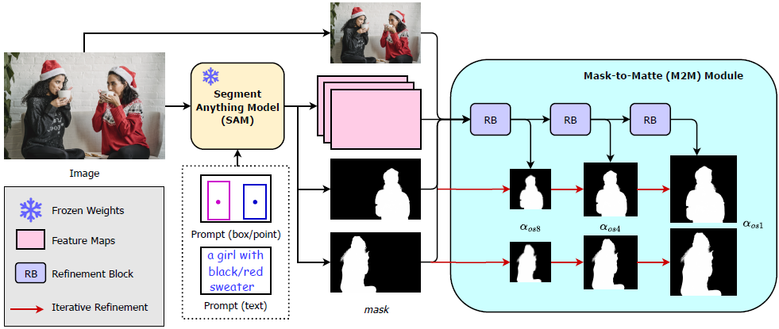

## Matting Anything

### 引言

在本文中，我们提出了 Matting Anything Model (MAM)，这是一个高效和通用的框架，接受来自用户的视觉或语义提示对图片中的物体进行抠图。MAM 有以下优势：

- MAM 能够处理各种类型的图像抠图，包括语义、实例和参考图像抠图，只有一个模型
- MAM 利用 Segment Anything Model (SAM) 输出的图片特征，通过轻量级的Mask-to-Matte (M2M) 模块，来迭代细化预测 alpha matte，该模块只有270万个可训练参数。
- 通过结合 SAM，MAM 简化了交互式使用图像抠图到框、点或文本提示所需的用户干预。

我们在各种图像抠图基准上评估了 MAM 的性能，结果表明，在每个基准的不同指标下，MAM 的性能与最先进的专业图像抠图模型相当。总体而言，MAM 具有较强的泛化能力，能够以较少的参数有效处理各种图像抠图任务，是实现统一图像抠图的实用方案。

 

### 网络结构



MAM 包含两个部分，冻结权重的 SAM 模型和可学习的 Mask-to-Matte (M2M) 模块。


#### Segment Anything Model (SAM)

基于 ViT 的语义分割模型，接受图片和输入提示。从一张图片 $I \in \mathbb{R}^{3 \times H \times W}$ 提取出密集特征 $F \in \mathbb{R}^{C \times \frac{H}{16} \times \frac{W}{16}}$。同时将 $N$ 个输入提示进行编码，并和图片特征一并输入掩码编码器产生每个提示的分割掩码 $m_i \in \mathbb{R}^{1 \times H \times W}, i \in N$。


#### Mask-to-Matte (M2M)

目的是将 SAM 输出的分割掩码高效并平滑地转换为 alpha matting。使用原图、SAM 输出的密集特征图和掩码预测作为 M2M 的输入，并且进行多个尺寸的预测和循环微调。

将调整尺寸后的原图、密集特征和掩码预测在特征维拼接，得到 $F_{m2m} \in \mathbb{R}^{(C+4) \times \frac{H}{16} \times \frac{W}{16}}$ 的输入，


### 损失计算


### 实验

#### 数据集

**训练数据集**

Adobe Image Matting (AIM)、Distinctions-646 (D646)、Animal Matting 2K (AM-2K)、Human-2K 和 RefMatte

**训练时用于制作合成图像的纯背景数据集**

COCO、Background Dataset - 20K

**测试数据集 (Semantic Image Matting)**

PPM-100、Animal Matting 2K (AM-2K)

**测试数据集 (Instance Image Matting)**

RWP36、HIM-2K


#### 实验环境

每个样本由随机抽取的前景物体和背景合成而成，然后将图片裁剪到 $1024 \times 1024$，送入基于 ViT-B 的 SAM 网络。


## 代码实现

代码实现：https://github.com/SHI-Labs/Matting-Anything


### 数据处理

**创建数据集**

混合多个数据集。使用 AIM, Distinctions-646, AM2K, Human-2K 时，合成背景。使用 RefMatte 时，使用自带的真实背景。

```py
train_dataset = DataGenerator(phase='train')
```

```py
class DataGenerator(Dataset):
    def __init__(self, phase="train"):
        self.phase = phase
        self.crop_size = CONFIG.data.crop_size
        self.pha_ratio = CONFIG.data.pha_ratio
        # coco ...
        self.bg20k_bg = [os.path.join(CONFIG.data.bg20k_bg, name) for name in sorted(os.listdir(CONFIG.data.bg20k_bg))]
        self.bg20k_num = len(self.bg20k_bg)

        # d646 ...
        # aim ...
        self.am2k_fg = [os.path.join(CONFIG.data.am2k_fg, name) for name in sorted(os.listdir(CONFIG.data.am2k_fg))]
        self.am2k_pha = [os.path.join(CONFIG.data.am2k_pha, name) for name in sorted(os.listdir(CONFIG.data.am2k_pha))]
        self.am2k_num = len(self.am2k_fg)
        self.human2k_fg = [os.path.join(CONFIG.data.human2k_fg, name) for name in
                           sorted(os.listdir(CONFIG.data.human2k_fg))]
        self.human2k_pha = [os.path.join(CONFIG.data.human2k_pha, name) for name in
                            sorted(os.listdir(CONFIG.data.human2k_pha))]
        self.human2k_num = len(self.human2k_fg)
        self.rim_img = [os.path.join(CONFIG.data.rim_img, name) for name in sorted(os.listdir(CONFIG.data.rim_img))]
        self.rim_pha = [os.path.join(CONFIG.data.rim_pha, name) for name in sorted(os.listdir(CONFIG.data.rim_pha))]
        self.rim_num = len(self.rim_img)

        self.transform_imagematte = transforms.Compose(
            [RandomAffine(degrees=30, scale=[0.8, 1.5], shear=10, flip=0.5),
             GenTrimap(),
             RandomCrop((self.crop_size, self.crop_size)),
             RandomJitter(),
             Composite(),
             ToTensor(phase="train", real_world_aug=CONFIG.data.real_world_aug)])

        self.transform_spd = transforms.Compose(
            [RandomAffine(degrees=30, scale=[0.8, 1.5], shear=10, flip=0.5),
             GenTrimap(),
             RandomCrop((self.crop_size, self.crop_size)),
             # RandomJitter(),
             Composite_Seg(),
             ToTensor(phase="train", real_world_aug=CONFIG.data.real_world_aug)])
```

**读取样本**

一半的概率使用合成图片，一半的概率使用 RefMatte 的真实图片。

```py
def __getitem__(self, idx):
    # if coco ...
    bg = cv2.imread(self.bg20k_bg[idx % self.bg20k_num])

    if random.random() < 0.5:
        if random.random() < 0.5:
            fg = cv2.imread(self.human2k_fg[idx % self.human2k_num])
            alpha = cv2.imread(self.human2k_pha[idx % self.human2k_num], 0).astype(np.float32) / 255
            fg, alpha = self._composite_fg_human2k(fg, alpha, idx)
            image_name = os.path.split(self.human2k_fg[idx % self.human2k_num])[-1]
        else:
            fg = cv2.imread(self.am2k_fg[idx % self.am2k_num])
            alpha = cv2.imread(self.am2k_pha[idx % self.am2k_num], 0).astype(np.float32) / 255
            fg, alpha = self._composite_fg_am2k(fg, alpha, idx)
            image_name = os.path.split(self.am2k_fg[idx % self.am2k_num])[-1]

        sample = {'fg': fg, 'alpha': alpha, 'bg': bg, 'image_name': image_name}
        sample = self.transform_imagematte(sample)
    else:
        fg = cv2.imread(self.rim_img[idx % self.rim_num])
        alpha = cv2.imread(self.rim_pha[idx % self.rim_num], 0).astype(np.float32) / 255

        if np.random.rand() < 0.25:
            fg = cv2.resize(fg, (1280, 1280), interpolation=maybe_random_interp(cv2.INTER_NEAREST))
            alpha = cv2.resize(alpha, (1280, 1280), interpolation=maybe_random_interp(cv2.INTER_NEAREST))

        image_name = os.path.split(self.rim_img[idx % self.rim_num])[-1]
        sample = {'fg': fg, 'alpha': alpha, 'bg': bg, 'image_name': image_name}
        sample = self.transform_spd(sample)

    return sample
```

最后的 sample 中包含六个内容。

```py
sample = {
    fg: (3, 1024, 1024), 
    alpha: (1, 1024, 1024),
    bg: (3, 1024, 1024), 
    trimap: (3, 1024, 1024), 
    image: (3, 1024, 1024), 
    boxes: (1, 4),
}
```


### SAM-M2M 网络结构

```py
def build_model(self):
    self.G = networks.get_generator_m2m(seg=self.model_config.arch.seg, m2m=self.model_config.arch.m2m)

	# for distributed ...

    self.build_lr_scheduler()
```

SAM-M2M 网络包含两个部分，冻结的 SAM 网络和 M2M 网络。

```py
class sam_m2m(nn.Module):
    def __init__(self, seg, m2m):
        super(sam_m2m, self).__init__()
        if m2m not in m2ms.__all__:
            raise NotImplementedError("Unknown M2M {}".format(m2m))
        self.m2m = m2ms.__dict__[m2m](nc=256)
        if seg == 'sam_vit_b':
            self.seg_model = sam_model_registry['vit_b'](checkpoint='ckpts/sam_vit_b_01ec64.pth')
        elif seg == 'sam_vit_l':
            ...
        self.seg_model.eval()
```

**前向过程**

将图片和框送入 SAM 获取密集特征和分割结果。会收到3个分割结果，选取预测质量最高的那一个。

```py
def forward(self, image, guidance):
    self.seg_model.eval()
    with torch.no_grad():
        # feas: (B, 256, 64, 64), masks: (B, 1, 256, 256)
        feas, masks = self.seg_model.forward_m2m(image, guidance, multimask_output=True)
    pred = self.m2m(feas, image, masks)
    return pred
```


#### Mask-to-Matte 

```py
def sam_decoder_deep(nc, **kwargs):
    model = SAM_Decoder_Deep(nc, [2, 3, 3, 2], **kwargs)
    return model
```


