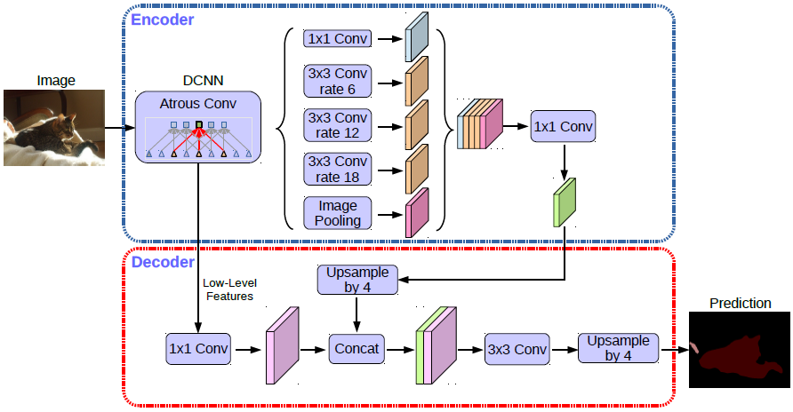

## DeepLab V3+

### 引言

语义分割网络通常使用 SPP 和编码器解码及结构。SPP 通过利用不同速率、不同感受野的卷积或者池化操作来探测输入特征，可以编码多尺度上下文信息；编解码结构则可以通过逐步恢复空间信息来获取更为清晰的物体边界。在这项研究中，我们结合了两者的优点。特别地，我们所提出的模型——DeepLabv3+，通过增加一个简单有效的解码器模块扩展了DeepLabv3，从而改善了分割效果，尤其是物体的边界。我们进一步探索了Xception模型，并在空洞空间金字塔池化模块和解码器模块分别使用了深度可分离卷积。我们在PASCAL VOC 2012和 Cityscapes数据集上验证了该模型的有效性，在不进行任何后处理的情况下，测试集性能分别达到89.0%和82.1%。


### 方法



整个网络是编码器解码器结构。

#### Encoder

##### Backbone

骨干网络可以使用两种网络结构：将 layer4 改为空洞卷积的 ResNet 系列和改进的 Xception 网络。从骨干网络收集两个尺寸的图片特征，分别是中间的 $(256, H/4, W/4)$ 和最后的 $(2048, H/8, W/8)$ 或 $(2048, H/16, W/16)$，最后的特征的分辨率根据输出步幅 `output_stride` 而定。将中间的特征直接送入 decoder，将最后的特征送入 ASPP。


##### ASPP

将输入分别进行 $1 \times 1$ 卷积、三种不同扩张率的卷积和池化然后上采样操作。将五种操作的结果在特征维度拼接起来，最后再通过一个卷积层汇总所有信息。输出的特征形状与输入一样。


#### Decoder

解码器先对编码器的中间特征进行卷积，然后和 ASPP 的输出拼接并输出 `num_classes` 个分割结果。


#### 损失计算


## 代码实现

### DeepLab V3+

Backbone 可使用 ResNet 或 Inception，然后将特征通过 ASPP，最后将两个尺寸的特征都通过 decoder 获得分割结果。可选择是否冻结 backbone。

```py
class DeepLab(BaseModel):
    def __init__(self, num_classes, in_channels=3, backbone='xception', pretrained=True, 
                output_stride=16, freeze_bn=False, freeze_backbone=False, **_):
                
        super(DeepLab, self).__init__()
        assert ('xception' or 'resnet' in backbone)
        if 'resnet' in backbone:
            self.backbone = ResNet(in_channels=in_channels, output_stride=output_stride, pretrained=pretrained)
            low_level_channels = 256
        else:
            self.backbone = Xception(output_stride=output_stride, pretrained=pretrained)
            low_level_channels = 128

        self.ASPP = ASPP(in_channels=2048, output_stride=output_stride)
        self.decoder = Decoder(low_level_channels, num_classes)

    def forward(self, x):
        H, W = x.size(2), x.size(3)
        x, low_level_features = self.backbone(x)
        x = self.ASPP(x)
        x = self.decoder(x, low_level_features)
        x = F.interpolate(x, size=(H, W), mode='bilinear', align_corners=True)
        return x
```


#### Encoder

##### Backbone

以 ResNet101 为例。中间的特征的形状是 $(256, 64, 64)$。而第三和第四层的卷积层的扩张率、填充和步长有所修改。第二层输出的特征图的形状是 $(512, 32, 32)$.

- 当 `output_stride = 8` 时，不调整后两层的步长，第三层的扩张率为 2， 第四层的扩张率为 4，最后特征为  $(2048, H/8, W/8)$。
- 当 `output_stride = 16` 时，第四层的步长为 2，第三层的扩张率为 1， 第四层的扩张率为 2，最后特征为  $(2048, H/16, W/16)$ 。

只有步长影响输出特征的分辨率，扩张率不影响。

```py
class ResNet(nn.Module):
    def __init__(self, in_channels=3, output_stride=16, backbone='resnet101', pretrained=True):
        super(ResNet, self).__init__()
        model = getattr(models, backbone)(pretrained)
        if not pretrained or in_channels != 3:
            self.layer0 = nn.Sequential(
                nn.Conv2d(in_channels, 64, 7, stride=2, padding=3, bias=False),
                nn.BatchNorm2d(64),
                nn.ReLU(inplace=True),
                nn.MaxPool2d(kernel_size=3, stride=2, padding=1)
            )
            initialize_weights(self.layer0)
        else:
            self.layer0 = nn.Sequential(*list(model.children())[:4])
        
        self.layer1 = model.layer1
        self.layer2 = model.layer2
        self.layer3 = model.layer3
        self.layer4 = model.layer4

        if output_stride == 16: s3, s4, d3, d4 = (2, 1, 1, 2)
        elif output_stride == 8: s3, s4, d3, d4 = (1, 1, 2, 4)
        
        if output_stride == 8: 
            for n, m in self.layer3.named_modules():
                if 'conv1' in n and (backbone == 'resnet34' or backbone == 'resnet18'):
                    m.dilation, m.padding, m.stride = (d3,d3), (d3,d3), (s3,s3)
                elif 'conv2' in n:
                    m.dilation, m.padding, m.stride = (d3,d3), (d3,d3), (s3,s3)
                elif 'downsample.0' in n:
                    m.stride = (s3, s3)

        for n, m in self.layer4.named_modules():
            if 'conv1' in n and (backbone == 'resnet34' or backbone == 'resnet18'):
                m.dilation, m.padding, m.stride = (d4,d4), (d4,d4), (s4,s4)
            elif 'conv2' in n:
                m.dilation, m.padding, m.stride = (d4,d4), (d4,d4), (s4,s4)
            elif 'downsample.0' in n:
                m.stride = (s4, s4)

    def forward(self, x):
        x = self.layer0(x)
        x = self.layer1(x)
        low_level_features = x
        x = self.layer2(x)
        x = self.layer3(x)
        x = self.layer4(x)

        return x, low_level_features
```


##### ASPP

将输入分别进行 $1 \times 1$ 卷积、三种不同扩张率的卷积和池化然后上采样操作。将五种操作的结果在特征维度拼接起来，最后再通过一个卷积层汇总所有信息。输出的特征形状与输入一样。

```py
def assp_branch(in_channels, out_channles, kernel_size, dilation):
    padding = 0 if kernel_size == 1 else dilation
    return nn.Sequential(
            nn.Conv2d(in_channels, out_channles, kernel_size, padding=padding, dilation=dilation, bias=False),
            nn.BatchNorm2d(out_channles),
            nn.ReLU(inplace=True))

class ASSP(nn.Module):
    def __init__(self, in_channels, output_stride):
        super(ASSP, self).__init__()

        assert output_stride in [8, 16], 'Only output strides of 8 or 16 are suported'
        if output_stride == 16: dilations = [1, 6, 12, 18]
        elif output_stride == 8: dilations = [1, 12, 24, 36]
        
        self.aspp1 = assp_branch(in_channels, 256, 1, dilation=dilations[0])
        self.aspp2 = assp_branch(in_channels, 256, 3, dilation=dilations[1])
        self.aspp3 = assp_branch(in_channels, 256, 3, dilation=dilations[2])
        self.aspp4 = assp_branch(in_channels, 256, 3, dilation=dilations[3])

        self.avg_pool = nn.Sequential(
            nn.AdaptiveAvgPool2d((1, 1)),
            nn.Conv2d(in_channels, 256, 1, bias=False),
            nn.BatchNorm2d(256),
            nn.ReLU(inplace=True))
        
        self.conv1 = nn.Conv2d(256*5, 256, 1, bias=False)
        self.bn1 = nn.BatchNorm2d(256)
        self.relu = nn.ReLU(inplace=True)
        self.dropout = nn.Dropout(0.5)

        initialize_weights(self)

    def forward(self, x):
        x1 = self.aspp1(x)
        x2 = self.aspp2(x)
        x3 = self.aspp3(x)
        x4 = self.aspp4(x)
        x5 = F.interpolate(self.avg_pool(x), size=(x.size(2), x.size(3)), mode='bilinear', align_corners=True)

        x = self.conv1(torch.cat((x1, x2, x3, x4, x5), dim=1))
        x = self.bn1(x)
        x = self.dropout(self.relu(x))

        return x
```


#### Decoder

解码器先对编码器的中间特征进行卷积，然后和 ASPP 的输出拼接并输出 `num_classes` 个分割结果。

```py
class Decoder(nn.Module):
    def __init__(self, low_level_channels, num_classes):
        super(Decoder, self).__init__()
        self.conv1 = nn.Conv2d(low_level_channels, 48, 1, bias=False)
        self.bn1 = nn.BatchNorm2d(48)
        self.relu = nn.ReLU(inplace=True)

        # Table 2, best performance with two 3x3 convs
        self.output = nn.Sequential(
            nn.Conv2d(48+256, 256, 3, stride=1, padding=1, bias=False),
            nn.BatchNorm2d(256),
            nn.ReLU(inplace=True),
            nn.Conv2d(256, 256, 3, stride=1, padding=1, bias=False),
            nn.BatchNorm2d(256),
            nn.ReLU(inplace=True),
            nn.Dropout(0.1),
            nn.Conv2d(256, num_classes, 1, stride=1),
        )
        initialize_weights(self)

    def forward(self, x, low_level_features):
        low_level_features = self.conv1(low_level_features)
        low_level_features = self.relu(self.bn1(low_level_features))
        H, W = low_level_features.size(2), low_level_features.size(3)

        x = F.interpolate(x, size=(H, W), mode='bilinear', align_corners=True)
        x = self.output(torch.cat((low_level_features, x), dim=1))
        return x
```

