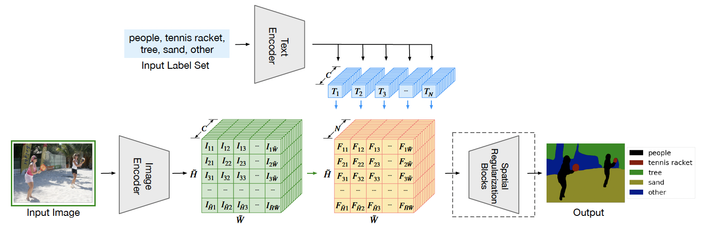

## LSeg

Language-Driven Semantic Segmentation

### 引言

提出了基于语言驱动的语义图像分割模型 LSeg。LSeg 使用文本编码器来编码输入的标签 (例如，“草”或“建筑”)，并使用基于 ViT 的图像编码器计算图像每个像素特征。最后将像素特征与文本特征进行对比，选择最相似的作为分割类别。文本编码器提供了非常灵活的标签的表示。这使得提供近似的标签都可以进行分割，如提供 "dog" 或 "pet" 都可以分割出图像中的狗。而且网络可以适应训练时没有见过的类别而无需重新训练，甚至不需要一个额外的训练样本。我们的方法实现了极具竞争力的 zero-shot 性能，甚至在提供固定标签集时达到了传统分割算法的精度。

虽说是使用了 CLIP 的预训练模型，但任务依旧是有监督训练。

### 方法

#### 数据集

有监督学习，不是对比学习。

#### 文本编码器

通过 CLIP 预训练的文本编码器得到文本的特征，得到 $N \times C$ 的特征。没有微调 CLIP 的文本编码器。

#### 图像编码器

使用 DPT，用 decoder 将特征图慢慢上采样。得到 $\tilde H \times \tilde W \times C$ 的特征，比原图尺寸小。用 ViT 或 diT 预训练参数比 CLIP 的参数更好。

#### 语义分割

将文本和图像的特征在特征维进行相乘，得到 $\tilde H \times \tilde W \times N$，表示每个像素是每个类别的分数。然后做交叉熵分类，是有监督学习。

#### Spatial Regularization Block

由 Conv 和 DepthwiseConv 组成，在比较后添加一些可学习的东西。

### 实验

#### 分析

对于数据集以外的文本的判别并不清晰，如背景可以用 other、and、but 等没有物体语义的词代替。

## 代码实现

