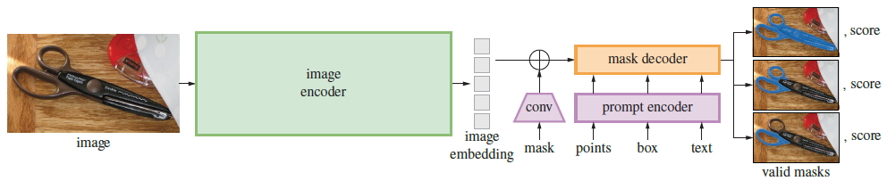

## Segment Anything

### 引言

之前的视觉任务中一个模型只对应一个任务，如物体识别模型做的再泛化也不能产生语义分割的结果。而现在的大视觉模型通过输入图片和提示就可以完成任意任务。提示搜索区域、物体的中心点就可以进行专门的分割。

SAM 项目包含新的图像分割任务、模型和数据集。利用高效的数据循环收集模型，建立了目前最大的分割数据集，在 1100 万张图像上建立了超过 10 亿个 mask。该模型被设计和训练为可提示的，因此它可以零样本转移到新的图像分布和任务中。评估了它在众多任务中的能力，发现它的零样本预测能力优秀，通常可与甚至优于之前的完全监督结果。

作者认为创建语义分割领域的 foundation 网络，需要在任务、模型和数据方面提出新的方法，即解决以下问题：

- 什么样的训练**任务**能够有助于零样本泛化？
  - 作者提出一个包含提示的语义分割任务，提供任何分割提示都能够做出正确的分割。即使分割提示比较模糊，如将提示点放在人的衣服上，则模型应该能输出人的衣服的分割或人的分割。在预训练和下游任务都使用提示。
- 对应的**网络结构**是什么样的？
  - 网络结构支持提示，而且能够实时生成分割，且分割可以是模糊的。提出使用**一个强大的图像编码器**、**一个提示编码器**和**合并处理两者特征的轻型分割解码器**。拆分为两个编码器也可以让我们仅对图像做一次编码，然后配合不同的提示输出不同的结果。提示编码器和轻型分割编码器在浏览器只需要 ~50ms 处理时间。
- 什么样的**数据**适合这样的任务和网络？
  - 需要大量且多样化的数据，创建了一个 data engine 来收集并循环更新和标注数据。有三个阶段：
    - assisted-manual：协助人工进行标注，和传统方法一样。
    - semi-automatic：根据位置提示自动分割常见物体，人工对剩余物体进行标注，提升多样性。
    - fully automatic： 根据固定的网格点提示，自动生成分割结果。


### Segment Anything Task

**Task**

将 prompt 的想法从 NLP 领域转到图像分割领域，prompt 可以是一组前景/背景点、一个粗糙的框或 mask、自由形式的文本等等（类似弱监督）。promptable 分割任务是在任何 prompt 下返回一个**有效的分割mask**。“有效”mask的要求仅仅意味着，即使一个prompt是不明确的，并且可能引用多个对象(例如，回想衬衫vs.人的例子，见图3)，输出也应该是这些对象中至少一个的合理mask。

**Pre-training**

输入的无论是图像还是提示，首先需要转化成一个向量，作者在这里直接用现成的（ViT、CLIP）

promptable分割任务提出了一种自然的预训练算法，该算法为每个训练样本模拟一系列prompts(例如点、框、掩码)，并将模型的mask预测与GT进行比较。作者将这种方法应用于交互式分割，目的是始终预测任何prompt的有效掩码，即使prompt是模糊的。

**Zero-shot transfer**

预训练任务赋予了模型在推理时对任何prompt作出适当反应的能力，从而可以通过设计适当的prompts来解决下游任务。例如，如果有一个猫的bounding box detector，那么可以通过向我们的模型提供detector's box输出作为prompt来解决猫实例分割问题。

**Discussion**

提示和组合是强大的工具，使单个模型能够以可扩展的方式使用，可完成模型设计时未知的任务。

作者预计，由prompt等驱动的可组合系统将比专门为固定任务训练的系统更广泛地支持各种应用。


### 方法



整个网络由三部分组成：图片编码器、提示编码器和掩码解码器

#### 图片编码器

通常来说，图片编码器是任意可以输出 $C \times H \times W$ 密集特征的网络。这里使用 MAE 预训练的 ViT 模型。即一个 ViT-H/16，并使用 $14 \times 14$ 的窗口注意力和等距全局注意力，和 ViTDet 一样。 编码器的输出是下采样到 $C \times H/16 \times W/16$ 的特征。

对输入图像，首先缩放并填充到 $1024 \times  1024$ 分辨率， 图片块编码是 $64 \times 64$ 长度，最后特征的形状为 $256 \times 64 \times 64$。


#### 提示编码器

分成2类：稀疏的 (点，box，文本)，稠密的（mask）

- point：映射到 256 维的向量，包含代表点位置的 positional encoding，加 2 个代表该点是前景/背景的可学习的编码。
- box：用一个embedding对表示（1）可学习的embedding代表左上角（2）可学习的embedding代表右下角
- 文本：用 CLIP 模型进行文本编码
- mask：用输入图像1/4分辨率的mask，然后用(2,2)卷积核，stride-2输出channel为4和16，再用(1,1)卷积核将channel升到256. mask 和iamge embedding通过element-wise相乘(逐元素相乘，可以理解成mask的feature对image的feature进行加权)


#### 分割解码器


## 代码实现


### 网络结构

以基于 ViT-Base 的网络为例。

```py
def build_sam_vit_b(checkpoint=None):
    # 四个参数都是图片编码器使用的
    return _build_sam(
        encoder_embed_dim=768,
        encoder_depth=12,
        encoder_num_heads=12,
        encoder_global_attn_indexes=[2, 5, 8, 11],
        checkpoint=checkpoint,   # 传入 ckpt 路径
    )
```

首先创建图片编码器、提示编码器和分割解码器，最后再用一个 SAM 网络将它们连接起来。

```py
def _build_sam(
    encoder_embed_dim, encoder_depth, encoder_num_heads,
    encoder_global_attn_indexes, checkpoint=None,
):
    prompt_embed_dim = 256
    image_size = 1024
    vit_patch_size = 16
    image_embedding_size = image_size // vit_patch_size   # 64
    sam = Sam(
        image_encoder=ImageEncoderViT(
            depth=encoder_depth,			# 12
            embed_dim=encoder_embed_dim,	# 768
            img_size=image_size,			# 1024
            mlp_ratio=4,
            norm_layer=partial(torch.nn.LayerNorm, eps=1e-6),
            num_heads=encoder_num_heads,	# 12
            patch_size=vit_patch_size,		# 16
            qkv_bias=True,
            use_rel_pos=True,
            global_attn_indexes=encoder_global_attn_indexes,   # [2, 5, 8, 11]
            window_size=14,
            out_chans=prompt_embed_dim,		# 256
        ),
        prompt_encoder=..., mask_decoder=...
        pixel_mean=[123.675, 116.28, 103.53],
        pixel_std=[58.395, 57.12, 57.375],
    )
    # 如果提供了训练参数，在这里加载
    ...
    return sam
```


#### SAM 模型

```py
class Sam(nn.Module):
    mask_threshold: float = 0.0
    image_format: str = "RGB"

    def __init__(
        self,
        image_encoder: ImageEncoderViT,
        prompt_encoder: PromptEncoder,
        mask_decoder: MaskDecoder,
        pixel_mean: List[float] = [123.675, 116.28, 103.53],
        pixel_std: List[float] = [58.395, 57.12, 57.375],
    ) -> None:
        """
        SAM predicts object masks from an image and input prompts.

        Arguments:
          image_encoder (ImageEncoderViT): The backbone used to encode the
            image into image embeddings that allow for efficient mask prediction.
          prompt_encoder (PromptEncoder): Encodes various types of input prompts.
          mask_decoder (MaskDecoder): Predicts masks from the image embeddings
            and encoded prompts.
          pixel_mean (list(float)): Mean values for normalizing pixels in the input image.
          pixel_std (list(float)): Std values for normalizing pixels in the input image.
        """
        super().__init__()
        self.image_encoder = image_encoder
        self.prompt_encoder = prompt_encoder
        self.mask_decoder = mask_decoder
        self.register_buffer("pixel_mean", torch.Tensor(pixel_mean).view(-1, 1, 1), False)
        self.register_buffer("pixel_std", torch.Tensor(pixel_std).view(-1, 1, 1), False)
```

**前向过程**

最后得到 1/4 尺寸的分割结果，用两次上采样到原图尺寸。

```py
def forward(
    self,
    batched_input: List[Dict[str, Any]],
    multimask_output: bool,
) -> List[Dict[str, torch.Tensor]]:
    """
    Predicts masks end-to-end from provided images and prompts.
    If prompts are not known in advance, using SamPredictor is
    recommended over calling the model directly.

    Arguments:
      batched_input (list(dict)): A list over input images, each a
        dictionary with the following keys. A prompt key can be
        excluded if it is not present.
          'image': The image as a torch tensor in 3xHxW format,
            already transformed for input to the model.
          'original_size': (tuple(int, int)) The original size of
            the image before transformation, as (H, W).
          'point_coords': (torch.Tensor) Batched point prompts for
            this image, with shape BxNx2. Already transformed to the
            input frame of the model.
          'point_labels': (torch.Tensor) Batched labels for point prompts,
            with shape BxN.
          'boxes': (torch.Tensor) Batched box inputs, with shape Bx4.
            Already transformed to the input frame of the model.
          'mask_inputs': (torch.Tensor) Batched mask inputs to the model,
            in the form Bx1xHxW.
      multimask_output (bool): Whether the model should predict multiple
        disambiguating masks, or return a single mask.

    Returns:
      (list(dict)): A list over input images, where each element is
        as dictionary with the following keys.
          'masks': (torch.Tensor) Batched binary mask predictions,
            with shape BxCxHxW, where B is the number of input prompts,
            C is determined by multimask_output, and (H, W) is the
            original size of the image.
          'iou_predictions': (torch.Tensor) The model's predictions
            of mask quality, in shape BxC.
          'low_res_logits': (torch.Tensor) Low resolution logits with
            shape BxCxHxW, where H=W=256. Can be passed as mask input
            to subsequent iterations of prediction.
    """
    input_images = torch.stack([self.preprocess(x["image"]) for x in batched_input], dim=0)
    image_embeddings = self.image_encoder(input_images)

    outputs = []
    for image_record, curr_embedding in zip(batched_input, image_embeddings):
        if "point_coords" in image_record:
            points = (image_record["point_coords"], image_record["point_labels"])
        else:
            points = None
        sparse_embeddings, dense_embeddings = self.prompt_encoder(
            points=points,
            boxes=image_record.get("boxes", None),
            masks=image_record.get("mask_inputs", None),
        )
        low_res_masks, iou_predictions = self.mask_decoder(
            image_embeddings=curr_embedding.unsqueeze(0),
            image_pe=self.prompt_encoder.get_dense_pe(),
            sparse_prompt_embeddings=sparse_embeddings,
            dense_prompt_embeddings=dense_embeddings,
            multimask_output=multimask_output,
        )
        masks = self.postprocess_masks(
            low_res_masks,
            input_size=image_record["image"].shape[-2:],
            original_size=image_record["original_size"],
        )
        masks = masks > self.mask_threshold
        outputs.append(
            {
                "masks": masks,
                "iou_predictions": iou_predictions,
                "low_res_logits": low_res_masks,
            }
        )
    return outputs
```


#### 图片编码器

使用 ViTDet 的设定，使用窗口自注意力减少处理高清图片时的计算量。最后使用投射层将特征维度降低。

```py
class ImageEncoderViT(nn.Module):
    def __init__(
        self,
        img_size: int = 1024, patch_size: int = 16, in_chans: int = 3,
        embed_dim: int = 768, depth: int = 12, num_heads: int = 12,
        mlp_ratio: float = 4.0, out_chans: int = 256,
        qkv_bias: bool = True,
        norm_layer: Type[nn.Module] = nn.LayerNorm,
        act_layer: Type[nn.Module] = nn.GELU,
        use_abs_pos: bool = True, use_rel_pos: bool = False,
        rel_pos_zero_init: bool = True, window_size: int = 0,
        global_attn_indexes: Tuple[int, ...] = (),
    ) -> None:
        """
        Args:
            img_size (int): Input image size.
            patch_size (int): Patch size.
            in_chans (int): Number of input image channels.
            embed_dim (int): Patch embedding dimension.
            depth (int): Depth of ViT.
            num_heads (int): Number of attention heads in each ViT block.
            mlp_ratio (float): Ratio of mlp hidden dim to embedding dim.
            qkv_bias (bool): If True, add a learnable bias to query, key, value.
            norm_layer (nn.Module): Normalization layer.
            act_layer (nn.Module): Activation layer.
            use_abs_pos (bool): If True, use absolute positional embeddings.
            use_rel_pos (bool): If True, add relative positional embeddings to the attention map.
            rel_pos_zero_init (bool): If True, zero initialize relative positional parameters.
            window_size (int): Window size for window attention blocks.
            global_attn_indexes (list): Indexes for blocks using global attention.
        """
        super().__init__()
        self.img_size = img_size

        self.patch_embed = PatchEmbed(
            kernel_size=(patch_size, patch_size), stride=(patch_size, patch_size),
            in_chans=in_chans, embed_dim=embed_dim,
        )

        self.pos_embed: Optional[nn.Parameter] = None
        if use_abs_pos:
            # Initialize absolute positional embedding with pretrain image size.
            self.pos_embed = nn.Parameter(
                torch.zeros(1, img_size // patch_size, img_size // patch_size, embed_dim)
            )

        self.blocks = nn.ModuleList()
        for i in range(depth):
            # 使用窗口注意力的块，不是全局注意力
            block = Block(
                dim=embed_dim, num_heads=num_heads, mlp_ratio=mlp_ratio,
                qkv_bias=qkv_bias, norm_layer=norm_layer, act_layer=act_layer,
                use_rel_pos=use_rel_pos, rel_pos_zero_init=rel_pos_zero_init,
                window_size=window_size if i not in global_attn_indexes else 0,
                input_size=(img_size // patch_size, img_size // patch_size),
            )
            self.blocks.append(block)

        self.neck = nn.Sequential(
            nn.Conv2d(embed_dim, out_chans, kernel_size=1, bias=False),
            LayerNorm2d(out_chans),
            nn.Conv2d( out_chans, out_chans, kernel_size=3, padding=1, bias=False),
            LayerNorm2d(out_chans),
        )
```

**前向过程**

图片块编码，添加可学习绝对位置编码，送进 ViT，最后进行降维。若输入图片为 $3 \times 1024 \times 1024$，输出特征为 $256 \times 64 \times 64$。缩放和填充在 SAM 网络进行，这里输入默认就是正方形。

```py
def forward(self, x: torch.Tensor) -> torch.Tensor:
    x = self.patch_embed(x)   # [B, 64, 64, 768], 特征维移到最后
    if self.pos_embed is not None:
        x = x + self.pos_embed
    for blk in self.blocks:
        x = blk(x)
    x = self.neck(x.permute(0, 3, 1, 2))
    return x
```


#### 提示编码器

提示编码器可以对点、框和mask 进行编码，映射成 256 维的向量。

```py
prompt_encoder=PromptEncoder(
    embed_dim=prompt_embed_dim,   # 256
    image_embedding_size=(image_embedding_size, image_embedding_size),   # 64
    input_image_size=(image_size, image_size),   # 1024
    mask_in_chans=16,
),
```

创建四个可学习的编码 `point_embeddings` 供点和框使用，分别是表示前景点、背景点、左上点和右下点。`not_a_point_embed` 和 `no_mask_embed` 用于缺少对应输入时使用。

```py
class PromptEncoder(nn.Module):
    def __init__(
        self, embed_dim: int, image_embedding_size: Tuple[int, int],
        input_image_size: Tuple[int, int], mask_in_chans: int,
        activation: Type[nn.Module] = nn.GELU,
    ) -> None:
        """
        Encodes prompts for input to SAM's mask decoder.

        Arguments:
          embed_dim (int): The prompts' embedding dimension
          image_embedding_size (tuple(int, int)): The spatial size of the
            image embedding, as (H, W).
          input_image_size (int): The padded size of the image as input
            to the image encoder, as (H, W).
          mask_in_chans (int): The number of hidden channels used for
            encoding input masks.
          activation (nn.Module): The activation to use when encoding
            input masks.
        """
        super().__init__()
        self.embed_dim = embed_dim
        self.input_image_size = input_image_size
        self.image_embedding_size = image_embedding_size
        self.pe_layer = PositionEmbeddingRandom(embed_dim // 2)

        self.num_point_embeddings: int = 4  # pos/neg point + 2 box corners
        point_embeddings = [nn.Embedding(1, embed_dim) for i in range(self.num_point_embeddings)]
        self.point_embeddings = nn.ModuleList(point_embeddings)
        self.not_a_point_embed = nn.Embedding(1, embed_dim)

        self.mask_input_size = (4 * image_embedding_size[0], 4 * image_embedding_size[1])
        self.mask_downscaling = nn.Sequential(
            nn.Conv2d(1, mask_in_chans // 4, kernel_size=2, stride=2),
            LayerNorm2d(mask_in_chans // 4),
            activation(),
            nn.Conv2d(mask_in_chans // 4, mask_in_chans, kernel_size=2, stride=2),
            LayerNorm2d(mask_in_chans),
            activation(),
            nn.Conv2d(mask_in_chans, embed_dim, kernel_size=1),
        )
        self.no_mask_embed = nn.Embedding(1, embed_dim)
```

**前向过程**

输入的三种提示都是可选的。输出两类提示的编码：稀疏（点、框和文本）和密集（mask）。

```py
def forward(
    self,
    points: Optional[Tuple[torch.Tensor, torch.Tensor]],
    boxes: Optional[torch.Tensor],
    masks: Optional[torch.Tensor],
) -> Tuple[torch.Tensor, torch.Tensor]:
    """
    Embeds different types of prompts, returning both sparse and dense
    embeddings.

    Arguments:
      points (tuple(torch.Tensor, torch.Tensor) or none): point coordinates
        and labels to embed.
      boxes (torch.Tensor or none): boxes to embed
      masks (torch.Tensor or none): masks to embed

    Returns:
      torch.Tensor: sparse embeddings for the points and boxes, with shape
        BxNx(embed_dim), where N is determined by the number of input points
        and boxes.
      torch.Tensor: dense embeddings for the masks, in the shape
        Bx(embed_dim)x(embed_H)x(embed_W)
    """
    bs = self._get_batch_size(points, boxes, masks)
    sparse_embeddings = torch.empty((bs, 0, self.embed_dim), device=self._get_device())
    
    if points is not None:
        coords, labels = points
        point_embeddings = self._embed_points(coords, labels, pad=(boxes is None))
        sparse_embeddings = torch.cat([sparse_embeddings, point_embeddings], dim=1)
    if boxes is not None:
        box_embeddings = self._embed_boxes(boxes)
        sparse_embeddings = torch.cat([sparse_embeddings, box_embeddings], dim=1)

    if masks is not None:
        dense_embeddings = self._embed_masks(masks)
    else:
        dense_embeddings = self.no_mask_embed.weight.reshape(1, -1, 1, 1).expand(
            bs, -1, self.image_embedding_size[0], self.image_embedding_size[1]
        )

    return sparse_embeddings, dense_embeddings
```


##### 点的编码

分辨率调整导致的点的位置变化不在此处理。若只提供了点没有提供框，就会补充一个点。将点坐标点映射到位置编码，并加上代表前景或背景的编码。

```py
input_point = np.array([[500, 375]])   # 像素坐标
input_label = np.array([1])   # 1: 前景点，0: 背景点

def _embed_points(
    self, points: torch.Tensor, labels: torch.Tensor, pad: bool,
) -> torch.Tensor:
    """Embeds point prompts."""
    # 此时的坐标还是像素坐标，不是 [-1, 1] 范围内
    points = points + 0.5  # Shift to center of pixel
    if pad:
        padding_point = torch.zeros((points.shape[0], 1, 2), device=points.device)
        padding_label = -torch.ones((labels.shape[0], 1), device=labels.device)
        points = torch.cat([points, padding_point], dim=1)   # (B, N+1, 2)
        labels = torch.cat([labels, padding_label], dim=1)   # (B, N+1)
    # 这一步会将像素坐标用位置编码表示，(B, N+1, 256)
    point_embedding = self.pe_layer.forward_with_coords(points, self.input_image_size)
    # 对于补充的点，用特别的 not_a_point_embed 表示
    point_embedding[labels == -1] = 0.0
    point_embedding[labels == -1] += self.not_a_point_embed.weight
    # 对于前景点和背景点，添加对应的编码
    point_embedding[labels == 0] += self.point_embeddings[0].weight
    point_embedding[labels == 1] += self.point_embeddings[1].weight
    return point_embedding   # (B, N, 2, 256)
```


##### 框的编码

用左上和右下表示一个框。将两个坐标映射到位置编码，然后加上表示左上或右下的编码。

```py
input_box = np.array([425, 600, 700, 875])

def _embed_boxes(self, boxes: torch.Tensor) -> torch.Tensor:
    """Embeds box prompts."""
    boxes = boxes + 0.5  # Shift to center of pixel
    coords = boxes.reshape(-1, 2, 2)
    corner_embedding = self.pe_layer.forward_with_coords(coords, self.input_image_size)
    corner_embedding[:, 0, :] += self.point_embeddings[2].weight
    corner_embedding[:, 1, :] += self.point_embeddings[3].weight
    return corner_embedding
```


##### mask 的编码

mask 直接用一个神经网络处理。输入的 mask 的分辨率默认是图片特征的尺寸的4倍，即$256 \times 256$，通过网络后降维4倍，变成和图片特征尺寸一样 $64 \times 64$。

```py
def _embed_masks(self, masks: torch.Tensor) -> torch.Tensor:
    """Embeds mask inputs."""
    mask_embedding = self.mask_downscaling(masks)
    return mask_embedding

self.mask_downscaling = nn.Sequential(
    nn.Conv2d(1, mask_in_chans // 4, kernel_size=2, stride=2),
    LayerNorm2d(mask_in_chans // 4),
    activation(),
    nn.Conv2d(mask_in_chans // 4, mask_in_chans, kernel_size=2, stride=2),
    LayerNorm2d(mask_in_chans),
    activation(),
    nn.Conv2d(mask_in_chans, embed_dim, kernel_size=1),
)
```


#### 分割解码器

```py
mask_decoder=MaskDecoder(
    num_multimask_outputs=3,
    transformer=TwoWayTransformer(
        depth=2, embedding_dim=prompt_embed_dim,
        mlp_dim=2048, num_heads=8,
    ),
    transformer_dim=prompt_embed_dim,
    iou_head_depth=3,
    iou_head_hidden_dim=256,
),
```

分割解码器包含一个两层的 `TwoWayTransformer` 来融合图片和提示的特征，最后从特征上采样到 1/4 尺寸的分割结果。另一个通路则预测分割结果的质量。

```py
class MaskDecoder(nn.Module):
    def __init__(
        self,
        *, transformer_dim: int, transformer: nn.Module,
        num_multimask_outputs: int = 3, activation: Type[nn.Module] = nn.GELU,
        iou_head_depth: int = 3, iou_head_hidden_dim: int = 256,
    ) -> None:
        """
        Predicts masks given an image and prompt embeddings, using a
        transformer architecture.

        Arguments:
          transformer_dim (int): the channel dimension of the transformer
          transformer (nn.Module): the transformer used to predict masks
          num_multimask_outputs (int): the number of masks to predict
            when disambiguating masks
          activation (nn.Module): the type of activation to use when
            upscaling masks
          iou_head_depth (int): the depth of the MLP used to predict
            mask quality
          iou_head_hidden_dim (int): the hidden dimension of the MLP
            used to predict mask quality
        """
        super().__init__()
        self.transformer_dim = transformer_dim
        self.transformer = transformer

        self.num_multimask_outputs = num_multimask_outputs

        self.iou_token = nn.Embedding(1, transformer_dim)
        self.num_mask_tokens = num_multimask_outputs + 1
        self.mask_tokens = nn.Embedding(self.num_mask_tokens, transformer_dim)

        self.output_upscaling = nn.Sequential(
            nn.ConvTranspose2d(transformer_dim, transformer_dim // 4, kernel_size=2, stride=2),
            LayerNorm2d(transformer_dim // 4),
            activation(),
            nn.ConvTranspose2d(transformer_dim // 4, transformer_dim // 8, kernel_size=2, stride=2),
            activation(),
        )
        self.output_hypernetworks_mlps = nn.ModuleList(
            [
                MLP(transformer_dim, transformer_dim, transformer_dim // 8, 3)
                for i in range(self.num_mask_tokens)
            ]
        )

        self.iou_prediction_head = MLP(
            transformer_dim, iou_head_hidden_dim, self.num_mask_tokens, iou_head_depth
        )
```

**前向过程**

`image_pe`：具有 image_embedding 形状的位置编码。

```py
def forward(
    self, image_embeddings: torch.Tensor, image_pe: torch.Tensor,
    sparse_prompt_embeddings: torch.Tensor, dense_prompt_embeddings: torch.Tensor,
    multimask_output: bool,
) -> Tuple[torch.Tensor, torch.Tensor]:
    """
    Predict masks given image and prompt embeddings.

    Arguments:
      image_embeddings (torch.Tensor): the embeddings from the image encoder
      image_pe (torch.Tensor): positional encoding with the shape of image_embeddings
      sparse_prompt_embeddings (torch.Tensor): the embeddings of the points and boxes
      dense_prompt_embeddings (torch.Tensor): the embeddings of the mask inputs
      multimask_output (bool): Whether to return multiple masks or a single
        mask.

    Returns:
      torch.Tensor: batched predicted masks
      torch.Tensor: batched predictions of mask quality
    """
    masks, iou_pred = self.predict_masks(
        image_embeddings=image_embeddings,
        image_pe=image_pe,
        sparse_prompt_embeddings=sparse_prompt_embeddings,
        dense_prompt_embeddings=dense_prompt_embeddings,
    )

    # Select the correct mask or masks for output
    if multimask_output:
        mask_slice = slice(1, None)
    else:
        mask_slice = slice(0, 1)
    masks = masks[:, mask_slice, :, :]
    iou_pred = iou_pred[:, mask_slice]

    # Prepare output
    return masks, iou_pred
```

将可学习的 output token 嵌入到提示特征集合中（类似于vit中的[class]标记），再传入 transformer。

**TwoWayTransformer**

负责融合图片和提示的特征，图片是 queries，提示是 keys。使用两个方向上的提示自注意力和交叉注意力(提示到图像嵌入，图像嵌入再到提示)来更新所有嵌入。每个解码器执行四个步骤，重复两次

1. prompt tokens+output tokens进行自注意力,
2. 用得到的token和image embedding进行cross-attention（token作为Q）
3. 逐点MLP 更新token
4. 用image embedding和（3）的token进行cross-attention（image embedding作为Q）

重复上述步骤2次，再将attn再通过残差进行连接，最终输出 masks 初步特征和计算 mask 质量的特征。

之后通过上采样网络和 MLP 输出最后的预测结果。

```py
def predict_masks(
    self, image_embeddings: torch.Tensor, image_pe: torch.Tensor,
    sparse_prompt_embeddings: torch.Tensor, dense_prompt_embeddings: torch.Tensor,
) -> Tuple[torch.Tensor, torch.Tensor]:
    # Concatenate output tokens
    output_tokens = torch.cat([self.iou_token.weight, self.mask_tokens.weight], dim=0)
    output_tokens = output_tokens.unsqueeze(0).expand(sparse_prompt_embeddings.size(0), -1, -1)
    # (B, N + 5, 256)
    tokens = torch.cat((output_tokens, sparse_prompt_embeddings), dim=1)

    # Expand per-image data in batch direction to be per-mask
    # (B^2, 256, 64, 64) ??
    src = torch.repeat_interleave(image_embeddings, tokens.shape[0], dim=0)
    src = src + dense_prompt_embeddings
    # (B^2, 256, 64, 64)
    pos_src = torch.repeat_interleave(image_pe, tokens.shape[0], dim=0)
    b, c, h, w = src.shape

    # Run the transformer, hs: (1, N + 5, 256), src: (1, 4096, 256)
    hs, src = self.transformer(src, pos_src, tokens)
    iou_token_out = hs[:, 0, :]   # (1, 256)
    mask_tokens_out = hs[:, 1 : (1 + self.num_mask_tokens), :]   # (1, 4, 256)

    # Upscale mask embeddings and predict masks using the mask tokens
    src = src.transpose(1, 2).view(b, c, h, w)
    # (1, 32, 256, 256)
    upscaled_embedding = self.output_upscaling(src)
    hyper_in_list: List[torch.Tensor] = []
    for i in range(self.num_mask_tokens):
        hyper_in_list.append(self.output_hypernetworks_mlps[i](mask_tokens_out[:, i, :]))
    # (1, 4, 32)
    hyper_in = torch.stack(hyper_in_list, dim=1)
    b, c, h, w = upscaled_embedding.shape
    masks = (hyper_in @ upscaled_embedding.view(b, c, h * w)).view(b, -1, h, w)

    # Generate mask quality predictions
    iou_pred = self.iou_prediction_head(iou_token_out)
	# (1, 4, 256, 256), (1, 4)
    return masks, iou_pred
```


SAM 接收上面传入的图片编码器、提示编码器和分割解码器三部分组成。

```py
class Sam(nn.Module):
    mask_threshold: float = 0.0
    image_format: str = "RGB"

    def __init__(
        self, image_encoder: ImageEncoderViT, prompt_encoder: PromptEncoder,
        mask_decoder: MaskDecoder,
        pixel_mean: List[float] = [123.675, 116.28, 103.53],
        pixel_std: List[float] = [58.395, 57.12, 57.375],
    ) -> None:
        """
        SAM predicts object masks from an image and input prompts.

        Arguments:
          image_encoder (ImageEncoderViT): The backbone used to encode the
            image into image embeddings that allow for efficient mask prediction.
          prompt_encoder (PromptEncoder): Encodes various types of input prompts.
          mask_decoder (MaskDecoder): Predicts masks from the image embeddings
            and encoded prompts.
          pixel_mean (list(float)): Mean values for normalizing pixels in the input image.
          pixel_std (list(float)): Std values for normalizing pixels in the input image.
        """
        super().__init__()
        self.image_encoder = image_encoder
        self.prompt_encoder = prompt_encoder
        self.mask_decoder = mask_decoder
        self.register_buffer("pixel_mean", torch.Tensor(pixel_mean).view(-1, 1, 1), False)
        self.register_buffer("pixel_std", torch.Tensor(pixel_std).view(-1, 1, 1), False)
```

**前向过程**


```py
def forward(
    self, batched_input: List[Dict[str, Any]], multimask_output: bool,
) -> List[Dict[str, torch.Tensor]]:
    """
    Predicts masks end-to-end from provided images and prompts.
    If prompts are not known in advance, using SamPredictor is
    recommended over calling the model directly.

    Arguments:
      batched_input (list(dict)): A list over input images, each a
        dictionary with the following keys. A prompt key can be
        excluded if it is not present.
          'image': The image as a torch tensor in 3xHxW format,
            already transformed for input to the model.
          'original_size': (tuple(int, int)) The original size of
            the image before transformation, as (H, W).
          'point_coords': (torch.Tensor) Batched point prompts for
            this image, with shape BxNx2. Already transformed to the
            input frame of the model.
          'point_labels': (torch.Tensor) Batched labels for point prompts,
            with shape BxN.
          'boxes': (torch.Tensor) Batched box inputs, with shape Bx4.
            Already transformed to the input frame of the model.
          'mask_inputs': (torch.Tensor) Batched mask inputs to the model,
            in the form Bx1xHxW.
      multimask_output (bool): Whether the model should predict multiple
        disambiguating masks, or return a single mask.

    Returns:
      (list(dict)): A list over input images, where each element is
        as dictionary with the following keys.
          'masks': (torch.Tensor) Batched binary mask predictions,
            with shape BxCxHxW, where B is the number of input prompts,
            C is determined by multimask_output, and (H, W) is the
            original size of the image.
          'iou_predictions': (torch.Tensor) The model's predictions
            of mask quality, in shape BxC.
          'low_res_logits': (torch.Tensor) Low resolution logits with
            shape BxCxHxW, where H=W=256. Can be passed as mask input
            to subsequent iterations of prediction.
    """
    input_images = torch.stack([self.preprocess(x["image"]) for x in batched_input], dim=0)
    image_embeddings = self.image_encoder(input_images)

    outputs = []
    for image_record, curr_embedding in zip(batched_input, image_embeddings):
        if "point_coords" in image_record:
            points = (image_record["point_coords"], image_record["point_labels"])
        else:
            points = None
        sparse_embeddings, dense_embeddings = self.prompt_encoder(
            points=points,
            boxes=image_record.get("boxes", None),
            masks=image_record.get("mask_inputs", None),
        )
        low_res_masks, iou_predictions = self.mask_decoder(
            image_embeddings=curr_embedding.unsqueeze(0),
            image_pe=self.prompt_encoder.get_dense_pe(),
            sparse_prompt_embeddings=sparse_embeddings,
            dense_prompt_embeddings=dense_embeddings,
            multimask_output=multimask_output,
        )
        masks = self.postprocess_masks(
            low_res_masks,
            input_size=image_record["image"].shape[-2:],
            original_size=image_record["original_size"],
        )
        masks = masks > self.mask_threshold
        outputs.append(
            {
                "masks": masks,
                "iou_predictions": iou_predictions,
                "low_res_logits": low_res_masks,
            }
        )
    return outputs
```


### 预测器

将 SAM 网络传给一个 `SAMPredictor` 预测器，负责对图片和提示预处理。

```py
sam_checkpoint = "checkpoints/sam_vit_b_01ec64.pth"
model_type = "vit_b"
device = "cuda"

# 创建网络本体
sam = sam_model_registry[model_type](checkpoint=sam_checkpoint)
sam.to(device=device)

# 用 SAMPredictor 包装整个网络，之后都使用预测器进行交互。
predictor = SamPredictor(sam)
```


#### 图片处理

然后将图片传入预测器，此时预测器就会对图片预处理并抽取特征。对于任意长宽的图片，首先将图片长边缩放到 1024，然后再短边填充0 (只在单边填充，不是双边填)。所以输入到编码器的就是 $(1, 3, 1024, 1024)$ 的图片。

```py
predictor.set_image(image)   # (1200, 1800, 3)
```

```py
self.original_size = original_image_size
self.input_size = tuple(transformed_image.shape[-2:])
input_image = self.model.preprocess(transformed_image)
self.features = self.model.image_encoder(input_image)   # (1, 256, 64, 64)
self.is_image_set = True
```


#### 提示处理

##### 点

```py
input_point = np.array([[500, 375], [1125, 625]])
input_label = np.array([1, 0])

masks, scores, logits = predictor.predict(
    point_coords=input_point,
    point_labels=input_label,
    multimask_output=True,
)
```

因为图片的分辨率调整了，所以点的位置也进行调整。点可以是浮点数。然后同样转张量并添加批量维。

```py
point_coords = self.transform.apply_coords(point_coords, self.original_size)
coords_torch = torch.as_tensor(point_coords, dtype=torch.float, device=self.device)
labels_torch = torch.as_tensor(point_labels, dtype=torch.int, device=self.device)
coords_torch, labels_torch = coords_torch[None, :, :], labels_torch[None, :]
```


#### 预测分割结果

```py
masks, iou_predictions, low_res_masks = self.predict_torch(
    coords_torch,
    labels_torch,
    box_torch,
    mask_input_torch,
    multimask_output,
    return_logits=return_logits,
)
```

先计算提示的编码。

```py
# (1, 3, 256), (1, 256, 64, 64)
sparse_embeddings, dense_embeddings = self.model.prompt_encoder(
    points=points,
    boxes=boxes,
    masks=mask_input,
)
```

然后将图片和提示的编码都送进分割解码器获得 mask。首先获取密集特征每个像素位置的编码，是由其位置和提示用位置编码相乘得到。

```py
low_res_masks, iou_predictions = self.model.mask_decoder(
    image_embeddings=self.features,
    image_pe=self.model.prompt_encoder.get_dense_pe(),
    sparse_prompt_embeddings=sparse_embeddings,
    dense_prompt_embeddings=dense_embeddings,
    multimask_output=multimask_output,
)
```

最后将结果上采样，然后转换成二元掩码。

```py
masks = self.model.postprocess_masks(low_res_masks, self.input_size, self.original_size)

if not return_logits:
    masks = masks > self.model.mask_threshold

return masks, iou_predictions, low_res_masks
```

