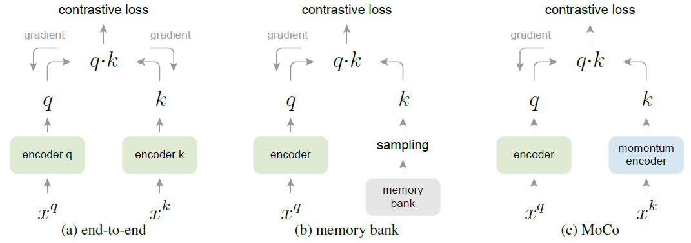
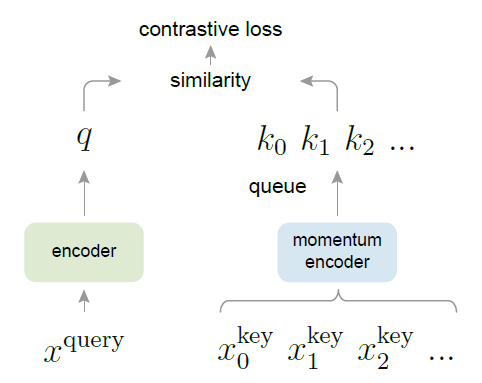

## MoCo

Momentum Contrast for Unsupervised Visual Representation Learning


### 引言

语言领域中无监督训练主导是因为文字/单词/词缀来自离散的信号空间，很容易对单词建立字典并映射成特征，然后将单词视为单个类别进行自监督学习。视觉信号是来自连续且高维的空间里，不像单词那样有很强的、简洁的语义信息，也无法生成字典。因此早期很难将无监督学习运用在视觉上。

近年的论文尝试对图片使用对比学习。常见的方法先对图片 $x_1$ 进行数据增强得到两张图片 $x_1^1$ 和 $x_1^2$，将 $x_1^1$ 视为锚点 (anchor)，将 $x_1^2$ 视为正样本，数据集中其他的图片 $x_2, ..., x_n$ 都为负样本。将锚点图片通过编码器 $E_1$，将正负样本图片通过编码器 $E_2$ 得到特征。理想的编码器能让正样本和锚点的特征距离靠近。

作者认为之前的方法都类似**字典查询**，即正负样本特征 (key) 都是来自于一个远比锚点特征数量大的字典，然后与锚点特征 (query) 进行比较。因此要有好的结果，字典需要具有两个特性，一：足够大，包含更丰富的视觉信息，有利于泛化。二：训练时要保证特征的一致性，字典中的 keys 都应该通过相同或相似的编码器产生，来保证和 query 的对比尽可能一致和公平。并避免 query 找到的是和它使用相同编码器的 key，而不是语义相近的 key。


**与现有方法比较**



方法 a 中 key 的特征一致性很高，但受制于批量的大小，每次只能对少量的负样本进行比较，而方法 b 虽然可以对比大量负样本，但是其部分特征来自不同时刻的编码器的输出，与当前时刻的编码器的输出进行比较有些不恰当。方法 c 则是作者提出的方法，即比较字典长度个负样本。


### 方法




MoCo 中提出一个由 FIFO 队列实现的大字典和动量编码器。开始时编码器 $f_q$ 和动量编码器 $f_k$ 参数相同。

使用个体判别作为代理任务。将一张图片进行两次数据增强得到两张图片 $x^q$ 和 $x_0^k$，$x_0^k$ 为正样本。将 $x^q$ 通过一个每轮更新的编码器 $f_q$ 得到特征 $q$，将正样本通过动量编码器 $f_k$ 得到特征 $k_0$，然后取字典中全部 $k_1, ..., k_n$ 作为负样本计算损失。编码器输出的特征会进行 L2 标准化。负样本的特征是由不同时刻的动量编码器得到，但理论上与当前时刻的动量编码器依旧相似，所以可用于比较。计算损失后更新 $f_q$，并将编码器 $f_q$ 的参数乘动量赋值给编码器 $f_k$ 的参数。
$$
\theta_k \leftarrow m\theta_k + (1-m) \theta_q
$$
最后将批量正样本 $x_0^k$ 推进队列，队列最早的一批移除队列。开始时队列未满则只推进队列。

所以批量在控制字典的更新速度和网络的计算速度，而字典大小控制损失的计算速度和特征丰富性。

MoCo 只是提供一种对比学习的方法，使正负样本能够更有效的进行对比。实际使用中的输入和模型根据代理任务而定，可以是图片块。两边的模型也可以参数共享、部分参数共享或者是不同的网络。


#### 损失函数 InfoNCE

在传统的判别式任务和生成式任务中，目标在训练过程中是固定的。对抗性的方法最初适用于生成，后来也在发掘它用于特征学习的潜力。

用 einsum 计算样本间的相似度。

**Noise Constrastive Estimation (NCE Loss)**

Noise Constrastive 将多分类降为二分类问题，数据类别和噪声类别。在噪声类别上依旧需要对所有类别的噪声计算和。而 NCE 只抽样一部分负样本参与计算，去近似损失。 此时就可以在负样本量上面做取舍。
$$
L_{NCE} = \log(\sigma (\Delta s_{\theta} (w^+, c))) + \sum_{i=1}^k \log(\sigma(-\Delta s_{\theta}(w_i^-, c)))
$$
**InfoNCE**

将预测视为多分类问题，并加入温度超参数控制分布。**实现起来就是字典长度K + 1个类别的交叉熵损失函数加上温度超参数。**
$$
L_{q} = -\log \frac{\exp (q \cdot k_+ / \tau)}{\sum_{i=0}^K \exp(q \cdot k_i / \tau)}
$$

- $q \cdot k$：相当于计算 logits，相似度。
- $K$：负样本数量，等于字典大小，不等于数据集大小。
- $\tau$：temperature hyper-parameter，控制 logit 分布的形状。大 $\tau$ 使指数内的值都变小，指数的结果的分布就更小更平滑，使模型对所有负样本都一视同仁。小 $\tau$ 使指数内的值都变大，指数的结果的分布就更集中，使模型更加关注特别困难的负样本。而这些负样本可能是潜在的正样本 (外观相近但不是同一张图)。

```py
criterion = nn.CrossEntropyLoss().cuda(args.gpu)
```


#### Shuffle BN

消除批量里的数据泄露。一种看法认为模型在识别批量中唯一的正样本，所以不应该接触任何负样本和他们的均值方差。所以应消除 BN 的影响。因此再次打乱一个编码器的样本顺序，保证每个 GPU 上两个编码器的批量是来自不同的原图。

We train with multiple GPUs and perform BN on the samples independently for each GPU (as done in common practice). For the key encoder fk, we shuffle the sample order in the current mini-batch before distributing it among GPUs (and shuffle back after encoding); the sample order of the mini-batch for the query encoder fq is not altered. This ensures the batch statistics used to compute a query and its positive key come from two different subsets. This effectively tackles the cheating issue and allows training to benefit from BN.


#### 实验参数

- 批量大小：128、256。
- 字典大小：65536+，小于数据集大小。
- 动量 $m$：0.999，作者发现 0.999 动量会比 0.9 好很多。


### 结果和迁移

在迁移学习上，将 MoCo 作为特征提取器，仅训练一个线性的分类头，可以使用很大的学习率如30，且没有权重衰减，说明 MoCo 学习到的特征和有监督预训练学习到的特征分布差别很大。

在应用到下游任务，如目标检测时，由于 MoCo 适合的超参数与常规下游任务模型差别很大，所以 MoCo 会使用特征归一化。即解冻 BN 进行微调，并使用 synchronize BN (同步多个 GPU 上的均值方差)。超参数则使用常规有监督预训练使用的超参数。

当下游任务数据量够大时，如 COCO，只要训练的久，随机初始的模型和预训练的模型的效果一样。所以将预训练模型和随机初始早期的模型作比较。


### 结论

在下游任务上能够超越用 ImageNet 预训练的模型，且类似语言领域，使用更大的数据集和模型可以获得更好的结果，但是有性能饱和。作者认为更好的数据集和代理任务会更有效。动量编码器被沿用至今。


## 代码实现

### 前向流程

```py
for i, (images, _) in enumerate(train_loader):
    # 模型前向，计算对比
    output, target = model(im_q=images[0], im_k=images[1])
    # 计算损失
    loss = criterion(output, target)

    # 计算并记录 top-1 和 top-5 的准确度，记录损失
    acc1, acc5 = accuracy(output, target, topk=(1, 5))
    losses.update(loss.item(), images[0].size(0))
    top1.update(acc1[0], images[0].size(0))
    top5.update(acc5[0], images[0].size(0))

    # compute gradient and do SGD step
    optimizer.zero_grad()
    loss.backward()
    optimizer.step()
```


### 数据处理

数据集类是 PyTorch 内置的 `ImageFolder` 类。文件夹格式是典型的分类文件夹格式，如下：

```
root/dog/xxx.png
root/dog/xxy.png
root/dog/[...]/xxz.png

root/cat/123.png
root/cat/nsdf3.png
root/cat/[...]/asd932_.png
```


**创建数据集类**

```py
train_dataset = datasets.ImageFolder(
	traindir, moco.loader.TwoCropsTransform(transforms.Compose(augmentation))
)
```


**数据增强**

对每一张图片进行两次独立的数据增强，获得两张图片，作为正样本对 query 和 key。

```py
class TwoCropsTransform:
    """Take two random crops of one image as the query and key."""

    def __init__(self, base_transform):
        self.base_transform = base_transform

    def __call__(self, x):
        q = self.base_transform(x)
        k = self.base_transform(x)
        return [q, k]
```

**训练时数据增强**

```py
normalize = transforms.Normalize(
    mean=[0.485, 0.456, 0.406], std=[0.229, 0.224, 0.225]
)

# MoCo v2's aug: similar to SimCLR https://arxiv.org/abs/2002.05709
augmentation = [
    transforms.RandomResizedCrop(224, scale=(0.2, 1.0)),
    transforms.RandomApply(
        [transforms.ColorJitter(0.4, 0.4, 0.4, 0.1)], p=0.8  # not strengthened
    ),
    transforms.RandomGrayscale(p=0.2),
    transforms.RandomApply([moco.loader.GaussianBlur([0.1, 2.0])], p=0.5),
    transforms.RandomHorizontalFlip(),
    transforms.ToTensor(),
    normalize,
]

# MoCo v1's aug: the same as InstDisc https://arxiv.org/abs/1805.01978
augmentation = [
    transforms.RandomResizedCrop(224, scale=(0.2, 1.0)),
    transforms.RandomGrayscale(p=0.2),
    transforms.ColorJitter(0.4, 0.4, 0.4, 0.4),
    transforms.RandomHorizontalFlip(),
    transforms.ToTensor(),
    normalize,
]
```


### 网络结构

```py
model = moco.builder.MoCo(
    models.__dict__[args.arch],     # e.g. resnet50
    args.moco_dim,      # feature dimension (default: 128)
    args.moco_k,        # queue size; number of negative keys (default: 65536)
    args.moco_m,        # moco momentum of updating key encoder (default: 0.999)
    args.moco_t,        # softmax temperature (default: 0.07)
    args.mlp,           # use mlp or not
)
```

**创建模型**

模型包含两个独立的图片编码器，编码器使用非预训练的常见模型。使用 MLP 时，直接将编码器的全连接层替换为有非线性变化的全连接层。

```py
def __init__(self, base_encoder, dim=128, K=65536, m=0.999, T=0.07, mlp=False):
    super(MoCo, self).__init__()

    self.K = K
    self.m = m
    self.T = T

    # create the encoders
    # num_classes is the output fc dimension
    self.encoder_q = base_encoder(num_classes=dim)
    self.encoder_k = base_encoder(num_classes=dim)

    if mlp:  # hack: brute-force replacement: fc -> fc + ReLu + fc
        dim_mlp = self.encoder_q.fc.weight.shape[1]
        self.encoder_q.fc = nn.Sequential(
            nn.Linear(dim_mlp, dim_mlp), nn.ReLU(), self.encoder_q.fc
        )
        self.encoder_k.fc = nn.Sequential(
            nn.Linear(dim_mlp, dim_mlp), nn.ReLU(), self.encoder_k.fc
        )
```

将 query 编码器的初始权重复制给 key 编码器，并关闭 key 编码器的梯度回传。每轮只会自动更新 query 编码器的权重，key 的权重手动用动量更新。

```py
# Copy query encoder's weight to key encoder's weight
# key encoder doesn't require gradient
for param_q, param_k in zip(
    self.encoder_q.parameters(), self.encoder_k.parameters()
):
    param_k.data.copy_(param_q.data)  # initialize
    param_k.requires_grad = False  # not update by gradient
```

然后创建队列 `queue`，使用随机初始化。并存储队列用的指针。

```py
# create the queue using random
self.register_buffer("queue", torch.randn(dim, K))
self.queue = nn.functional.normalize(self.queue, dim=0)
self.register_buffer("queue_ptr", torch.zeros(1, dtype=torch.long))
```


**模型前向**

```py
output, target = model(im_q=images[0], im_k=images[1])
```

用 query 编码器获取 query 图片的特征，然后每个特征单独做标准化。

```py
def forward(self, im_q, im_k):
    q = self.encoder_q(im_q)  # queries: NxC
    q = nn.functional.normalize(q, dim=1)
```

对于 key 编码器，首先对模型权重进行动量更新。

```py
with torch.no_grad():  # no gradient to keys
    self._momentum_update_key_encoder()  # update the key encoder
```

```py
@torch.no_grad()
def _momentum_update_key_encoder(self):
    """
    Momentum update of the key encoder
    """
    for param_q, param_k in zip(
        self.encoder_q.parameters(), self.encoder_k.parameters()
    ):
        param_k.data = param_k.data * self.m + param_q.data * (1.0 - self.m)
```

然后再次打乱样本顺序，计算特征并标准化。

```py
# shuffle for making use of BN
im_k, idx_unshuffle = self._batch_shuffle_ddp(im_k)

k = self.encoder_k(im_k)  # keys: NxC
k = nn.functional.normalize(k, dim=1)

# undo shuffle
k = self._batch_unshuffle_ddp(k, idx_unshuffle)
```


### 对比

计算相似度分数，负样本是整个队列。同样使用不含学习参数的计算方式。在连接 logits 的时候将 `l_pos` 放在前面，所以对于所有样本，标签都是索引 0。

```py
# Einstein sum is more intuitive
# positive logits: Nx1, e.g. 256
l_pos = torch.einsum("nc,nc->n", [q, k]).unsqueeze(-1)
# negative logits: NxK, e.g. 256x65536
l_neg = torch.einsum("nc,ck->nk", [q, self.queue.clone().detach()])

# logits: Nx(1+K)
logits = torch.cat([l_pos, l_neg], dim=1)

# apply temperature
logits /= self.T

# labels: positive key indicators
labels = torch.zeros(logits.shape[0], dtype=torch.long).cuda()
```

然后将 key 编码器的输出送进队列，替换原来位置上的数据。

```py
self._dequeue_and_enqueue(k)
return logits, labels
```

首先将每个 GPU 上的输出聚集起来，然后替换指针后一个批量的数据并更新指针位置。

```py
@torch.no_grad()
def _dequeue_and_enqueue(self, keys):
    # gather keys before updating queue
    keys = concat_all_gather(keys)

    batch_size = keys.shape[0]

    ptr = int(self.queue_ptr)
    assert self.K % batch_size == 0  # for simplicity

    # replace the keys at ptr (dequeue and enqueue)
    self.queue[:, ptr : ptr + batch_size] = keys.T
    ptr = (ptr + batch_size) % self.K  # move pointer

    self.queue_ptr[0] = ptr
```


### 计算损失

损失就是交叉熵损失函数。

```py
criterion = nn.CrossEntropyLoss().cuda(args.gpu)
```

```
loss = criterion(output, target)
```

