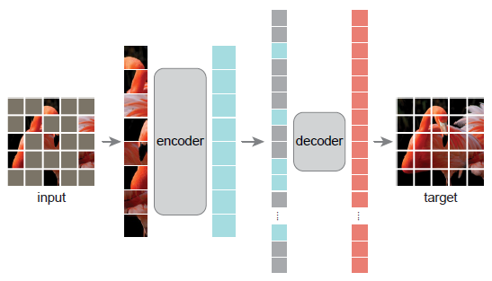

## MAE

Masked Autoencoders Are Scalable Vision Learners


### 引言

MAE 探索如何对 ViT 进行类似 NLP 领域常见的大规模预训练，提出在 ViT 上实现类似于 BERT 的**通过完型填空获取图片的理解**。在 CV 领域，输入通常是图片，而输出通常是标签或 mask，很少会是一个图像，所以起名为 Auto-encoder。而在 NLP 领域，输入输出都是词很常见。


深度学习进展迅速，但是 CV 领域依旧需要百万级别甚至更多的带有标注的图片。而在 NLP 领域，自监督训练已经非常成熟。为什么 BERT 这类模型和训练方法不能直接用于 CV 领域，作者有以下解释：

- 网络结构不一样，在 NLP 中可以直接使用一个特别词元表示遮盖，然后进入 Transformer。而卷积网络中不知道如何表示遮盖，而且遮盖的边界是不清晰的，会影响之后的还原。直到 ViT 的出现，现在可以对图片块做遮盖。
- 信息密度不一样，在 NLP 中词就是一个语义的实体且信息丰富，完形填空并不是容易的任务。而图像中像素是由冗余的，通过临近的像素信息，被遮盖的区域依旧可以被恢复。所以本作要提高任务的难度，即遮盖大量的图片块。
- 自编码器的解码器不同，在 BERT 上做完形填空训练时的解码器不过是一层 MLP 分类器来预测词元。而 CV 领域解码器需要重建像素，语义信息很低，通常也会是 CNN。所以解码器对中间特征的语义层级有关。


MAE 是一种可扩展的 CV 自监督学习器。在训练期间，随机屏蔽输入图像的部分图片块，并重建缺失的像素。MAE 网络由非对称编码器-解码器组成。编码器提取在可见的图片块的特征，而轻量级解码器从编码器特征和掩码标记重建遮蔽区域的像素。作者发现掩蔽输入图像的大部分区域，如 75%，是非常有意义的自监督任务。因为网络只对可见区域抽取特征，训练速度会提高3倍或更多。在使用 vanilla ViT-Huge 这类大型网络在 ImageNet-1K 数据训练，获得 87.8% 的精度。作者发现该预训练模型在下游任务中的迁移性能优于有监督的预训练。


### 方法



首先将图像按照 ViT 的方式切块，并添加位置编码，然后将 75% 的块遮蔽，将没有被遮盖的块通过 ViT 编码器得到特征。将正常块的特征和被遮盖的块的特征 (一个可学习的特征表示被遮盖的块 + 位置编码) 一起送入解码器。将解码器对每个图片块的特征通过一个线性层，映射回图片块大小 * RGB三个维度。将最后的结果与原图像进行 MSE 比较。编码器占主要的计算量。在下游任务时，只需要编码器，且不需要在盖住某些块，将编码器输出的特征当做图像的特征。解码器丢弃。


First we generate a token for every input patch (by linear projection with an added positional
embedding). Next we randomly shuffle the list of tokens and remove the last portion of the list, based on the masking ratio. This process produces a small subset of tokens for the encoder and is equivalent to sampling patches without replacement. After encoding, we append a list of mask tokens to the list of encoded patches, and unshuffle this full list (inverting the random shuffle operation) to align all tokens with their targets. The decoder is applied to this full list (with positional embeddings added). As noted, no sparse operations are needed. This simple implementation introduces negligible overhead as the shuffling and unshuffling operations are fast.


#### 损失

将原图和被遮盖区域的重建内容做 MSE 损失。


### 实验

在 ImageNet-1K 数据集上不使用标号，做自监督预训练。然后使用标号，再进行有监督微调。MAE 对数据增强不敏感。随机遮盖比规律遮盖效果更好。微调方面，调整所有层的结果最好，但调整越靠顶部的层提升更明显。


### 总结

通过一个自编码器在 ImageNet 数据集上训练何以媲美有监督训练的效果。作者指出图片和语言的区别，对于语言来说，一个词是语义的单元，包含的语义信息比较多。而图片块只含有不完整的语义信息。但这样的情况下，MAE 依旧可以胜任这些复杂的工作，因为 MAE 能够学习到很丰富的隐藏表达。


## 代码实现


### 网络结构

```py
class MaskedAutoencoderViT(nn.Module):
    """ Masked Autoencoder with VisionTransformer backbone
    """
    def __init__(self, img_size=224, patch_size=16, in_chans=3,
                 embed_dim=1024, depth=24, num_heads=16,
                 decoder_embed_dim=512, decoder_depth=8, decoder_num_heads=16,
                 mlp_ratio=4., norm_layer=nn.LayerNorm, norm_pix_loss=False):
        super().__init__()

        # --------------------------------------------------------------------------
        # MAE encoder specifics
        self.patch_embed = PatchEmbed(img_size, patch_size, in_chans, embed_dim)
        num_patches = self.patch_embed.num_patches

        self.cls_token = nn.Parameter(torch.zeros(1, 1, embed_dim))
        self.pos_embed = nn.Parameter(torch.zeros(1, num_patches + 1, embed_dim), requires_grad=False)  # fixed sin-cos embedding

        self.blocks = nn.ModuleList([
            # Block(embed_dim, num_heads, mlp_ratio, qkv_bias=True, qk_scale=None, norm_layer=norm_layer)
            Block(embed_dim, num_heads, mlp_ratio, qkv_bias=True, norm_layer=norm_layer)
            for i in range(depth)])
        self.norm = norm_layer(embed_dim)
        # --------------------------------------------------------------------------

        # --------------------------------------------------------------------------
        # MAE decoder specifics
        self.decoder_embed = nn.Linear(embed_dim, decoder_embed_dim, bias=True)

        self.mask_token = nn.Parameter(torch.zeros(1, 1, decoder_embed_dim))

        self.decoder_pos_embed = nn.Parameter(torch.zeros(1, num_patches + 1, decoder_embed_dim), requires_grad=False)  # fixed sin-cos embedding

        self.decoder_blocks = nn.ModuleList([
            # Block(decoder_embed_dim, decoder_num_heads, mlp_ratio, qkv_bias=True, qk_scale=None, norm_layer=norm_layer)
            Block(decoder_embed_dim, decoder_num_heads, mlp_ratio, qkv_bias=True, norm_layer=norm_layer)
            for i in range(decoder_depth)])

        self.decoder_norm = norm_layer(decoder_embed_dim)
        self.decoder_pred = nn.Linear(decoder_embed_dim, patch_size**2 * in_chans, bias=True) # decoder to patch
        # --------------------------------------------------------------------------

        self.norm_pix_loss = norm_pix_loss

        self.initialize_weights()
```


#### 编码器位置编码


#### 解码器位置编码


#### 遮盖

随机的方式很特别

```py
def random_masking(self, x, mask_ratio):
    """
    Perform per-sample random masking by per-sample shuffling.
    Per-sample shuffling is done by argsort random noise.
    x: [N, L, D], sequence
    """
    N, L, D = x.shape  # batch, length, dim
    len_keep = int(L * (1 - mask_ratio))

    noise = torch.rand(N, L, device=x.device)  # noise in [0, 1]

    # sort noise for each sample
    ids_shuffle = torch.argsort(noise, dim=1)  # ascend: small is keep, large is remove
    ids_restore = torch.argsort(ids_shuffle, dim=1)

    # keep the first subset
    ids_keep = ids_shuffle[:, :len_keep]
    x_masked = torch.gather(x, dim=1, index=ids_keep.unsqueeze(-1).repeat(1, 1, D))

    # generate the binary mask: 0 is keep, 1 is remove
    mask = torch.ones([N, L], device=x.device)
    mask[:, :len_keep] = 0
    # unshuffle to get the binary mask
    mask = torch.gather(mask, dim=1, index=ids_restore)

    return x_masked, mask, ids_restore
```

结果

```py
```

