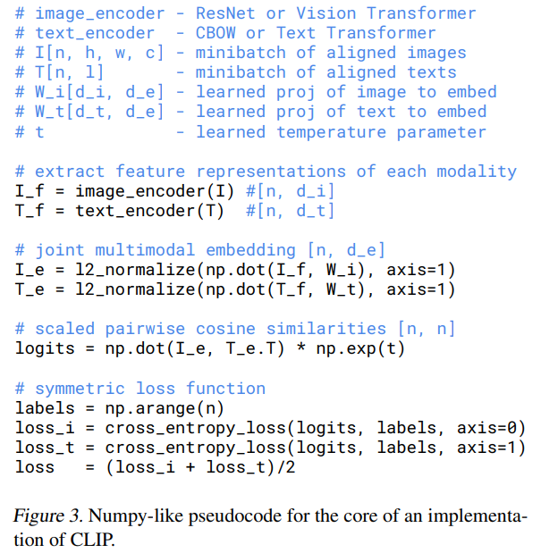

## CLIP

Learning Transferable Visual Models From Natural Language Supervision


### 引言

利用自然语言的监督信号，来训练一个泛化和迁移效果很好的**视觉模型**。这是一个包含文字和图片的多模态的工作。视觉模型通常在固定类别数量的数据集 (如 ImageNet) 上用分类任务进行预训练，而这样的有监督训练也限制了模型的泛化性，使其很难预测新的类别。作者认为从 NLP 得到监督信号很有前途，因为文字涵盖描述的领域非常广泛。本作证实**通过的图片文本对的对比学习任务，就可以学习到最好的图像表征**，甚至是很好的多模态特征。作者收集了 **4 亿个图片文本对数据集**进行训练。训练完后，自然语言被用于引导视觉模型对新的物体类别进行零次分类预测。作者在 30 个数据集上进行下游任务的测试。模型的迁移性很好。

在 NLP 领域，使用大规模原始的文本数据进行下游任务无关的自监督预训练非常成功，可以学习到很泛化的特征。任务通常是完形填空或预测下一个词。

作者曾尝试让模型为输入的图像生成匹配的文本，比较文本是否符合描述。但发现一张图像其实可以对应多种描述，所以该任务的标签其实不准确。后来改成对比学习，即仅让模型学习找到图像最对应的文本。


### 方法


#### 数据集创建

先前常用的图像语义理解数据集主要有3个：MS-COCO、Visual Genome、YFCC100M。前两个是质量很高的标注数据集，但规模很小只有约10万张图片；YFCC100M 有 100M 的图像，但质量参差不齐，从中筛选出有英文描述的图像后只剩约15M，与 ImageNet 大小相当。

网络上有海量的带有文字描述的图像，作者收集了 4 亿个图片文本对来构建数据集，称为**WIT，即 WebImageText**。构建过程中为了覆盖尽可能广泛的类别的图片，作者建立了一个约 50 万的查询 (query) 集 (根据 wiki 高频词 + bi-gram 数据增强 + WordNet 建立)，搜索过程必须保证图片文本对中的文本包含某个 query。此外为了平衡数据集，每个query至多包含 20000 个图片文本对。


#### 对比学习预训练

研究表明对比目标函数 (contrastive objectives) 的表现可以超越等价的预测目标函数 (predictive objective)。因此本作的任务就是**预测一段文字描述与哪一个图片匹配**。

模型的输入是批量个图像和文本的配对，分别通过图像编码器和文本编码器，得到两者的特征向量。对于批量里所有图像文本对做对比学习，计算余弦相似度，即对角线上的都是正样本，剩余为负样本。


**文本编码器**

使用 Transformer 将文本映射成一条向量。文本编码使用 Byte-Pair Encoding (BPE)，并添加开始和结束词元。


**图像编码器**

使用 ResNet 或 ViT 将图像映射成一条特征向量。使用 ResNet 时的改进包括ResNetD、antialiased rect-2 blur pooling、全局池化变为attention池化。使用 ViT 时在编码输入到 Transformer 之前加一个层标准化。


**实现细节**

- 两个编码器都没有使用预训练模型，直接从头训练。
- 因为数据集很大，所以训练起来没有过拟合，数据增强也仅使用了随机裁剪和标准化。
- 文本和图像编码器最后将特征映射为向量时，使用的是**线性投射层**而不是像 SimCLR 一样使用非线性投射层。作者认为两者在本作上没有区别，而非线性投射层可能对单模态更有效。


#### 损失计算

计算了批量中每张图片对每个文字描述的相似度后，得到一个 $N \times N$ 的分数矩阵。此时对角线上是正确标签，再文字描述维度和图片维度分别计算一次全部的交叉熵分类损失，然后取两个损失的平均作为总损失。伪代码如下：




#### 零次预测 Zero-Shot Prediction

原本的 CLIP 模型只有两个编码器将输入映射为特征向量，没有分类头，如何计算分类任务上的精度？作者使用 prompt template。以 ImageNet-1k 为例，CLIP 先把一千个类用一千个含有该类别词语的句子 (类似 prompt) 代替，如简单将原标签替换为 "a photo of {原标签}"，然后看图片的特征和哪个句子的特征最接近，就取其作为分类结果。选择使用句子而不是使用一个词是为了和训练内容匹配，而且能用上下文信息避免多义词的影响。

使用时，准备一张图像和多个该图像准备可能相关的文字描述，看图像的特征向量与哪个文字描述最接近，就判定该图像就是匹配该文字描述。**所以网络不会根据图像生成文字描述，而仅仅是判断哪个文字描述跟图像最接近。**

零次预测的动机是作者想让模型在迁移到下游任务时不需要微调，最多修改 prompt 就可以完成任务。

##### Prompt

作者研究了 prompt engineering 和 prompt ensembling，提出了很多有用的提示模板，详见 `Prompt_Engineering_for_ImageNet.ipynb`。


### 实验

- 实验训练了 5 个不同的图像编码器：
  - 5 个图像编码器基于 ResNet 的网络：ResNet-50、ResNet-101、RN50x4、RN50x16 和 RN50x64，后 3 个实基于 EfficientNet 修改的 ResNet 变体，拥有更大的计算量。
  - 3 个图像编码器基于 ViT 的网络：ViT-B/32、ViT-B/16 和 ViT-L/14。

- 使用 32768 批量，训练 32 epoch，使用 Adam 优化器
- 使用混精度加速训练并节省内存


**大规模训练的工程细节**

https://lilianweng.github.io/posts/2021-09-25-train-large/


### 迁移和泛化

Zero-Shot CLIP 和 Linear Probe on ResNet-50 比较，在大规模常见物体分类数据集上，CLIP 效果更好。而在细分类、复杂和抽象的数据集上，有微调的 ResNet 更好。所以 CLIP 应该使用 Few-Shot 提升效果。Few-Shot = 1代表在每个类上都采样一个样本进行训练。结果是使用了 Few-Shot 到 Linear Probe 的 CLIP 结果全面超过别的网络，而使用 Linear Probe 结果最好。但在 CLIP 自身的对比上，使用 1,2,4-shot 甚至不如 Zero-Shot，这是不应该发生的。

CLIP 对 distribution shift 也更加鲁棒，在卡通、素描、对抗图案的图像依旧能保持高的精度。


### 与人的对比

作者将 Zero-Shot CLIP 与人类在宠物数据集上比较分类任务的精度，发现 CLIP 更好。而且对 CLIP 难的分类，对人也很难。


### 模型局限性

- Zero-Shot CLIP 在 ImageNet 精度只有 76.2，而当时最好的模型有 88+ 的精度。如果想让 Zero-Shot CLIP 接近最好的结果，可能要 1000 倍的计算量的提升。
- 尽管 CLIP 在自然分布的图像上表现很好，在 out-of-distribution 的图像上的泛化表现依旧很差。CLIP 的训练数据没有包含 MNIST，表现甚至不如对像素点的 Logistic Regression。
- 使用 CLIP 时，CLIP 是在给定的多个文本描述做选择，CLIP 无法自动生成图像的描述。
- 数据用量很大，可能的解决方案是使用小数据集配合更好的数据增强、自监督或自训练 (伪标签)。
- Zero-Shot CLIP 依旧在验证集上进行了调参，并引导了 CLIP 的选型，并不是完全的 Zero-Shot。
- 数据量很大，没有清洗和审查，可能有偏见。


## 代码实现

### 数据处理

图像的默认大小是 224\*224，对 ViT-L/14 最后在 336\*336 大小的图像上进行了一轮微调。

#### 数据增强

仅使用了随机裁剪和标准化，没有针对色彩调整。

```py
def _convert_image_to_rgb(image):
    return image.convert("RGB")

def _transform(n_px):
    return Compose([
        Resize(n_px, interpolation=BICUBIC),
        CenterCrop(n_px),
        _convert_image_to_rgb,
        ToTensor(),
        Normalize((0.48145466, 0.4578275, 0.40821073), (0.26862954, 0.26130258, 0.27577711)),
    ])
```


### 网络结构

以 ViT-B-32 预训练模型为例，文本编码器为 Transformer，图像编码器为 ViT。

```py
model = CLIP(
    embed_dim=768, 
  	# Image encoder settings
    image_resolution=224, vision_layers=12, vision_width=768, vision_patch_size=32,
  	# Text encoder settings
    context_length=77, vocab_size=49408, transformer_width=512, transformer_heads=8, transformer_layers=12
)
```


### Transformer 文本编码器

文本编码器的结构在 CLIP 中创建，没有使用一个单独的类。文本长度上限为 77。

#### 分词器

使用 CLIP 的 `tokenizer()` 处理文本，将文本分词，添加开始和结束词元，然后将每个词通过 Byte-Pair Encoding tokenization 拆分为词元，并转换为一个数值。

详见：https://huggingface.co/learn/nlp-course/chapter6/5

```py
text = clip.tokenize(["a diagram", "a dog", "a cat"]).to(device)
```

```py
def tokenize(texts: Union[str, List[str]], context_length: int = 77, truncate: bool = False) -> Union[torch.IntTensor, torch.LongTensor]:
    """
    Returns the tokenized representation of given input string(s)
    """
    if isinstance(texts, str):
        texts = [texts]

    sot_token = _tokenizer.encoder["<|startoftext|>"]
    eot_token = _tokenizer.encoder["<|endoftext|>"]
    all_tokens = [[sot_token] + _tokenizer.encode(text) + [eot_token] for text in texts]
    if packaging.version.parse(torch.__version__) < packaging.version.parse("1.8.0"):
        result = torch.zeros(len(all_tokens), context_length, dtype=torch.long)
    else:
        result = torch.zeros(len(all_tokens), context_length, dtype=torch.int)
	
    # 循环所有文本，截断过长的文本
    for i, tokens in enumerate(all_tokens):
        if len(tokens) > context_length:
            if truncate:
                tokens = tokens[:context_length]
                tokens[-1] = eot_token
            else:
                raise RuntimeError(f"Input {texts[i]} is too long for context length {context_length}")
        result[i, :len(tokens)] = torch.tensor(tokens)

    return result   # (number of input strings, context_length)
```


#### 文本编码器

词元个数为 49408，将每个词元映射到长度 512 的向量。

#### 位置编码

使用可学习的位置编码，使用可学习的位置编码，尺寸 77*512。

#### Transformer

12层，每层特征长度为 512，使用 8 头多头自注意力。使用文本编码。输出的尺寸是 78*512。

**文本掩码**

使用文本掩码，只注意当前词元前面的词。

```py
def build_attention_mask(self):
    # pytorch uses additive attention mask, set mask to -inf and remaining to 0
    # Returns a tensor filled with uninitialized data
    mask = torch.empty(self.context_length, self.context_length)
    # Set all to -inf
    mask.fill_(float("-inf"))
    # zero out the lower diagonal
    mask.triu_(1)  
    return mask
```


#### 特征向量

将 Transformer 在 `eot_token` (end of text) 位置的特征向量，与一个可学习的矩阵相乘将特征投射到多模，矩阵尺寸：512*512。输出为长度 512 的向量。


`moodel.CLIP`

```py
class CLIP(nn.Module):
    def __init__(self, embed_dim: int,
                 # vision
                 image_resolution: int,
                 vision_layers: Union[Tuple[int, int, int, int], int],
                 vision_width: int, vision_patch_size: int,
                 # text
                 context_length: int, vocab_size: int, transformer_width: int,
                 transformer_heads: int, transformer_layers: int
                 ):
        super().__init__()
        self.context_length = context_length
		
        # 图像编码器为 ResNet
        if isinstance(vision_layers, (tuple, list)):
            vision_heads = vision_width * 32 // 64
            self.visual = ModifiedResNet(...)

        # 图像编码器为 ViT
        else:
            vision_heads = vision_width // 64
            self.visual = VisionTransformer(
                input_resolution=image_resolution, patch_size=vision_patch_size,
                width=vision_width, layers=vision_layers, heads=vision_heads,
                output_dim=embed_dim
            )

        self.transformer = Transformer(
            width=transformer_width,
            layers=transformer_layers,
            heads=transformer_heads,
            attn_mask=self.build_attention_mask()
        )

        self.vocab_size = vocab_size
        self.token_embedding = nn.Embedding(vocab_size, transformer_width)
        self.positional_embedding = nn.Parameter(torch.empty(self.context_length, transformer_width))
        self.ln_final = LayerNorm(transformer_width)

        self.text_projection = nn.Parameter(torch.empty(transformer_width, embed_dim))
        # 创建可学习的对比温度系数
        self.logit_scale = nn.Parameter(torch.ones([]) * np.log(1 / 0.07))

        self.initialize_parameters()
```

文本编码器的前向由 `encoder_text()` 实现。

```py
def encode_text(self, text):
    x = self.token_embedding(text).type(self.dtype)  # [batch_size, n_ctx, d_model]

    x = x + self.positional_embedding.type(self.dtype)
    x = x.permute(1, 0, 2)  # NLD -> LND
    x = self.transformer(x)
    x = x.permute(1, 0, 2)  # LND -> NLD
    x = self.ln_final(x).type(self.dtype)

    # x.shape = [batch_size, n_ctx, transformer.width]
    # take features from the eot embedding (eot_token is the highest number in each sequence)
    x = x[torch.arange(x.shape[0]), text.argmax(dim=-1)] @ self.text_projection

    return x
```


### ViT 图像编码器结构

类似 ViT 的结构，使用 LayerNorm 的位置有些不同。


#### 切块

输入的图像尺寸是 224，切成 49 个长宽为 32 的图片块。

#### 图像编码器

送到以 `Conv2d` 实现的图像编码器中，将每个图片块映射成一条 768 维的向量，然后展平，输出是 768\*49。

#### 分类头和位置编码

使用可学习的分类头向量，长度 768，拼接在图片块特征向量前。使用可学习的位置编码，尺寸 50*768。

#### Transformer

12层，每层特征长度为 768，使用 12 头多头自注意力。输出的尺寸是 50*768。

#### 特征向量

将 Transformer 在分类头位置的特征向量，与一个可学习的矩阵相乘将特征投射到多模态，矩阵尺寸：768*512。输出为长度 512 的向量。


`model.VisionTransformer`

```py
class VisionTransformer(nn.Module):
    def __init__(self, input_resolution: int, patch_size: int, width: int, layers: int, heads: int, output_dim: int):
        super().__init__()
        self.input_resolution = input_resolution
        self.output_dim = output_dim
        self.conv1 = nn.Conv2d(in_channels=3, out_channels=width, kernel_size=patch_size, stride=patch_size, bias=False)

        scale = width ** -0.5
        self.class_embedding = nn.Parameter(scale * torch.randn(width))
        self.positional_embedding = nn.Parameter(scale * torch.randn((input_resolution // patch_size) ** 2 + 1, width))
        self.ln_pre = LayerNorm(width)

        self.transformer = Transformer(width, layers, heads)

        self.ln_post = LayerNorm(width)
        self.proj = nn.Parameter(scale * torch.randn(width, output_dim))
    
    def forward(self, x: torch.Tensor):
        x = self.conv1(x)  # shape = [*, width, grid, grid]
        x = x.reshape(x.shape[0], x.shape[1], -1)  # shape = [*, width, grid ** 2]
        x = x.permute(0, 2, 1)  # shape = [*, grid ** 2, width]
        # 将分类头向量拓展到批量维度
        x = torch.cat([self.class_embedding.to(x.dtype) + torch.zeros(x.shape[0], 1, x.shape[-1], dtype=x.dtype, device=x.device), x], dim=1)  # shape = [*, grid ** 2 + 1, width]
        x = x + self.positional_embedding.to(x.dtype)
        x = self.ln_pre(x)

        x = x.permute(1, 0, 2)  # NLD -> LND
        x = self.transformer(x)
        x = x.permute(1, 0, 2)  # LND -> NLD

        x = self.ln_post(x[:, 0, :])

        if self.proj is not None:
            x = x @ self.proj

        return x
```


### 对比

得到文本和图像的向量后，先进行标准化，然后乘上可学习的温度系数 `logit_scale`，然后计算特征向量之间的余弦相似度。

```py
def forward(self, image, text):
    # (B, N, C)
    image_features = self.encode_image(image)
    text_features = self.encode_text(text)

    # normalized features
    image_features = image_features / image_features.norm(dim=1, keepdim=True)
    text_features = text_features / text_features.norm(dim=1, keepdim=True)

    # cosine similarity as logits
    logit_scale = self.logit_scale.exp()
    logits_per_image = logit_scale * image_features @ text_features.t()
    logits_per_text = logits_per_image.t()

    # shape = [global_batch_size, global_batch_size]
    return logits_per_image, logits_per_text
```

正样本对都在对角线上，然后使用交叉熵分类损失函数，在图像和文本维度都进行损失计算。

```py
logits_per_image, logits_per_text = model(image, text)
labels = np.arange(n)
loss_i = cross_entropy(logits_per_image, labels)
loss_t = cross_entropy(logits_per_text, labels)
loss = (loss_i + loss_t) / 2
```

