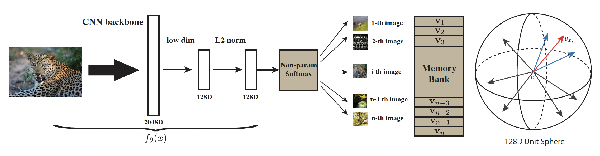
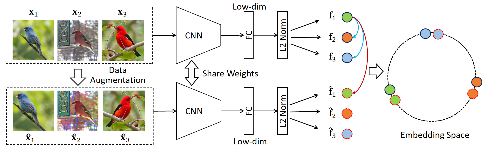
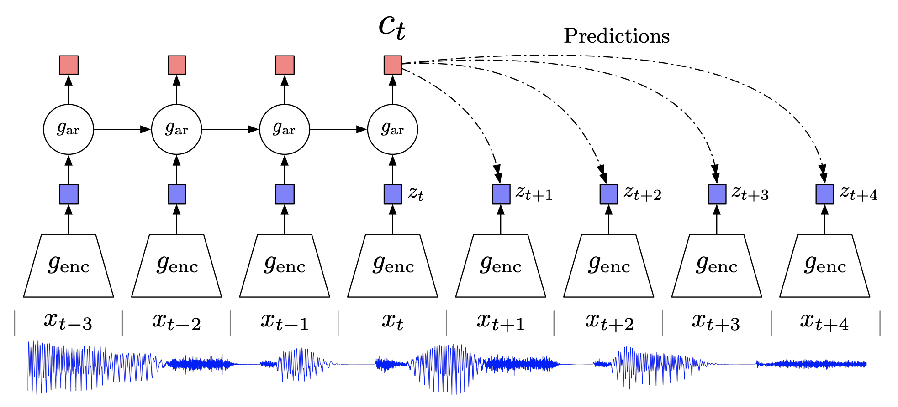
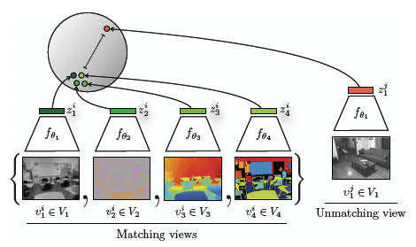
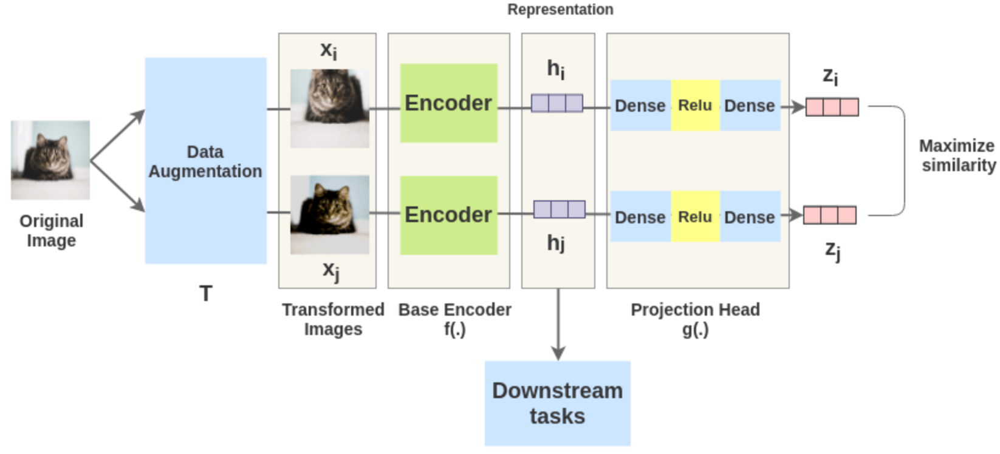

# 对比学习 Contrastive Learning

训练后的编码器可以对**相同类别的样本输出距离近的特征**，**对不同类别的样本输出距离远的特征**。也就是类似的样本在特征空间相邻的区域，不同的物体在特征空间不相邻的区域。此时编码器生成的就是很好的特征。


### 代理任务 Pretext Task

为了提供对比学习需要的监督信号，来学习更好的特征，任务本身并不解决现实问题。图片对比学习中模型不需要知道图片的类别，但依旧需要知道哪些图片是相似的，哪些不相似。因此通过一些代理任务，人为定义哪些图片是相似的（正样本），哪些不是（负样本），从而提供一个监督信号去训练模型，也就是自监督训练。因此只要有定义正样本和负样本的规则，就可以使用对比学习。如：对于影片，相邻的帧是正样本，不相邻的是负样本。常见代理任务如下：

#### 个体判别 Instance Discrimination

对一张图片进行裁剪和数据增广，获得的新图片为原图的正样本，数据集剩余的所有图片都是负样本。

#### Constrastive Predictive Coding (CPC)

上下文信息预测未来，类似 context (patch) auto-encoding

#### Contrastive Multiview Coding (CMC)

利用一个物体的不同视角做对比学习，类似给黑白图片上色 Colorization.

#### 图片重建

从部分图片重建回整张图，如 denoising auto-encoder, cross-channel auto-encoders。

重建某个图片块，如：context auto-encoder。

#### 伪标签

将数据增广的图片视为同一类：Transformations of a single ("exemplar") image

打乱图片块预测顺序：patch orderings

tracking or segmenting objects in videos, or clustering features.


# 18 年 - 19 年中：百花齐放

## InstDisc

Unsupervised Feature Learning via Non-Parametric Instance Discrimination


### 引言

在有监督分类中，将一张图片送入分类器，会有一些类别的分数很高。这些类别高分不是因为有相近的语义信息，而**纯粹是图片与该类图片的外观很类似**。InstDisc 作为无监督学习，将有监督分类任务推到了极致，将每一张图片都视为一个类别，让模型学习辨别。


### 方法



首先将图片进行数据增强，然后通过一个编码器 (如 Res50) 将图片映射为特征向量。该特征与 Memory Bank 中该图片对应的特征作为正样本对，并再随机抽取出 4096 个特征作为负样本对。接着使用特征内积作为相似度分数。然后使用 NCE Loss 和负对数似然作为损失，使正样本对的相似度提高，负样本对相似度降低。最后将本批量的特征向量更新到 Memory Bank。

Memory Bank 存储每张图片的特征，特征维度是128 (受制于空间大小)，开始时随机初始化。在训练过程中动量式更新，使得特征更能表示该张图片。

编码器可以是 CNN，如 Res50。最后将 2048 维的特征通过一层线性层转换到 128 维，**没有非线性激活**。

```py
self.avgpool = nn.AvgPool2d(7, stride=1)
self.fc = nn.Linear(512 * block.expansion, low_dim)
self.l2norm = Normalize(2)
```

本文没有使用一个学习的分类头决定特征的类别分数，而是直接使用内积，因为作者认为分类头只对参与了学习过程的类别有效，且无法推广到新的图片上。


### 损失函数


$$
P(i|\bold{v}) = \frac{\exp(\bold{v}_i^T\bold{v}/\tau)}{\sum_{j=1}^{n}\exp(\bold{v}_j^T\bold{v}/\tau)} \\\\
J(\theta) = - \sum_{i=1}^n \log P(i|f_\theta(x_i))
$$


由于新特征可能与原特征差别过大，导致训练不稳定，引入一个新的损失限制特征间的差别，整体上类似通过动量更新特征，而不是直接更新特征。
$$
-\log h(i, \bold{v}_i^{t-1}) + \lambda ||\bold{v}_i^t - \bold{v}_i^{t-1}||_2^2
$$


## 代码实现

### 前向流程

```py
for i, (input, _, index) in enumerate(train_loader):
    # 模型前向
    feature = model(input)
	# 计算对比
    output = lemniscate(feature, index)
	# 计算损失
	loss = criterion(output, index) / args.iter_size
    # 梯度回传，模型更新更新
    ...
```


### 数据处理

以 CIFAR10 为例，数据集类很简单，仅对图片进行数据增强，并将图片、类别标签和索引传入。索引用于定位图片对应的特征在 memory bank 中的位置。原类别标签其实没有用上。

```py
class CIFAR10Instance(datasets.CIFAR10):
    """ CIFAR10Instance Dataset. """
    def __getitem__(self, index):
        if self.train:
            img, target = self.train_data[index], self.train_labels[index]
        else:
            img, target = self.test_data[index], self.test_labels[index]

        # doing this so that it is consistent with all other datasets
        # to return a PIL Image
        img = Image.fromarray(img)

        if self.transform is not None:
            img = self.transform(img)

        if self.target_transform is not None:
            target = self.target_transform(target)

        return img, target, index
```

**训练集数据增强**

```py
normalize = transforms.Normalize(mean=[0.485, 0.456, 0.406],
                                 std=[0.229, 0.224, 0.225])
transforms.Compose([
    transforms.RandomResizedCrop(224, scale=(0.2,1.)),
    transforms.RandomGrayscale(p=0.2),
    transforms.ColorJitter(0.4, 0.4, 0.4, 0.4),
    transforms.RandomHorizontalFlip(),
    transforms.ToTensor(),
    normalize,
])
```

**验证集数据增强**

```py
transforms.Compose([
    transforms.Resize(256),
    transforms.CenterCrop(224),
    transforms.ToTensor(),
    normalize,
])
```


### 模型

**创建模型**

使用一个 CNN 模型作为编码器。

```py
model = models.__dict__[args.arch](low_dim=args.low_dim)   # e.g. resnet18
```

以 ResNet18 为例， 加载原模型，并将最后一层的特征维度降维到 128 维。

```py
def resnet18(pretrained=False, **kwargs):
    """Constructs a ResNet-18 model.

    Args:
        pretrained (bool): If True, returns a model pre-trained on ImageNet
    """
    model = ResNet(BasicBlock, [2, 2, 2, 2], **kwargs)
    if pretrained:
        model.load_state_dict(model_zoo.load_url(model_urls['resnet18']))
    return model
```

```py
class ResNet(nn.Module):

    def __init__(self, block, layers, low_dim=128):
        self.inplanes = 64
        super(ResNet, self).__init__()
        self.conv1 = nn.Conv2d(3, 64, kernel_size=7, stride=2, padding=3,
                               bias=False)
        self.bn1 = nn.BatchNorm2d(64)
        self.relu = nn.ReLU(inplace=True)
        self.maxpool = nn.MaxPool2d(kernel_size=3, stride=2, padding=1)
        self.layer1 = self._make_layer(block, 64, layers[0])
        self.layer2 = self._make_layer(block, 128, layers[1], stride=2)
        self.layer3 = self._make_layer(block, 256, layers[2], stride=2)
        self.layer4 = self._make_layer(block, 512, layers[3], stride=2)
        self.avgpool = nn.AvgPool2d(7, stride=1)
        # 降维，且没有使用非线性激活
        self.fc = nn.Linear(512 * block.expansion, low_dim)
        self.l2norm = Normalize(2)

        for m in self.modules():
            if isinstance(m, nn.Conv2d):
                n = m.kernel_size[0] * m.kernel_size[1] * m.out_channels
                m.weight.data.normal_(0, math.sqrt(2. / n))
            elif isinstance(m, nn.BatchNorm2d):
                m.weight.data.fill_(1)
                m.bias.data.zero_()
```

**模型前向**

```py
feature = model(input)
```


### 对比

**创建**

对比模块是一个 `NCEAverage` 对象，负责对比时抽取负样本、调用计算正负样本的相似度和存储 memory bank。

```py
# args.low_dim: memory bank 的存储的特征的维度，默认 128
# args.nce_t: 计算 NCE Loss 使用的温度系数
# args.nce_m: 动量更新 memory bank 里特征的动量系数
lemniscate = NCEAverage(args.low_dim, ndata, args.nce_k, args.nce_t, args.nce_m).cuda()
```

```py
class NCEAverage(nn.Module):

    def __init__(self, inputSize, outputSize, K, T=0.07, momentum=0.5, Z=None):
        super(NCEAverage, self).__init__()
        self.nLem = outputSize  # 数据集长度 = ndata
        self.unigrams = torch.ones(self.nLem)  # 创建全 1 向量，表示样本均匀抽取
        self.multinomial = AliasMethod(self.unigrams)  # 用于随机采样负样本
        self.multinomial.cuda()
        self.K = K  # 抽取的负样本的个数 = args.nce_k = 4096

        self.register_buffer('params', torch.tensor([K, T, -1, momentum]))  # 保存超参数
        stdv = 1. / math.sqrt(inputSize / 3)
        # 初始化 memory bank 为随机向量
        self.register_buffer('memory', torch.rand(outputSize, inputSize).mul_(2 * stdv).add_(-stdv))

    def forward(self, x, y):
        batchSize = x.size(0)
        # 为每个数据采样 4097 个样本的 idx，后续将第一列替换为正样本的索引，剩余列作为负样本的索引
        idx = self.multinomial.draw(batchSize * (self.K + 1)).view(batchSize, -1)
        out = NCEFunction.apply(x, y, self.memory, idx, self.params)
        return out
```


**抽取负样本的索引**

```py
output = lemniscate(feature, index)
```

抽取 批量 * 4097 个样本的索引，然后调用 `NCEFunction.apply()` 计算正负样本间的相似度。

```py
def forward(self, x, y):
    batchSize = x.size(0)
    idx = self.multinomial.draw(batchSize * (self.K + 1)).view(batchSize, -1)
    out = NCEFunction.apply(x, y, self.memory, idx, self.params)
    return out
```


**计算正负样本的相似度**

从 memory bank 中抽取正负样本的特征，与本轮的正样本比较。比较时，一个来自当前编码器，一个来自 memory bank，即使是正样本对也因为有数据增强所以不完全相似。
$$
P(i|\bold{v}) = \frac{\exp(\bold{v}_i^T\bold{v}/\tau)}{\sum_{j=1}^{n}\exp(\bold{v}_j^T\bold{v}/\tau)}
$$

```py
@staticmethod
def forward(self, x, y, memory, idx, params):
    # 读取超参数：负样本的个数、温度系数、标准化常量和 memory bank 更新动量
    K = int(params[0].item())
    T = params[1].item()
    Z = params[2].item()
    momentum = params[3].item()
    
    batchSize = x.size(0)
    outputSize = memory.size(0)  	# memory bank 长度，即数据集长度
    inputSize = memory.size(1)  	# 特征维度，128

    # 将 4097 列的第 1 列替换为正样本 (y) 的索引
    # idx.select(1, 0) equal to idx[:,0]
    idx.select(1, 0).copy_(y.data)

    # 从 memory bank 中提取出索引位置上的特征用作比较
    weight = torch.index_select(memory, 0, idx.view(-1))
    weight.resize_(batchSize, K + 1, inputSize)

    # 直接使用特征间的内积作为相似度分数，形状：[B, K+1, 1]
    # 传统分类中会使用一个可学习的分类头判断样本与该类的相似度，这里直接使用内积
    out = torch.bmm(weight, x.data.resize_(batchSize, inputSize, 1))
    # 除以温度系数
    out.div_(T).exp_()  # batchSize * self.K+1
    x.data.resize_(batchSize, inputSize)
	
    # 将相似度除以相似度总和，成为概率
    if Z < 0:
        params[2] = out.mean() * outputSize
        Z = params[2].item()
        print("normalization constant Z is set to {:.1f}".format(Z))

    out.div_(Z).resize_(batchSize, K + 1)

    self.save_for_backward(x, memory, y, weight, out, params)

    # [B, K+1]
    return out
```


### 计算损失

**创建**

存储数据集长度。

```py
criterion = NCECriterion(ndata).cuda()
```

**使用**

此时我们有了正负样本间的相似度，就可以计算损失。

```py
loss = criterion(output, index) / args.iter_size
```

- P(noise) 是常量
- 当正样本对相似度低时，P(data) 低，Prob of data 低
- 当正样本对相似度高时，P(data) 高，Prob of data 高
- 当正负样本对相似度低时，P(data) 低，Prob of noise 高
- 当正负样本对相似度高时，P(data) 高，Prob of noise 低
- **当正样本对相似度高，正负样本对相似度低时，Prob of data 和 Prob of noise 都高，负对数似然损失就低**

```py
def forward(self, x, targets):
    # x: [B, K+1]
    batchSize = x.size(0)
    K = x.size(1) - 1   # 负样本数 4096
    # 噪音分布是 1/n 的均匀分布
    Pnt = 1 / float(self.nLem)
    Pns = 1 / float(self.nLem)

    # Prob of data: P(data) / (P(data) + P(noise))
    # P(data) = Pmt, P(noise) = K * Pnt
    Pmt = x.select(1, 0)
    Pmt_div = Pmt.add(K * Pnt + eps)
    lnPmt = torch.div(Pmt, Pmt_div)

    # Prob of noise is P(noise) / (P(data) + P(noise))
    # P(data) = Pms, P(noise) = K * Pns
    # x.narrow(1, 1, K), get in 1 dim, from idx 1 to K, get all
    Pon_div = x.narrow(1, 1, K).add(K * Pns + eps)
    Pon = Pon_div.clone().fill_(K * Pns)
    lnPon = torch.div(Pon, Pon_div)

    # 取 log
    lnPmt.log_()
    lnPon.log_()

    lnPmtsum = lnPmt.sum(0)
    lnPonsum = lnPon.view(-1, 1).sum(0)

    # 负对数似然
    loss = - (lnPmtsum + lnPonsum) / batchSize

    return loss
```


### 更新 Memory Bank

计算完梯度后，将该批量的特征更新到 Memory Bank。

```py
@staticmethod
def backward(self, gradOutput):
    # 正样本特征、Memory Bank、正样本索引、Memory Bank 中正负样本的特征、相似度和超参数
    x, memory, y, weight, out, params = self.saved_tensors
    K = int(params[0].item())
    T = params[1].item()
    Z = params[2].item()
    momentum = params[3].item()
    batchSize = gradOutput.size(0)

    # gradients d Pm / d linear = exp(linear) / Z
    gradOutput.data.mul_(out.data)
    # add temperature
    gradOutput.data.div_(T)

    gradOutput.data.resize_(batchSize, 1, K + 1)

    # gradient of linear
    gradInput = torch.bmm(gradOutput.data, weight)
    gradInput.resize_as_(x)

    # update the non-parametric data using momentum
    weight_pos = weight.select(1, 0).resize_as_(x)
    weight_pos.mul_(momentum)
    weight_pos.add_(torch.mul(x.data, 1 - momentum))
    w_norm = weight_pos.pow(2).sum(1, keepdim=True).pow(0.5)
    updated_weight = weight_pos.div(w_norm)
    memory.index_copy_(0, y, updated_weight)

    return gradInput, None, None, None, None
```


## InvaSpread

Unsupervised Embedding Learning via Invariant and Spreading Instance Feature


### 方法



使用端到端的学习方式，也使用个体判别任务。没有使用额外的数据结构 (如 Memory Bank) 存储大量的负样本，所有正负样本来自本批量。

假设批量大小为 256，对每张图片生成一张数据增强后的图片作为正样本对，并取批量中剩余的图片全作为负样本，这样对每张图片就有 (256-1)*2 个负样本。所有样本都通过同样的编码器。计算 L2 距离作为相似度。

和 SimCLR 一样，CNN 最后没有非线性激活层，只有线性层和随机失活层。

可以视为 SimCLR 的前身，但效果不如SimCLR，因为字典不够大，对比不够全面，batch_size 仅为 256，同时缺少 SimCLR 中多样的数据增强方式以及MLP模块。


## CPC

Representation Learning with Contrastive Predictive Coding


### 方法



提出一种新的对比学习的代理任务，是一种生成型的代理任务。 CPC 是一种很通用的结构，可以处理音频、图片、文字和用于强化学习。以音频信号为例，首先将 $x_{t-3}$ 到 $x_{t}$ 时刻的输入都送入一个编码器获得特征 $z_{t-3}$ 到 $z_t$ (蓝色方块)，然后将特征送入自回归模型，如 LSTM，得到 $t$ 时刻的上下文的特征表示 $c_t$。如果上下文的特征表示足够好，通过它应该可以做对未来合理的预测。所以用该山下文特征预测后几个时刻的特征 $z_{t+1}$ 到 $z_{t+4}$，与真正的未来的输入 $x_{t+1} $ 到 $x_{t+4}$ 的特征作为正样本对对比。负样本的定义可以很广泛，如其他时刻的输入的特征。


## CMC

Contrastive Multiview Coding


### 引言

人是通过不同的视角来感知环境的（比如看、听、触等），而且每一个视角都是有噪声、不完整的，但是最重要的那些信息其实是在所有的视角中共享的。基于此，CMC是想学习的到一个具有视角不变性的特征，增大视角之间的互信息，可以抓到所有视角下的关键因素。


### 方法



提出更广泛的定义正样本的方法。CMC 基于 NYU RGBD 数据集，该数据集同时有一个物体五个视角图片，分别是：Luminance 亮度图、Chrominance 色度图 (色彩的鲜艳/饱和度)、Depth 深度图、 Surface normal 法线图和物体分割图。一个物体的多个视角被当做正样本对。虽然这些视角来自不同传感器或不同模态，但是在特征空间上依旧应该很接近。而其他物体的任何视角的图片都与当前物体的任何视角的图片成负样本对。由此证明了多视角多模态对比学习的可行性。启发了 CLIP 的工作。

对比学习还可以用在蒸馏的工作上，老师模型和学生模型可以选择任意类型的网络。对于同一张图片，老师模型和学生模型输出的特征要很接近，是正样本对。对于不同的图片，两个模型输出的特征是负样本对。

在处理不同视角/模态的数据时，可能需要使用不同的编码器，因此计算量可能倍增。比如 CLIP 在文本端使用大型语言模型如 BERT，在图片端使用 VIT。后续工作使用 Transformer 同时处理多模态下的数据。


# 19 年中 - 20 年中：CV 双雄

MoCo 和 SimCLR


## MoCo

详见 [MoCo](MoCo.md) 


## SimCLR v1

A Simple Framework for Contrastive Learning of Visual Representation


### 方法



**前向过程**

对于一个批量里的图片 `x`，经过两次不同的数据增强得到 `x_i` 和 `x_j`，为正样本对。如果批量为 n，那么正样本个数就为 n，负样本个数为 batch 内剩下所有的样本以及它们增强后的样本，为 2(n-1) 个，与 InvaSpread 相同。

得到正负样本后，通过同样的编码器 (如 Res50) 得到 2048 维的特征 `h`，然后通过一个映射层 `g`，也就是MLP，降为到 128 维的特征 `z`，这里的 MLP 效果很重要

得到特征表示 `z` 之后，利用一个 normalized temperature-scaled 交叉熵函数衡量正样本的相似度，normalized 是说对特征做一个 L2 归一化；


对一个批量里的图片做数据增强。同一个图片延伸出来的两张图片为正样本对，其他图片为负样本。负样本个数：$2(N-1)$。所有样本使用同样的编码器，如 Res50。对编码器输出的 2048 维的特征再使用 MLP 降为到 128 维度进行比较。损失函数类似 infoNCE loss。

该非线性 MLP 对对比学习的效果提升很大，作者认为 MLP 有助模型抗衡数据增强的效果，所以可能会抹除对下游任务有帮助的信息，比如颜色和旋转方向。作者使用没有经过 MLP 和经过了 MLP 的特征预测其经过的数据增强。发现没有经过 MLP 的特征能够更准确的预测其本身经过的数据增强。所以下游任务可以直接使用没经过 MLP 的特征。

比起 InvaSpread，本文使用了更多的数据增强，提出了可学习的非线性变换层，使用更大的批量和训练时间。


#### 数据增强

作者发现使用随机裁剪/缩放和随机色彩变换时最有效的，其他方法都是锦上添花。


#### 非线性变换层

InvaSpread 和 MoCo 都没有使用。可以提升效果10多个点。
