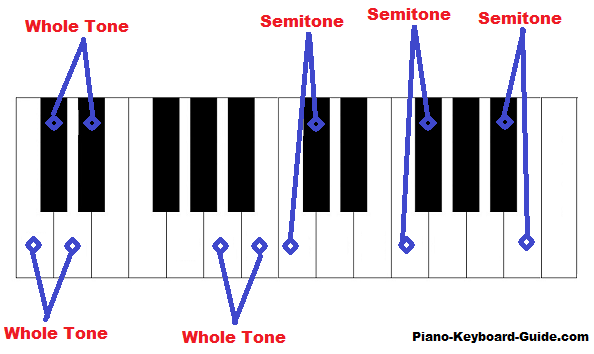

## Introduction

### Content

[TOC]

### Waveform

Represent a complex sound/audio using waveform.

It carries multifactorial information:

- Frequency
- Intensity
- Timbre (音色)

#### Periodic and aperiodic sound

#### Sine Wave

$$
y(t) = A \sin(2 \pi ft + \phi)
$$

- $A$: Amplitude, larger amplitude -> louder.
- $f$: Frequency, higher frequency -> higher sound. $f = \frac{1}{T}$
- $\phi$: Phase.

### Pitch

- Rather subjective perception.
- 2 frequencies are perceived similarly if they differ by a power of 2. e.g. 27.5 Hz, 55 Hz, 110 Hz, 220 Hz, 440 Hz and 880 Hz, which forms a **log scale**.

#### Pitch to frequency

$$
F(p) = 2 ^{\frac{p - 69}{12}} \cdot 440 \\
$$

e.g. C4: $F(60) = 261.6$
$$
F(p + 1)/F(p) = 2^{1/12} = 1.059
$$
Subsequent pitches (semitone) frequency ratio is 1.059

#### Cents

- A more precised pitch representation.
- Octave (八度音阶) divided in 1200 cents, 100 cents in a semitone.
- Noticable pitch difference: 10-25 cents

Sound Power

- 

### Intensity

### 傅里叶变换

#### 傅里叶级数

任何一个周期性的函数 $f(t)$，都可以分解为一系列正余弦函数的和。一个周期性的时序信号被拆分为一系列的频率、每个频率的振幅和每个频率的相位。

#### 连续傅里叶变换
